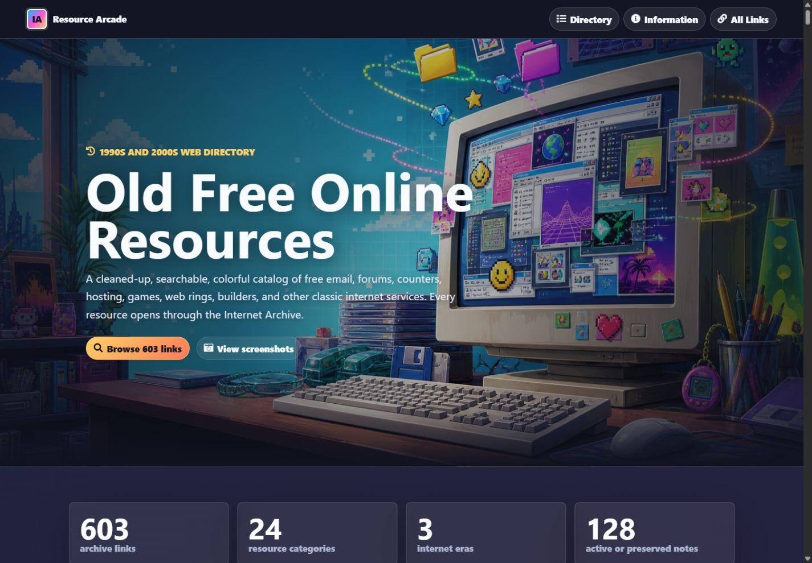
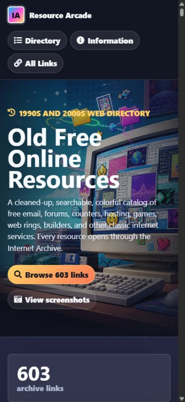
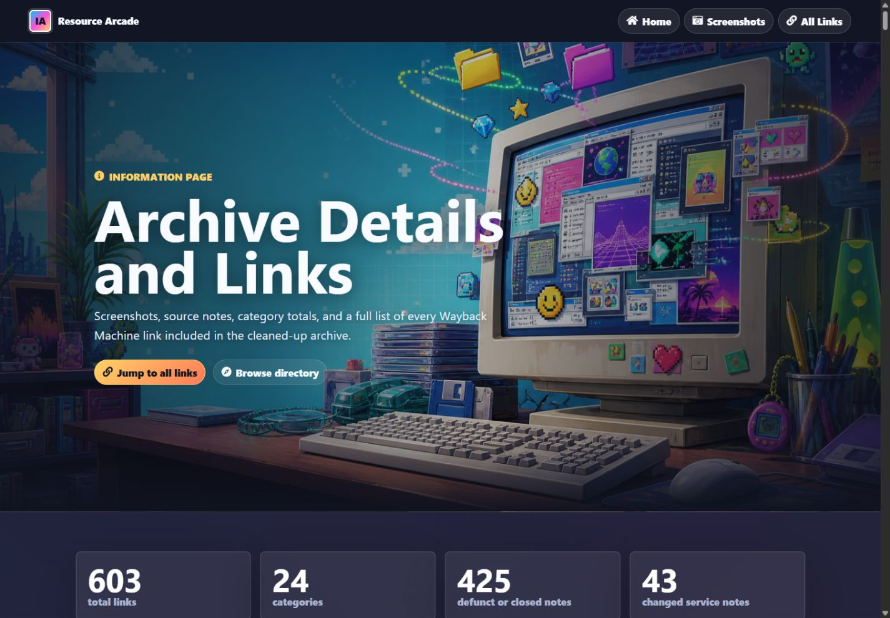

# Old Free Online Resources Archive

A cleaned-up, colorful, searchable version of the original **Old Free Online Resources** HTML list.

## Links

- [Home page](index.html)
- [Information page with screenshots and complete link list](information.html)
- [Complete link list](information.html#all-links)
- [Structured link manifest](links.json)

## Screenshots

## What Changed

- Rebuilt the old page into a colorful retro archive.
- Added working search, era filters, status filters, category chips, and responsive resource cards.
- Added an information page with screenshot details and all 603 resource links.
- Fixed the malformed Chicken Smoothie Wayback Machine URL.
- Preserved the original HTML in `source/Old Free Online Resources.original.html`.

## Archive Stats

- 603 Internet Archive links
- 24 categories
- 1990s: 381, Early 2000s: 142, Mid-2000s: 80

## Categories

- Free Email: 37 links
- Counters and Trackers: 32 links
- Remote Scripts: 21 links
- Remote Forums Hosting: 30 links
- Downloadable Forums: 24 links
- URL Redirection: 38 links
- Free ISP: 25 links
- Free Hosting: 76 links
- Free Guestbooks: 20 links
- Free Web Rings: 20 links
- Free Chat Rooms: 20 links
- Free Domain Names: 20 links
- Free File Hosting: 20 links
- Free Search Engines: 20 links
- Free Website Builders: 20 links
- Free Blog Platforms: 20 links
- Free Image Hosting: 20 links
- Free Instant Messaging: 20 links
- Free Online Games: 20 links
- Free Email Forwarding: 20 links
- Free Web Directories: 20 links
- Free Polls and Surveys: 20 links
- Free Virtual Pets: 20 links
- Teen Chat and Kid-Friendly Sites: 20 links
