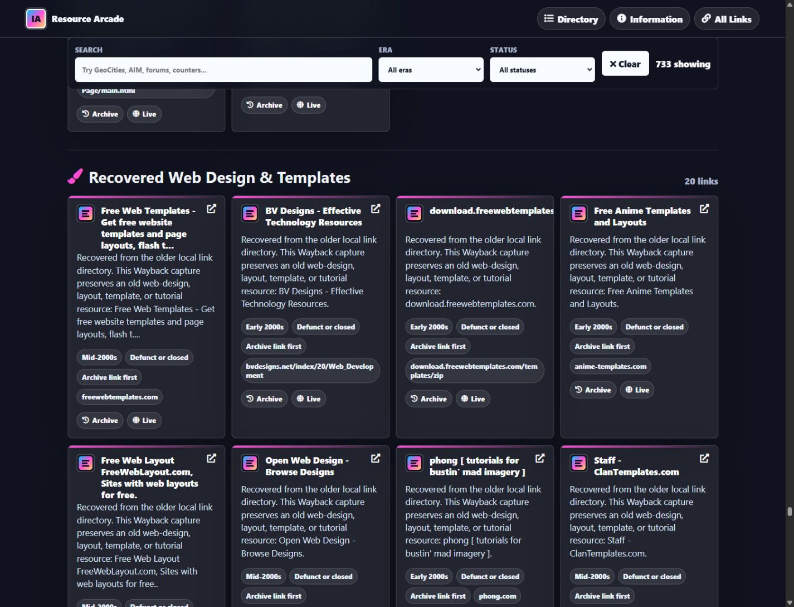
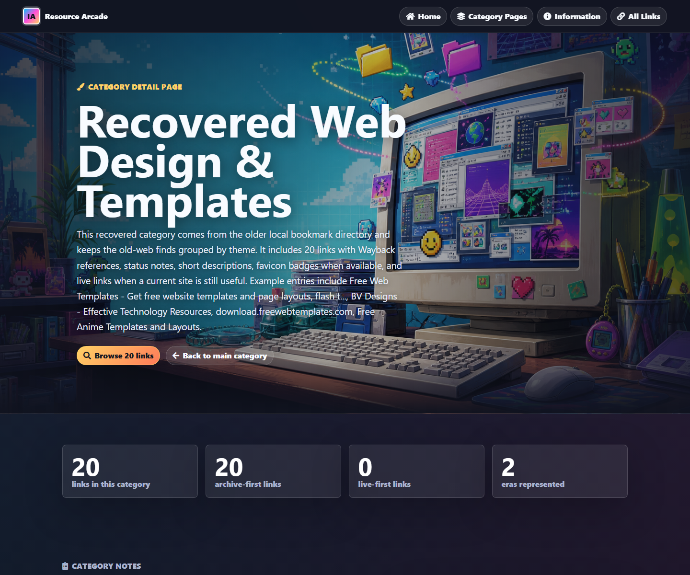
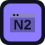
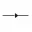

# Old Free Online Resources Archive

A professional, colorful, searchable archive of old free online resources from the 1990s and 2000s. The project preserves the original link directory, improves the browsing experience, and keeps the full categorized link list visible right here on the GitHub main page.

## Project Links

- [Live website](https://rice2k.github.io/old-free-online-resources/)
- [Information page with screenshots and complete link list](https://rice2k.github.io/old-free-online-resources/information.html)
- [Detailed category pages](https://rice2k.github.io/old-free-online-resources/information.html#category-pages)
- [Complete link list on the live site](https://rice2k.github.io/old-free-online-resources/information.html#all-links)
- [Structured link manifest](links.json)
- [Original source backup](source/Old%20Free%20Online%20Resources.original.html)
- [Categorized recovered old-web source](source/recovered-old-web-finds.json)

## Screenshots

## What Changed

- Rebuilt the old page into a colorful retro archive.
- Added working search, era filters, status filters, category chips, and responsive resource cards.
- Added an information page with screenshot details and all 733 resource links.
- Added dedicated detail pages for every service category.
- Listed every archive link on this GitHub README, grouped by category with short descriptions.
- Added extra old-web discovery directories for finding more old websites later.
- Added categorized recovered old-web sections from an older local bookmark directory.
- Checked a previous local Rice2k archive page against this list; the unique link set matched.
- Fixed the malformed Chicken Smoothie Wayback Machine URL.
- Preserved the original HTML in `source/Old Free Online Resources.original.html`.

## Archive Stats

- 733 Internet Archive links
- 32 categories
- 1990s: 385, Early 2000s: 228, Mid-2000s: 120
- 555 defunct or closed notes
- 128 active or preserved notes

## Categories

- [Free Email](https://rice2k.github.io/old-free-online-resources/email.html): 37 links
- [Counters and Trackers](https://rice2k.github.io/old-free-online-resources/counters.html): 32 links
- [Remote Scripts](https://rice2k.github.io/old-free-online-resources/scripts.html): 21 links
- [Remote Forums Hosting](https://rice2k.github.io/old-free-online-resources/forums.html): 30 links
- [Downloadable Forums](https://rice2k.github.io/old-free-online-resources/downloadable-forums.html): 24 links
- [URL Redirection](https://rice2k.github.io/old-free-online-resources/redirection.html): 38 links
- [Free ISP](https://rice2k.github.io/old-free-online-resources/isp.html): 25 links
- [Free Hosting](https://rice2k.github.io/old-free-online-resources/hosting.html): 76 links
- [Free Guestbooks](https://rice2k.github.io/old-free-online-resources/guestbooks.html): 20 links
- [Free Web Rings](https://rice2k.github.io/old-free-online-resources/webrings.html): 20 links
- [Free Chat Rooms](https://rice2k.github.io/old-free-online-resources/chatrooms.html): 20 links
- [Free Domain Names](https://rice2k.github.io/old-free-online-resources/domains.html): 20 links
- [Free File Hosting](https://rice2k.github.io/old-free-online-resources/filehosting.html): 20 links
- [Free Search Engines](https://rice2k.github.io/old-free-online-resources/searchengines.html): 20 links
- [Free Website Builders](https://rice2k.github.io/old-free-online-resources/websitebuilders.html): 20 links
- [Free Blog Platforms](https://rice2k.github.io/old-free-online-resources/blogs.html): 20 links
- [Free Image Hosting](https://rice2k.github.io/old-free-online-resources/imagehosting.html): 20 links
- [Free Instant Messaging](https://rice2k.github.io/old-free-online-resources/instantmessaging.html): 20 links
- [Free Online Games](https://rice2k.github.io/old-free-online-resources/onlinegames.html): 20 links
- [Free Email Forwarding](https://rice2k.github.io/old-free-online-resources/emailforwarding.html): 20 links
- [Free Web Directories](https://rice2k.github.io/old-free-online-resources/webdirectories.html): 20 links
- [Free Polls and Surveys](https://rice2k.github.io/old-free-online-resources/polls.html): 20 links
- [Free Virtual Pets](https://rice2k.github.io/old-free-online-resources/virtualpets.html): 20 links
- [Teen Chat and Kid-Friendly Sites](https://rice2k.github.io/old-free-online-resources/teenchat.html): 20 links
- [Recovered Graal Fan Sites & Resources](https://rice2k.github.io/old-free-online-resources/recovered-graal-fan-sites.html): 42 links
- [Recovered Web Design & Templates](https://rice2k.github.io/old-free-online-resources/recovered-web-design-templates.html): 20 links
- [Recovered Icons, Blinkies & Graphics](https://rice2k.github.io/old-free-online-resources/recovered-icons-graphics.html): 17 links
- [Recovered AIM & Messenger Culture](https://rice2k.github.io/old-free-online-resources/recovered-aim-messenger.html): 4 links
- [Recovered Topsites, Webrings & Link Pages](https://rice2k.github.io/old-free-online-resources/recovered-topsites-webrings.html): 10 links
- [Recovered Classic Gaming & Fan Sites](https://rice2k.github.io/old-free-online-resources/recovered-classic-gaming-fan-sites.html): 10 links
- [Recovered Webmaster Tools & Trackers](https://rice2k.github.io/old-free-online-resources/recovered-webmaster-tools.html): 8 links
- [Recovered GeoCities & Personal Sites](https://rice2k.github.io/old-free-online-resources/recovered-geocities-personal-sites.html): 19 links

## Detailed Category Pages

Each category page includes a category summary, era totals, status totals, favicon badges, a focused resource grid, a compact table, live links, and Wayback links.

| Category page | Links | Archive-first | Live-first | Repo file |
| --- | ---: | ---: | ---: | --- |
| [Free Email](https://rice2k.github.io/old-free-online-resources/email.html) | 37 | 30 | 7 | [HTML file](email.html) |
| [Counters and Trackers](https://rice2k.github.io/old-free-online-resources/counters.html) | 32 | 26 | 6 | [HTML file](counters.html) |
| [Remote Scripts](https://rice2k.github.io/old-free-online-resources/scripts.html) | 21 | 18 | 3 | [HTML file](scripts.html) |
| [Remote Forums Hosting](https://rice2k.github.io/old-free-online-resources/forums.html) | 30 | 22 | 8 | [HTML file](forums.html) |
| [Downloadable Forums](https://rice2k.github.io/old-free-online-resources/downloadable-forums.html) | 24 | 12 | 12 | [HTML file](downloadable-forums.html) |
| [URL Redirection](https://rice2k.github.io/old-free-online-resources/redirection.html) | 38 | 36 | 2 | [HTML file](redirection.html) |
| [Free ISP](https://rice2k.github.io/old-free-online-resources/isp.html) | 25 | 25 | 0 | [HTML file](isp.html) |
| [Free Hosting](https://rice2k.github.io/old-free-online-resources/hosting.html) | 76 | 67 | 9 | [HTML file](hosting.html) |
| [Free Guestbooks](https://rice2k.github.io/old-free-online-resources/guestbooks.html) | 20 | 19 | 1 | [HTML file](guestbooks.html) |
| [Free Web Rings](https://rice2k.github.io/old-free-online-resources/webrings.html) | 20 | 19 | 1 | [HTML file](webrings.html) |
| [Free Chat Rooms](https://rice2k.github.io/old-free-online-resources/chatrooms.html) | 20 | 15 | 5 | [HTML file](chatrooms.html) |
| [Free Domain Names](https://rice2k.github.io/old-free-online-resources/domains.html) | 20 | 18 | 2 | [HTML file](domains.html) |
| [Free File Hosting](https://rice2k.github.io/old-free-online-resources/filehosting.html) | 20 | 14 | 6 | [HTML file](filehosting.html) |
| [Free Search Engines](https://rice2k.github.io/old-free-online-resources/searchengines.html) | 20 | 14 | 6 | [HTML file](searchengines.html) |
| [Free Website Builders](https://rice2k.github.io/old-free-online-resources/websitebuilders.html) | 20 | 9 | 11 | [HTML file](websitebuilders.html) |
| [Free Blog Platforms](https://rice2k.github.io/old-free-online-resources/blogs.html) | 20 | 15 | 5 | [HTML file](blogs.html) |
| [Free Image Hosting](https://rice2k.github.io/old-free-online-resources/imagehosting.html) | 20 | 13 | 7 | [HTML file](imagehosting.html) |
| [Free Instant Messaging](https://rice2k.github.io/old-free-online-resources/instantmessaging.html) | 20 | 12 | 8 | [HTML file](instantmessaging.html) |
| [Free Online Games](https://rice2k.github.io/old-free-online-resources/onlinegames.html) | 20 | 8 | 12 | [HTML file](onlinegames.html) |
| [Free Email Forwarding](https://rice2k.github.io/old-free-online-resources/emailforwarding.html) | 20 | 18 | 2 | [HTML file](emailforwarding.html) |
| [Free Web Directories](https://rice2k.github.io/old-free-online-resources/webdirectories.html) | 20 | 19 | 1 | [HTML file](webdirectories.html) |
| [Free Polls and Surveys](https://rice2k.github.io/old-free-online-resources/polls.html) | 20 | 18 | 2 | [HTML file](polls.html) |
| [Free Virtual Pets](https://rice2k.github.io/old-free-online-resources/virtualpets.html) | 20 | 16 | 4 | [HTML file](virtualpets.html) |
| [Teen Chat and Kid-Friendly Sites](https://rice2k.github.io/old-free-online-resources/teenchat.html) | 20 | 12 | 8 | [HTML file](teenchat.html) |
| [Recovered Graal Fan Sites & Resources](https://rice2k.github.io/old-free-online-resources/recovered-graal-fan-sites.html) | 42 | 42 | 0 | [HTML file](recovered-graal-fan-sites.html) |
| [Recovered Web Design & Templates](https://rice2k.github.io/old-free-online-resources/recovered-web-design-templates.html) | 20 | 20 | 0 | [HTML file](recovered-web-design-templates.html) |
| [Recovered Icons, Blinkies & Graphics](https://rice2k.github.io/old-free-online-resources/recovered-icons-graphics.html) | 17 | 17 | 0 | [HTML file](recovered-icons-graphics.html) |
| [Recovered AIM & Messenger Culture](https://rice2k.github.io/old-free-online-resources/recovered-aim-messenger.html) | 4 | 4 | 0 | [HTML file](recovered-aim-messenger.html) |
| [Recovered Topsites, Webrings & Link Pages](https://rice2k.github.io/old-free-online-resources/recovered-topsites-webrings.html) | 10 | 10 | 0 | [HTML file](recovered-topsites-webrings.html) |
| [Recovered Classic Gaming & Fan Sites](https://rice2k.github.io/old-free-online-resources/recovered-classic-gaming-fan-sites.html) | 10 | 10 | 0 | [HTML file](recovered-classic-gaming-fan-sites.html) |
| [Recovered Webmaster Tools & Trackers](https://rice2k.github.io/old-free-online-resources/recovered-webmaster-tools.html) | 8 | 8 | 0 | [HTML file](recovered-webmaster-tools.html) |
| [Recovered GeoCities & Personal Sites](https://rice2k.github.io/old-free-online-resources/recovered-geocities-personal-sites.html) | 19 | 19 | 0 | [HTML file](recovered-geocities-personal-sites.html) |

## More Old-Web Directories

These extra directories and search tools are useful places to find more old websites to add in the future.

| Directory | Type | Why it helps |
| --- | --- | --- |
| [Old'aVista](https://oldavista.com/) | Old-site search | Searches old personal websites from hosts like GeoCities, Angelfire, AOL Hometown, Xoom, and Tripod. |
| [Wiby](https://wiby.me/) | Classic web search | A lightweight search engine focused on older-style pages and the early-web browsing feeling. |
| [TheOldNet WebRing](https://webring.theoldnet.com/) | Webring | A live webring for modern retro-styled personal sites and vintage-computer-friendly web wandering. |
| [Wayback Machine](https://web.archive.org/) | Web archive | The core Internet Archive tool for finding historical snapshots of URLs and old websites. |
| [Curlie](https://curlie.org/) | Human-edited directory | A volunteer-edited web directory descended from the old Open Directory Project/DMOZ tradition. |
| [Open Directory Project mirror](https://odp.org/) | Classic directory | A browseable Open Directory Project-style category directory useful for older web research paths. |
| [Neocities Browse](https://neocities.org/browse) | Indie web directory | Browse modern handmade personal sites, including many pages tagged with retro and 1990s aesthetics. |
| [Marginalia Search](https://marginalia-search.com/) | Small-web search | A discovery-oriented search engine for non-commercial, independent, old, and weird web pages. |

## Full Categorized Link Directory

Every listing below includes a Wayback Machine archive link. Archive-only, changed, or defunct resources use Wayback first; active resources can use the live site first and still keep an archive link.

### Free Email

| Icon | Service | Short description | Main link | Archive | Era | Status group |
| --- | --- | --- | --- | --- | --- | --- |
|  | [Hotmail](https://web.archive.org/web/*/hotmail.com) | Hotmail is an email entry that changed from its original free-web era form. The Wayback link is the best primary reference for old versions. | Wayback | [Archive](https://web.archive.org/web/*/hotmail.com) | 1990s | Changed over time |
|  | [Hotpop](https://web.archive.org/web/*/hotpop.com) | Hotpop is an email entry listed as defunct or closed. The Wayback Machine link is used first because the live site may no longer function. | Wayback | [Archive](https://web.archive.org/web/*/hotpop.com) | 1990s | Defunct or closed |
|  | [Weedmail](https://web.archive.org/web/*/weedmail.com) | Weedmail is an email entry listed as defunct or closed. The Wayback Machine link is used first because the live site may no longer function. | Wayback | [Archive](https://web.archive.org/web/*/weedmail.com) | 1990s | Defunct or closed |
|  | [Tshirthell](https://web.archive.org/web/*/tshirthell.com) | Tshirthell is an email entry listed as defunct or closed. The Wayback Machine link is used first because the live site may no longer function. | Wayback | [Archive](https://web.archive.org/web/*/tshirthell.com) | Early 2000s | Defunct or closed |
|  | [Beer](https://web.archive.org/web/*/beer.com) | Beer is an email entry listed as defunct or closed. The Wayback Machine link is used first because the live site may no longer function. | Wayback | [Archive](https://web.archive.org/web/*/beer.com) | 1990s | Defunct or closed |
|  | [Yahoo](https://yahoo.com) | Latest news coverage, email, free stock quotes, live scores and video are just the beginning. Discover more every day at Yahoo! | Live | [Archive](https://web.archive.org/web/*/yahoo.com) | 1990s | Active or preserved |
|  | [Pimpemail](https://web.archive.org/web/*/pimpemail.com) | Pimpemail is an email entry listed as defunct or closed. The Wayback Machine link is used first because the live site may no longer function. | Wayback | [Archive](https://web.archive.org/web/*/pimpemail.com) | Early 2000s | Defunct or closed |
|  | [Email](https://web.archive.org/web/*/email.com) | Email is an email entry that changed from its original free-web era form. The Wayback link is the best primary reference for old versions. | Wayback | [Archive](https://web.archive.org/web/*/email.com) | 1990s | Changed over time |
|  | [GMX](https://gmx.net) | Kostenlose E-Mail-Adresse erstellen, Nachrichten lesen und Fotos & Dateien in der GMX Cloud sicher speichern. Jetzt registrieren! | Live | [Archive](https://web.archive.org/web/*/gmx.net) | 1990s | Active or preserved |
|  | [Mypad](https://web.archive.org/web/*/mypad.com) | Mypad is an email entry listed as defunct or closed. The Wayback Machine link is used first because the live site may no longer function. | Wayback | [Archive](https://web.archive.org/web/*/mypad.com) | 1990s | Defunct or closed |
|  | [KGB](https://web.archive.org/web/*/kgb.cz) | KGB is an email entry with uncertain current status. The Wayback Machine link is used first so the listing still has a reliable reference point. | Wayback | [Archive](https://web.archive.org/web/*/kgb.cz) | 1990s | Status uncertain |
|  | [Amexmail](https://web.archive.org/web/*/amexmail.com) | Amexmail is an email entry listed as defunct or closed. The Wayback Machine link is used first because the live site may no longer function. | Wayback | [Archive](https://web.archive.org/web/*/amexmail.com) | 1990s | Defunct or closed |
|  | [Web.de](https://web.de) | Sichere Kommunikation, aktuelle Nachrichten und nützliche Online-Services - alles an einem Ort. Einfach, kostenlos und zuverlässig. | Live | [Archive](https://web.archive.org/web/*/web.de) | 1990s | Active or preserved |
|  | [Mynet](https://mynet.com) | Güncel altın fiyatları, son dakika haberleri, spor, oyun, yemek ve ilginizi çekebilecek birçok servis, Türkiye’nin lider internet platformu Mynet ile sizlerle! | Live | [Archive](https://web.archive.org/web/*/mynet.com) | 1990s | Active or preserved |
|  | [Saintmail](https://web.archive.org/web/*/saintmail.net) | Saintmail is an email entry listed as defunct or closed. The Wayback Machine link is used first because the live site may no longer function. | Wayback | [Archive](https://web.archive.org/web/*/saintmail.net) | 1990s | Defunct or closed |
|  | [MSN](https://web.archive.org/web/*/msn.com) | MSN is an email entry that changed from its original free-web era form. The Wayback link is the best primary reference for old versions. | Wayback | [Archive](https://web.archive.org/web/*/msn.com) | 1990s | Changed over time |
|  | [Everyone.net](https://web.archive.org/web/*/everyone.net) | Everyone.net is an email entry with uncertain current status. The Wayback Machine link is used first so the listing still has a reliable reference point. | Wayback | [Archive](https://web.archive.org/web/*/everyone.net) | 1990s | Status uncertain |
|  | [AOL Mail](https://web.archive.org/web/*/mail.aol.com) | AOL Mail is an email entry that changed from its original free-web era form. The Wayback link is the best primary reference for old versions. | Wayback | [Archive](https://web.archive.org/web/*/mail.aol.com) | 1990s | Changed over time |
|  | [Excite Mail](https://web.archive.org/web/*/excite.com) | Excite Mail is an email entry listed as defunct or closed. The Wayback Machine link is used first because the live site may no longer function. | Wayback | [Archive](https://web.archive.org/web/*/excite.com) | 1990s | Defunct or closed |
|  | [Lycos Mail](https://web.archive.org/web/*/lycos.com) | Lycos Mail is an email entry listed as defunct or closed. The Wayback Machine link is used first because the live site may no longer function. | Wayback | [Archive](https://web.archive.org/web/*/lycos.com) | 1990s | Defunct or closed |
|  | [Mail.com](https://mail.com) | The right email address for you ✔ Secure ✔ 100+ domain names ✔ Up to 10 mail addresses ✔ Sync across devices ✔ 65GB email storage ✔ Sign up today! | Live | [Archive](https://web.archive.org/web/*/mail.com) | 1990s | Active or preserved |
|  | [Inbox.com](https://web.archive.org/web/*/inbox.com) | Inbox.com is an email entry with uncertain current status. The Wayback Machine link is used first so the listing still has a reliable reference point. | Wayback | [Archive](https://web.archive.org/web/*/inbox.com) | Early 2000s | Status uncertain |
|  | [Hushmail](https://hushmail.com) | Send secure emails and forms with Hushmail. Trusted by therapy and healthcare practitioners for handling sensitive information. | Live | [Archive](https://web.archive.org/web/*/hushmail.com) | 1990s | Active or preserved |
|  | [Runbox](https://web.archive.org/web/*/runbox.com) | Runbox is an email entry that changed from its original free-web era form. The Wayback link is the best primary reference for old versions. | Wayback | [Archive](https://web.archive.org/web/*/runbox.com) | Early 2000s | Changed over time |
|  | [Bigfoot](https://web.archive.org/web/*/bigfoot.com) | Bigfoot is an email entry listed as defunct or closed. The Wayback Machine link is used first because the live site may no longer function. | Wayback | [Archive](https://web.archive.org/web/*/bigfoot.com) | 1990s | Defunct or closed |
|  | [Juno Mail](https://web.archive.org/web/*/mail.juno.com) | Juno Mail is an email entry that changed from its original free-web era form. The Wayback link is the best primary reference for old versions. | Wayback | [Archive](https://web.archive.org/web/*/mail.juno.com) | 1990s | Changed over time |
|  | [Altavista Mail](https://web.archive.org/web/*/altavista.com) | Altavista Mail is an email entry listed as defunct or closed. The Wayback Machine link is used first because the live site may no longer function. | Wayback | [Archive](https://web.archive.org/web/*/altavista.com) | 1990s | Defunct or closed |
|  | [Netscape Mail](https://web.archive.org/web/*/netscape.com) | Netscape Mail is an email entry listed as defunct or closed. The Wayback Machine link is used first because the live site may no longer function. | Wayback | [Archive](https://web.archive.org/web/*/netscape.com) | 1990s | Defunct or closed |
|  | [Go.com](https://web.archive.org/web/*/go.com) | Go.com is an email entry listed as defunct or closed. The Wayback Machine link is used first because the live site may no longer function. | Wayback | [Archive](https://web.archive.org/web/*/go.com) | 1990s | Defunct or closed |
|  | [Mailcity](https://web.archive.org/web/*/mailcity.com) | Mailcity is an email entry listed as defunct or closed. The Wayback Machine link is used first because the live site may no longer function. | Wayback | [Archive](https://web.archive.org/web/*/mailcity.com) | 1990s | Defunct or closed |
|  | [Postmark](https://web.archive.org/web/*/postmark.com) | Postmark is an email entry listed as defunct or closed. The Wayback Machine link is used first because the live site may no longer function. | Wayback | [Archive](https://web.archive.org/web/*/postmark.com) | 1990s | Defunct or closed |
|  | [Zapak Mail](https://web.archive.org/web/*/zapak.com) | Zapak Mail is an email entry listed as defunct or closed. The Wayback Machine link is used first because the live site may no longer function. | Wayback | [Archive](https://web.archive.org/web/*/zapak.com) | Early 2000s | Defunct or closed |
|  | [Rediffmail](https://rediff.com) | &#10004;Read Latest India News &#10004;Get Realtime Stock Quotes &#10004;See Live Cricket Scores &#10004;Log in to Rediffmail &#10004;Expert advice on career, personal finance and relationships | Live | [Archive](https://web.archive.org/web/*/rediff.com) | 1990s | Active or preserved |
|  | [IndiaTimes Mail](https://web.archive.org/web/*/indiatimes.com) | IndiaTimes Mail is an email entry listed as defunct or closed. The Wayback Machine link is used first because the live site may no longer function. | Wayback | [Archive](https://web.archive.org/web/*/indiatimes.com) | Early 2000s | Defunct or closed |
|  | [Fastmail](https://web.archive.org/web/*/fastmail.com) | Fastmail is an email entry that changed from its original free-web era form. The Wayback link is the best primary reference for old versions. | Wayback | [Archive](https://web.archive.org/web/*/fastmail.com) | 1990s | Changed over time |
|  | [Rocketmail](https://web.archive.org/web/*/rocketmail.com) | Rocketmail is an email entry listed as defunct or closed. The Wayback Machine link is used first because the live site may no longer function. | Wayback | [Archive](https://web.archive.org/web/*/rocketmail.com) | 1990s | Defunct or closed |
|  | [Theglobe](https://web.archive.org/web/*/theglobe.com) | Theglobe is an email entry listed as defunct or closed. The Wayback Machine link is used first because the live site may no longer function. | Wayback | [Archive](https://web.archive.org/web/*/theglobe.com) | 1990s | Defunct or closed |

### Counters and Trackers

| Icon | Service | Short description | Main link | Archive | Era | Status group |
| --- | --- | --- | --- | --- | --- | --- |
|  | [Sitemeter](https://web.archive.org/web/*/sitemeter.com) | Sitemeter is a counters and trackers entry listed as defunct or closed. The Wayback Machine link is used first because the live site may no longer function. | Wayback | [Archive](https://web.archive.org/web/*/sitemeter.com) | 1990s | Defunct or closed |
|  | [Stats4you](https://web.archive.org/web/*/stats4you.com) | Stats4you is a counters and trackers entry listed as defunct or closed. The Wayback Machine link is used first because the live site may no longer function. | Wayback | [Archive](https://web.archive.org/web/*/stats4you.com) | 1990s | Defunct or closed |
|  | [Stats4all](https://web.archive.org/web/*/stats4all.com) | Stats4all is a counters and trackers entry listed as defunct or closed. The Wayback Machine link is used first because the live site may no longer function. | Wayback | [Archive](https://web.archive.org/web/*/stats4all.com) | 1990s | Defunct or closed |
|  | [Bravenet](https://bravenet.com) | Bravenet offers free web tools, web hosting, domains, email and an easy free site builder. Build your website with our easy webpage builder, web tools, and web services. | Live | [Archive](https://web.archive.org/web/*/bravenet.com) | 1990s | Active or preserved |
|  | [Webtrendslive](https://web.archive.org/web/*/webtrendslive.com) | Webtrendslive is a counters and trackers entry listed as defunct or closed. The Wayback Machine link is used first because the live site may no longer function. | Wayback | [Archive](https://web.archive.org/web/*/webtrendslive.com) | 1990s | Defunct or closed |
|  | [Analogstats](https://web.archive.org/web/*/analogstats.com) | Analogstats is a counters and trackers entry listed as defunct or closed. The Wayback Machine link is used first because the live site may no longer function. | Wayback | [Archive](https://web.archive.org/web/*/analogstats.com) | 1990s | Defunct or closed |
|  | [Freestats](https://web.archive.org/web/*/freestats.com) | Freestats is a counters and trackers entry listed as defunct or closed. The Wayback Machine link is used first because the live site may no longer function. | Wayback | [Archive](https://web.archive.org/web/*/freestats.com) | 1990s | Defunct or closed |
|  | [Thecounter](https://web.archive.org/web/*/thecounter.com) | Thecounter is a counters and trackers entry listed as defunct or closed. The Wayback Machine link is used first because the live site may no longer function. | Wayback | [Archive](https://web.archive.org/web/*/thecounter.com) | 1990s | Defunct or closed |
|  | [Geocounter](https://web.archive.org/web/*/geocounter.net) | Geocounter is a counters and trackers entry listed as defunct or closed. The Wayback Machine link is used first because the live site may no longer function. | Wayback | [Archive](https://web.archive.org/web/*/geocounter.net) | 1990s | Defunct or closed |
|  | [Vioclicks](https://web.archive.org/web/*/vioclicks.com) | Vioclicks is a counters and trackers entry listed as defunct or closed. The Wayback Machine link is used first because the live site may no longer function. | Wayback | [Archive](https://web.archive.org/web/*/vioclicks.com) | 1990s | Defunct or closed |
|  | [Admo](https://web.archive.org/web/*/admo.net) | Admo is a counters and trackers entry listed as defunct or closed. The Wayback Machine link is used first because the live site may no longer function. | Wayback | [Archive](https://web.archive.org/web/*/admo.net) | 1990s | Defunct or closed |
|  | [Darkcounter](https://web.archive.org/web/*/darkcounter.com) | Darkcounter is a counters and trackers entry that changed from its original free-web era form. The Wayback link is the best primary reference for old versions. | Wayback | [Archive](https://web.archive.org/web/*/darkcounter.com) | 1990s | Changed over time |
|  | [WebCounter](https://web.archive.org/web/*/webcounter.com) | WebCounter is a counters and trackers entry listed as defunct or closed. The Wayback Machine link is used first because the live site may no longer function. | Wayback | [Archive](https://web.archive.org/web/*/webcounter.com) | 1990s | Defunct or closed |
|  | [Extreme Tracking](https://extremetracking.com) | Extreme Tracking is a counters and trackers entry from the 1990s web. It is marked "Active", so the live site is the primary link with Wayback kept for older captures. Fetched title: eXTReMe Tracking. | Live | [Archive](https://web.archive.org/web/*/extremetracking.com) | 1990s | Active or preserved |
|  | [HitCounter](https://web.archive.org/web/*/hitcounter.com) | HitCounter is a counters and trackers entry listed as defunct or closed. The Wayback Machine link is used first because the live site may no longer function. | Wayback | [Archive](https://web.archive.org/web/*/hitcounter.com) | 1990s | Defunct or closed |
|  | [StatCounter](https://statcounter.com) | StatCounter is a simple but powerful real-time web analytics service that helps you track, analyse and understand your visitors so you can make good decisions to become more successful online. | Live | [Archive](https://web.archive.org/web/*/statcounter.com) | Early 2000s | Active or preserved |
|  | [Nedstat](https://web.archive.org/web/*/nedstat.com) | Nedstat is a counters and trackers entry listed as defunct or closed. The Wayback Machine link is used first because the live site may no longer function. | Wayback | [Archive](https://web.archive.org/web/*/nedstat.com) | 1990s | Defunct or closed |
|  | [CoolCounter](https://web.archive.org/web/*/coolcounter.com) | CoolCounter is a counters and trackers entry listed as defunct or closed. The Wayback Machine link is used first because the live site may no longer function. | Wayback | [Archive](https://web.archive.org/web/*/coolcounter.com) | 1990s | Defunct or closed |
|  | [LiveStats](https://web.archive.org/web/*/livestats.com) | LiveStats is a counters and trackers entry listed as defunct or closed. The Wayback Machine link is used first because the live site may no longer function. | Wayback | [Archive](https://web.archive.org/web/*/livestats.com) | 1990s | Defunct or closed |
|  | [GoStats](https://web.archive.org/web/*/gostats.com) | GoStats is a counters and trackers entry with uncertain current status. The Wayback Machine link is used first so the listing still has a reliable reference point. | Wayback | [Archive](https://web.archive.org/web/*/gostats.com) | Early 2000s | Status uncertain |
|  | [Web-Stat](https://web-stat.com) | Monitor individual visitors using your website in real-time. Understand & grow your traffic with free, live analytics. Add to your site in minutes! | Live | [Archive](https://web.archive.org/web/*/web-stat.com) | Early 2000s | Active or preserved |
|  | [Clicky](https://clicky.com) | Clicky is a counters and trackers entry from the Mid-2000s web. It is marked "Active", so the live site is the primary link with Wayback kept for older captures. Fetched title: Clicky. | Live | [Archive](https://web.archive.org/web/*/clicky.com) | Mid-2000s | Active or preserved |
|  | [EasyCounter](https://web.archive.org/web/*/easycounter.com) | EasyCounter is a counters and trackers entry listed as defunct or closed. The Wayback Machine link is used first because the live site may no longer function. | Wayback | [Archive](https://web.archive.org/web/*/easycounter.com) | Early 2000s | Defunct or closed |
|  | [Countomat](https://web.archive.org/web/*/countomat.com) | Countomat is a counters and trackers entry listed as defunct or closed. The Wayback Machine link is used first because the live site may no longer function. | Wayback | [Archive](https://web.archive.org/web/*/countomat.com) | 1990s | Defunct or closed |
|  | [SuperCounter](https://web.archive.org/web/*/supercounter.com) | SuperCounter is a counters and trackers entry listed as defunct or closed. The Wayback Machine link is used first because the live site may no longer function. | Wayback | [Archive](https://web.archive.org/web/*/supercounter.com) | 1990s | Defunct or closed |
|  | [TrackStar](https://web.archive.org/web/*/trackstar.com) | TrackStar is a counters and trackers entry listed as defunct or closed. The Wayback Machine link is used first because the live site may no longer function. | Wayback | [Archive](https://web.archive.org/web/*/trackstar.com) | 1990s | Defunct or closed |
|  | [VisitorVille](https://web.archive.org/web/*/visitorville.com) | VisitorVille is a counters and trackers entry listed as defunct or closed. The Wayback Machine link is used first because the live site may no longer function. | Wayback | [Archive](https://web.archive.org/web/*/visitorville.com) | Early 2000s | Defunct or closed |
|  | [HitTail](https://web.archive.org/web/*/hittail.com) | HitTail is a counters and trackers entry listed as defunct or closed. The Wayback Machine link is used first because the live site may no longer function. | Wayback | [Archive](https://web.archive.org/web/*/hittail.com) | Mid-2000s | Defunct or closed |
|  | [CounterCentral](https://web.archive.org/web/*/countercentral.com) | CounterCentral is a counters and trackers entry listed as defunct or closed. The Wayback Machine link is used first because the live site may no longer function. | Wayback | [Archive](https://web.archive.org/web/*/countercentral.com) | 1990s | Defunct or closed |
|  | [WebTraxs](https://web.archive.org/web/*/webtraxs.com) | WebTraxs is a counters and trackers entry listed as defunct or closed. The Wayback Machine link is used first because the live site may no longer function. | Wayback | [Archive](https://web.archive.org/web/*/webtraxs.com) | 1990s | Defunct or closed |
|  | [OneStat](https://web.archive.org/web/*/onestat.com) | OneStat is a counters and trackers entry listed as defunct or closed. The Wayback Machine link is used first because the live site may no longer function. | Wayback | [Archive](https://web.archive.org/web/*/onestat.com) | Early 2000s | Defunct or closed |
|  | [Shinystat](https://shinystat.com) | Shinystat is a counters and trackers entry from the Early 2000s web. It is marked "Active", so the live site is the primary link with Wayback kept for older captures. | Live | [Archive](https://web.archive.org/web/*/shinystat.com) | Early 2000s | Active or preserved |

### Remote Scripts

| Icon | Service | Short description | Main link | Archive | Era | Status group |
| --- | --- | --- | --- | --- | --- | --- |
|  | [Hostedscripts](https://web.archive.org/web/*/hostedscripts.com) | Hostedscripts is a remote scripts entry with uncertain current status. The Wayback Machine link is used first so the listing still has a reliable reference point. | Wayback | [Archive](https://web.archive.org/web/*/hostedscripts.com) | 1990s | Status uncertain |
|  | [CGI Central](https://web.archive.org/web/*/cgicentral.net) | CGI Central is a remote scripts entry listed as defunct or closed. The Wayback Machine link is used first because the live site may no longer function. | Wayback | [Archive](https://web.archive.org/web/*/cgicentral.net) | 1990s | Defunct or closed |
|  | [HotScripts](https://hotscripts.com) | HotScripts is a remote scripts entry from the 1990s web. It is marked "Active resource", so the live site is the primary link with Wayback kept for older captures. | Live | [Archive](https://web.archive.org/web/*/hotscripts.com) | 1990s | Active or preserved |
|  | [ScriptDungeon](https://web.archive.org/web/*/scriptdungeon.com) | ScriptDungeon is a remote scripts entry listed as defunct or closed. The Wayback Machine link is used first because the live site may no longer function. | Wayback | [Archive](https://web.archive.org/web/*/scriptdungeon.com) | 1990s | Defunct or closed |
|  | [FreeScripts](https://web.archive.org/web/*/freescripts.com) | FreeScripts is a remote scripts entry listed as defunct or closed. The Wayback Machine link is used first because the live site may no longer function. | Wayback | [Archive](https://web.archive.org/web/*/freescripts.com) | 1990s | Defunct or closed |
|  | [CGI-Resources](https://web.archive.org/web/*/cgi-resources.com) | CGI-Resources is a remote scripts entry listed as defunct or closed. The Wayback Machine link is used first because the live site may no longer function. | Wayback | [Archive](https://web.archive.org/web/*/cgi-resources.com) | 1990s | Defunct or closed |
|  | [Matt's Script Archive](https://web.archive.org/web/*/scriptarchive.com) | Matt's Script Archive is a remote scripts entry listed as defunct or closed. The Wayback Machine link is used first because the live site may no longer function. | Wayback | [Archive](https://web.archive.org/web/*/scriptarchive.com) | 1990s | Defunct or closed |
|  | [FormMail](https://web.archive.org/web/*/formmail.com) | FormMail is a remote scripts entry listed as defunct or closed. The Wayback Machine link is used first because the live site may no longer function. | Wayback | [Archive](https://web.archive.org/web/*/formmail.com) | 1990s | Defunct or closed |
|  | [PerlScripts](https://web.archive.org/web/*/perlscripts.com) | PerlScripts is a remote scripts entry listed as defunct or closed. The Wayback Machine link is used first because the live site may no longer function. | Wayback | [Archive](https://web.archive.org/web/*/perlscripts.com) | 1990s | Defunct or closed |
|  | [JavaScript Kit](https://javascriptkit.com) | JavaScript Kit is a remote scripts entry from the 1990s web. It is marked "Active", so the live site is the primary link with Wayback kept for older captures. | Live | [Archive](https://web.archive.org/web/*/javascriptkit.com) | 1990s | Active or preserved |
|  | [Dynamic Drive](https://dynamicdrive.com) | Dynamic Drive is a remote scripts entry from the 1990s web. It is marked "Active", so the live site is the primary link with Wayback kept for older captures. | Live | [Archive](https://web.archive.org/web/*/dynamicdrive.com) | 1990s | Active or preserved |
|  | [CGI World](https://web.archive.org/web/*/cgiworld.com) | CGI World is a remote scripts entry listed as defunct or closed. The Wayback Machine link is used first because the live site may no longer function. | Wayback | [Archive](https://web.archive.org/web/*/cgiworld.com) | 1990s | Defunct or closed |
|  | [ScriptOcean](https://web.archive.org/web/*/scriptocean.com) | ScriptOcean is a remote scripts entry listed as defunct or closed. The Wayback Machine link is used first because the live site may no longer function. | Wayback | [Archive](https://web.archive.org/web/*/scriptocean.com) | 1990s | Defunct or closed |
|  | [CodeLifter](https://web.archive.org/web/*/codelifter.com) | CodeLifter is a remote scripts entry listed as defunct or closed. The Wayback Machine link is used first because the live site may no longer function. | Wayback | [Archive](https://web.archive.org/web/*/codelifter.com) | 1990s | Defunct or closed |
|  | [Planet Source Code](https://web.archive.org/web/*/planetsourcecode.com) | Planet Source Code is a remote scripts entry listed as defunct or closed. The Wayback Machine link is used first because the live site may no longer function. | Wayback | [Archive](https://web.archive.org/web/*/planetsourcecode.com) | 1990s | Defunct or closed |
|  | [WebScripts](https://web.archive.org/web/*/webscripts.com) | WebScripts is a remote scripts entry listed as defunct or closed. The Wayback Machine link is used first because the live site may no longer function. | Wayback | [Archive](https://web.archive.org/web/*/webscripts.com) | 1990s | Defunct or closed |
|  | [CGI-Bin](https://web.archive.org/web/*/cgi-bin.com) | CGI-Bin is a remote scripts entry listed as defunct or closed. The Wayback Machine link is used first because the live site may no longer function. | Wayback | [Archive](https://web.archive.org/web/*/cgi-bin.com) | 1990s | Defunct or closed |
|  | [ScriptSearch](https://web.archive.org/web/*/scriptsearch.com) | ScriptSearch is a remote scripts entry listed as defunct or closed. The Wayback Machine link is used first because the live site may no longer function. | Wayback | [Archive](https://web.archive.org/web/*/scriptsearch.com) | 1990s | Defunct or closed |
|  | [FreeCGI](https://web.archive.org/web/*/freecgi.com) | FreeCGI is a remote scripts entry listed as defunct or closed. The Wayback Machine link is used first because the live site may no longer function. | Wayback | [Archive](https://web.archive.org/web/*/freecgi.com) | 1990s | Defunct or closed |
|  | [JScript](https://web.archive.org/web/*/jscript.com) | JScript is a remote scripts entry listed as defunct or closed. The Wayback Machine link is used first because the live site may no longer function. | Wayback | [Archive](https://web.archive.org/web/*/jscript.com) | 1990s | Defunct or closed |
|  | [RemoteLoader](https://web.archive.org/web/*/remoteloader.com) | RemoteLoader is a remote scripts entry listed as defunct or closed. The Wayback Machine link is used first because the live site may no longer function. | Wayback | [Archive](https://web.archive.org/web/*/remoteloader.com) | 1990s | Defunct or closed |

### Remote Forums Hosting

| Icon | Service | Short description | Main link | Archive | Era | Status group |
| --- | --- | --- | --- | --- | --- | --- |
|  | [Upperboard](https://web.archive.org/web/*/upperboard.com) | Upperboard is a remote forums hosting entry listed as defunct or closed. The Wayback Machine link is used first because the live site may no longer function. | Wayback | [Archive](https://web.archive.org/web/*/upperboard.com) | 1990s | Defunct or closed |
|  | [Proboards](https://proboards.com) | Unlimited members, unlimited threads, unlimited size! Build the discussion forum of your dreams with ProBoards | Live | [Archive](https://web.archive.org/web/*/proboards.com) | Early 2000s | Active or preserved |
|  | [Ezboard](https://web.archive.org/web/*/ezboard.com) | Ezboard is a remote forums hosting entry listed as defunct or closed. The Wayback Machine link is used first because the live site may no longer function. | Wayback | [Archive](https://web.archive.org/web/*/ezboard.com) | 1990s | Defunct or closed |
|  | [MSN](https://web.archive.org/web/*/msn.com) | MSN is a remote forums hosting entry listed as defunct or closed. The Wayback Machine link is used first because the live site may no longer function. | Wayback | [Archive](https://web.archive.org/web/*/msn.com) | 1990s | Defunct or closed |
|  | [Yahoo](https://web.archive.org/web/*/yahoo.com) | Yahoo is a remote forums hosting entry listed as defunct or closed. The Wayback Machine link is used first because the live site may no longer function. | Wayback | [Archive](https://web.archive.org/web/*/yahoo.com) | 1990s | Defunct or closed |
|  | [Network54](https://network54.com) | Network54 is a remote forums hosting entry from the 1990s web. It is marked "Active", so the live site is the primary link with Wayback kept for older captures. | Live | [Archive](https://web.archive.org/web/*/network54.com) | 1990s | Active or preserved |
|  | [Dk3](https://web.archive.org/web/*/dk3.com) | Dk3 is a remote forums hosting entry listed as defunct or closed. The Wayback Machine link is used first because the live site may no longer function. | Wayback | [Archive](https://web.archive.org/web/*/dk3.com) | 1990s | Defunct or closed |
|  | [Delphi](https://delphi.com) | With a brand presence in more than 150 countries Delphi provides OE specification end-to-end solutions from components to sophisticated software solutions. | Live | [Archive](https://web.archive.org/web/*/delphi.com) | 1990s | Active or preserved |
|  | [Guestforum](https://web.archive.org/web/*/guestforum.com) | Guestforum is a remote forums hosting entry listed as defunct or closed. The Wayback Machine link is used first because the live site may no longer function. | Wayback | [Archive](https://web.archive.org/web/*/guestforum.com) | 1990s | Defunct or closed |
|  | [Mycool](https://web.archive.org/web/*/mycool.com) | Mycool is a remote forums hosting entry listed as defunct or closed. The Wayback Machine link is used first because the live site may no longer function. | Wayback | [Archive](https://web.archive.org/web/*/mycool.com) | 1990s | Defunct or closed |
|  | [InvisionFree](https://web.archive.org/web/*/invisionfree.com) | InvisionFree is a remote forums hosting entry listed as defunct or closed. The Wayback Machine link is used first because the live site may no longer function. | Wayback | [Archive](https://web.archive.org/web/*/invisionfree.com) | Early 2000s | Defunct or closed |
|  | [ZetaBoards](https://web.archive.org/web/*/zetaboards.com) | ZetaBoards is a remote forums hosting entry listed as defunct or closed. The Wayback Machine link is used first because the live site may no longer function. | Wayback | [Archive](https://web.archive.org/web/*/zetaboards.com) | Mid-2000s | Defunct or closed |
|  | [Forumer](https://web.archive.org/web/*/forumer.com) | Forumer is a remote forums hosting entry listed as defunct or closed. The Wayback Machine link is used first because the live site may no longer function. | Wayback | [Archive](https://web.archive.org/web/*/forumer.com) | Early 2000s | Defunct or closed |
|  | [FreeForums](https://freeforums.net) | Unlimited members, unlimited threads, unlimited size! Build the discussion forum of your dreams with ProBoards | Live | [Archive](https://web.archive.org/web/*/freeforums.net) | Mid-2000s | Active or preserved |
|  | [Lefora](https://web.archive.org/web/*/lefora.com) | Lefora is a remote forums hosting entry listed as defunct or closed. The Wayback Machine link is used first because the live site may no longer function. | Wayback | [Archive](https://web.archive.org/web/*/lefora.com) | Mid-2000s | Defunct or closed |
|  | [ActiveBoard](https://web.archive.org/web/*/activeboard.com) | ActiveBoard is a remote forums hosting entry listed as defunct or closed. The Wayback Machine link is used first because the live site may no longer function. | Wayback | [Archive](https://web.archive.org/web/*/activeboard.com) | Early 2000s | Defunct or closed |
|  | [BoardHost](https://boardhost.com) | Boardhost: Reliable message boards. | Live | [Archive](https://web.archive.org/web/*/boardhost.com) | 1990s | Active or preserved |
|  | [Yuku](https://web.archive.org/web/*/yuku.com) | Yuku is a remote forums hosting entry listed as defunct or closed. The Wayback Machine link is used first because the live site may no longer function. | Wayback | [Archive](https://web.archive.org/web/*/yuku.com) | Mid-2000s | Defunct or closed |
|  | [Forumotion](https://forumotion.com) | Forumotion is a remote forums hosting entry from the Mid-2000s web. It is marked "Active", so the live site is the primary link with Wayback kept for older captures. | Live | [Archive](https://web.archive.org/web/*/forumotion.com) | Mid-2000s | Active or preserved |
|  | [CreateAForum](https://createaforum.com) | Create A Forum - The #1 one free forum host. Create your own free forum and build a community using CreateAForum.com forum hosting service. | Live | [Archive](https://web.archive.org/web/*/createaforum.com) | Mid-2000s | Active or preserved |
|  | [Aimoo](https://web.archive.org/web/*/aimoo.com) | Aimoo is a remote forums hosting entry listed as defunct or closed. The Wayback Machine link is used first because the live site may no longer function. | Wayback | [Archive](https://web.archive.org/web/*/aimoo.com) | Early 2000s | Defunct or closed |
|  | [QuickTopic](https://web.archive.org/web/*/quicktopic.com) | QuickTopic is a remote forums hosting entry listed as defunct or closed. The Wayback Machine link is used first because the live site may no longer function. | Wayback | [Archive](https://web.archive.org/web/*/quicktopic.com) | Early 2000s | Defunct or closed |
|  | [Tapatalk](https://tapatalk.com) | Tapatalk is a remote forums hosting entry from the Mid-2000s web. It is marked "Active", so the live site is the primary link with Wayback kept for older captures. Fetched title: Tapatalk the world. | Live | [Archive](https://web.archive.org/web/*/tapatalk.com) | Mid-2000s | Active or preserved |
|  | [Vanilla Forums](https://web.archive.org/web/*/vanillaforums.com) | Vanilla Forums is a remote forums hosting entry that changed from its original free-web era form. The Wayback link is the best primary reference for old versions. | Wayback | [Archive](https://web.archive.org/web/*/vanillaforums.com) | Early 2000s | Changed over time |
|  | [Boomerang Boards](https://web.archive.org/web/*/boomerangboards.com) | Boomerang Boards is a remote forums hosting entry listed as defunct or closed. The Wayback Machine link is used first because the live site may no longer function. | Wayback | [Archive](https://web.archive.org/web/*/boomerangboards.com) | Early 2000s | Defunct or closed |
|  | [ForumCircle](https://web.archive.org/web/*/forumcircle.com) | ForumCircle is a remote forums hosting entry listed as defunct or closed. The Wayback Machine link is used first because the live site may no longer function. | Wayback | [Archive](https://web.archive.org/web/*/forumcircle.com) | Early 2000s | Defunct or closed |
|  | [XBoard](https://web.archive.org/web/*/xboard.com) | XBoard is a remote forums hosting entry listed as defunct or closed. The Wayback Machine link is used first because the live site may no longer function. | Wayback | [Archive](https://web.archive.org/web/*/xboard.com) | 1990s | Defunct or closed |
|  | [SimpleBoards](https://web.archive.org/web/*/simpleboards.com) | SimpleBoards is a remote forums hosting entry listed as defunct or closed. The Wayback Machine link is used first because the live site may no longer function. | Wayback | [Archive](https://web.archive.org/web/*/simpleboards.com) | 1990s | Defunct or closed |
|  | [MyForum](https://web.archive.org/web/*/myforum.com) | MyForum is a remote forums hosting entry listed as defunct or closed. The Wayback Machine link is used first because the live site may no longer function. | Wayback | [Archive](https://web.archive.org/web/*/myforum.com) | 1990s | Defunct or closed |
|  | [ForumHome](https://web.archive.org/web/*/forumhome.com) | ForumHome is a remote forums hosting entry listed as defunct or closed. The Wayback Machine link is used first because the live site may no longer function. | Wayback | [Archive](https://web.archive.org/web/*/forumhome.com) | 1990s | Defunct or closed |

### Downloadable Forums

| Icon | Service | Short description | Main link | Archive | Era | Status group |
| --- | --- | --- | --- | --- | --- | --- |
|  | [phpBB](https://phpbb.com) | phpBB is a downloadable forums entry from the Early 2000s web. It is marked "Active", so the live site is the primary link with Wayback kept for older captures. | Live | [Archive](https://web.archive.org/web/*/phpbb.com) | Early 2000s | Active or preserved |
|  | [vBulletin](https://vbulletin.com) | vBulletin is a downloadable forums entry from the 1990s web. It is marked "Active", so the live site is the primary link with Wayback kept for older captures. | Live | [Archive](https://web.archive.org/web/*/vbulletin.com) | 1990s | Active or preserved |
|  | [Ikonboard](https://web.archive.org/web/*/ikonboard.com) | Ikonboard is a downloadable forums entry listed as defunct or closed. The Wayback Machine link is used first because the live site may no longer function. | Wayback | [Archive](https://web.archive.org/web/*/ikonboard.com) | 1990s | Defunct or closed |
|  | [yaBB](https://web.archive.org/web/*/yabb.com) | yaBB is a downloadable forums entry listed as defunct or closed. The Wayback Machine link is used first because the live site may no longer function. | Wayback | [Archive](https://web.archive.org/web/*/yabb.com) | Early 2000s | Defunct or closed |
|  | [SMF](https://simplemachines.org) | SMF is a downloadable forums entry from the Early 2000s web. It is marked "Active", so the live site is the primary link with Wayback kept for older captures. | Live | [Archive](https://web.archive.org/web/*/simplemachines.org) | Early 2000s | Active or preserved |
|  | [PunBB](https://web.archive.org/web/*/punbb.informer.com) | PunBB is a downloadable forums entry listed as defunct or closed. The Wayback Machine link is used first because the live site may no longer function. | Wayback | [Archive](https://web.archive.org/web/*/punbb.informer.com) | Early 2000s | Defunct or closed |
|  | [XMB Forum](https://web.archive.org/web/*/xmbforum2.com) | XMB Forum is a downloadable forums entry listed as defunct or closed. The Wayback Machine link is used first because the live site may no longer function. | Wayback | [Archive](https://web.archive.org/web/*/xmbforum2.com) | Early 2000s | Defunct or closed |
|  | [MyBB](https://mybb.com) | MyBB is a downloadable forums entry from the Mid-2000s web. It is marked "Active", so the live site is the primary link with Wayback kept for older captures. | Live | [Archive](https://web.archive.org/web/*/mybb.com) | Mid-2000s | Active or preserved |
|  | [FluxBB](https://fluxbb.org) | FluxBB is a downloadable forums entry from the Mid-2000s web. It is marked "Active", so the live site is the primary link with Wayback kept for older captures. | Live | [Archive](https://web.archive.org/web/*/fluxbb.org) | Mid-2000s | Active or preserved |
|  | [Phorum](https://web.archive.org/web/*/phorum.org) | Phorum is a downloadable forums entry listed as defunct or closed. The Wayback Machine link is used first because the live site may no longer function. | Wayback | [Archive](https://web.archive.org/web/*/phorum.org) | 1990s | Defunct or closed |
|  | [bbPress](https://bbpress.org) | bbPress is a downloadable forums entry from the Mid-2000s web. It is marked "Active", so the live site is the primary link with Wayback kept for older captures. Fetched title: Forums, made the WordPress way. | Live | [Archive](https://web.archive.org/web/*/bbpress.org) | Mid-2000s | Active or preserved |
|  | [MiniBB](https://minibb.com) | MiniBB is a downloadable forums entry from the Early 2000s web. It is marked "Active", so the live site is the primary link with Wayback kept for older captures. | Live | [Archive](https://web.archive.org/web/*/minibb.com) | Early 2000s | Active or preserved |
|  | [FUDforum](https://fudforum.org) | FUDforum is a downloadable forums entry from the Early 2000s web. It is marked "Active", so the live site is the primary link with Wayback kept for older captures. | Live | [Archive](https://web.archive.org/web/*/fudforum.org) | Early 2000s | Active or preserved |
|  | [MercuryBoard](https://web.archive.org/web/*/mercuryboard.com) | MercuryBoard is a downloadable forums entry listed as defunct or closed. The Wayback Machine link is used first because the live site may no longer function. | Wayback | [Archive](https://web.archive.org/web/*/mercuryboard.com) | Early 2000s | Defunct or closed |
|  | [OpenBB](https://web.archive.org/web/*/openbb.com) | OpenBB is a downloadable forums entry listed as defunct or closed. The Wayback Machine link is used first because the live site may no longer function. | Wayback | [Archive](https://web.archive.org/web/*/openbb.com) | Early 2000s | Defunct or closed |
|  | [UBB](https://web.archive.org/web/*/ubbcentral.com) | UBB is a downloadable forums entry that changed from its original free-web era form. The Wayback link is the best primary reference for old versions. | Wayback | [Archive](https://web.archive.org/web/*/ubbcentral.com) | 1990s | Changed over time |
|  | [WWWBoard](https://web.archive.org/web/*/wwwboard.com) | WWWBoard is a downloadable forums entry listed as defunct or closed. The Wayback Machine link is used first because the live site may no longer function. | Wayback | [Archive](https://web.archive.org/web/*/wwwboard.com) | 1990s | Defunct or closed |
|  | [Discourse](https://discourse.org) | The customizable, scalable community platform powering over 22,000 communities. Create knowledge through conversation. | Live | [Archive](https://web.archive.org/web/*/discourse.org) | Mid-2000s | Active or preserved |
|  | [NodeBB](https://nodebb.org) | NodeBB Forum Software - The Modern Discussion Platform | Live | [Archive](https://web.archive.org/web/*/nodebb.org) | Mid-2000s | Active or preserved |
|  | [Vanilla](https://vanillaforums.org) | Explore Higher Logic Vanilla, our all-in-one customer community software designed to help you and your customers succeed. Discover features, benefits, and FAQs. | Live | [Archive](https://web.archive.org/web/*/vanillaforums.org) | Early 2000s | Active or preserved |
|  | [Burning Board Lite](https://web.archive.org/web/*/woltlab.com) | Burning Board Lite is a downloadable forums entry listed as defunct or closed. The Wayback Machine link is used first because the live site may no longer function. | Wayback | [Archive](https://web.archive.org/web/*/woltlab.com) | Early 2000s | Defunct or closed |
|  | [YetAnotherForum](https://yetanotherforum.net) | YetAnotherForum is a downloadable forums entry from the Early 2000s web. It is marked "Active", so the live site is the primary link with Wayback kept for older captures. | Live | [Archive](https://web.archive.org/web/*/yetanotherforum.net) | Early 2000s | Active or preserved |
|  | [PHP-Nuke Forums](https://web.archive.org/web/*/phpnuke.org) | PHP-Nuke Forums is a downloadable forums entry listed as defunct or closed. The Wayback Machine link is used first because the live site may no longer function. | Wayback | [Archive](https://web.archive.org/web/*/phpnuke.org) | Early 2000s | Defunct or closed |
|  | [FusionBB](https://web.archive.org/web/*/fusionbb.com) | FusionBB is a downloadable forums entry listed as defunct or closed. The Wayback Machine link is used first because the live site may no longer function. | Wayback | [Archive](https://web.archive.org/web/*/fusionbb.com) | Early 2000s | Defunct or closed |

### URL Redirection

| Icon | Service | Short description | Main link | Archive | Era | Status group |
| --- | --- | --- | --- | --- | --- | --- |
|  | [Idz](https://web.archive.org/web/*/idz.net) | Idz is an url redirection entry listed as defunct or closed. The Wayback Machine link is used first because the live site may no longer function. | Wayback | [Archive](https://web.archive.org/web/*/idz.net) | 1990s | Defunct or closed |
|  | [Cjb](https://web.archive.org/web/*/cjb.net) | Cjb is an url redirection entry that changed from its original free-web era form. The Wayback link is the best primary reference for old versions. | Wayback | [Archive](https://web.archive.org/web/*/cjb.net) | 1990s | Changed over time |
|  | [D.bz](https://web.archive.org/web/*/d.buzz.bz) | D.bz is an url redirection entry listed as defunct or closed. The Wayback Machine link is used first because the live site may no longer function. | Wayback | [Archive](https://web.archive.org/web/*/d.buzz.bz) | 1990s | Defunct or closed |
|  | [Quickurl](https://web.archive.org/web/*/quickurl.com) | Quickurl is an url redirection entry listed as defunct or closed. The Wayback Machine link is used first because the live site may no longer function. | Wayback | [Archive](https://web.archive.org/web/*/quickurl.com) | 1990s | Defunct or closed |
|  | [ShortURL](https://web.archive.org/web/*/shorturl.com) | ShortURL is an url redirection entry with uncertain current status. The Wayback Machine link is used first so the listing still has a reliable reference point. | Wayback | [Archive](https://web.archive.org/web/*/shorturl.com) | 1990s | Status uncertain |
|  | [Neaturl](https://web.archive.org/web/*/neaturl.com) | Neaturl is an url redirection entry listed as defunct or closed. The Wayback Machine link is used first because the live site may no longer function. | Wayback | [Archive](https://web.archive.org/web/*/neaturl.com) | 1990s | Defunct or closed |
|  | [N2v](https://web.archive.org/web/*/n2v.net) | N2v is an url redirection entry listed as defunct or closed. The Wayback Machine link is used first because the live site may no longer function. | Wayback | [Archive](https://web.archive.org/web/*/n2v.net) | 1990s | Defunct or closed |
|  | [Hotredirect](https://web.archive.org/web/*/hotredirect.com) | Hotredirect is an url redirection entry listed as defunct or closed. The Wayback Machine link is used first because the live site may no longer function. | Wayback | [Archive](https://web.archive.org/web/*/hotredirect.com) | 1990s | Defunct or closed |
|  | [Ipfox](https://web.archive.org/web/*/ipfox.com) | Ipfox is an url redirection entry listed as defunct or closed. The Wayback Machine link is used first because the live site may no longer function. | Wayback | [Archive](https://web.archive.org/web/*/ipfox.com) | 1990s | Defunct or closed |
|  | [B4.to](https://web.archive.org/web/*/b4.to) | B4.to is an url redirection entry listed as defunct or closed. The Wayback Machine link is used first because the live site may no longer function. | Wayback | [Archive](https://web.archive.org/web/*/b4.to) | 1990s | Defunct or closed |
|  | [Iscool](https://web.archive.org/web/*/iscool.net) | Iscool is an url redirection entry listed as defunct or closed. The Wayback Machine link is used first because the live site may no longer function. | Wayback | [Archive](https://web.archive.org/web/*/iscool.net) | 1990s | Defunct or closed |
|  | [Hacked.at](https://web.archive.org/web/*/hacked.at) | Hacked.at is an url redirection entry listed as defunct or closed. The Wayback Machine link is used first because the live site may no longer function. | Wayback | [Archive](https://web.archive.org/web/*/hacked.at) | 1990s | Defunct or closed |
|  | [Emu.vg](https://web.archive.org/web/*/emu.vg) | Emu.vg is an url redirection entry listed as defunct or closed. The Wayback Machine link is used first because the live site may no longer function. | Wayback | [Archive](https://web.archive.org/web/*/emu.vg) | 1990s | Defunct or closed |
|  | [Dot.nu](https://web.archive.org/web/*/dot.nu) | Dot.nu is an url redirection entry listed as defunct or closed. The Wayback Machine link is used first because the live site may no longer function. | Wayback | [Archive](https://web.archive.org/web/*/dot.nu) | 1990s | Defunct or closed |
|  | [Myredirector](https://web.archive.org/web/*/myredirector.com) | Myredirector is an url redirection entry listed as defunct or closed. The Wayback Machine link is used first because the live site may no longer function. | Wayback | [Archive](https://web.archive.org/web/*/myredirector.com) | 1990s | Defunct or closed |
|  | [Kickme.to](https://web.archive.org/web/*/kickme.to) | Kickme.to is an url redirection entry listed as defunct or closed. The Wayback Machine link is used first because the live site may no longer function. | Wayback | [Archive](https://web.archive.org/web/*/kickme.to) | 1990s | Defunct or closed |
|  | [Has.it](https://web.archive.org/web/*/has.it) | Has.it is an url redirection entry listed as defunct or closed. The Wayback Machine link is used first because the live site may no longer function. | Wayback | [Archive](https://web.archive.org/web/*/has.it) | 1990s | Defunct or closed |
|  | [TinyURL](https://tinyurl.com) | URL Shortener, Branded Short Links & Analytics \| TinyURL | Live | [Archive](https://web.archive.org/web/*/tinyurl.com) | Early 2000s | Active or preserved |
|  | [Bitly](https://bitly.com) | Bitly makes it easy to create, share, and track short links and QR Codes. Find what | Live | [Archive](https://web.archive.org/web/*/bitly.com) | Mid-2000s | Active or preserved |
|  | [V3](https://web.archive.org/web/*/v3.com) | V3 is an url redirection entry listed as defunct or closed. The Wayback Machine link is used first because the live site may no longer function. | Wayback | [Archive](https://web.archive.org/web/*/v3.com) | 1990s | Defunct or closed |
|  | [XRL.us](https://web.archive.org/web/*/xrl.us) | XRL.us is an url redirection entry listed as defunct or closed. The Wayback Machine link is used first because the live site may no longer function. | Wayback | [Archive](https://web.archive.org/web/*/xrl.us) | Early 2000s | Defunct or closed |
|  | [SnipURL](https://web.archive.org/web/*/snipurl.com) | SnipURL is an url redirection entry listed as defunct or closed. The Wayback Machine link is used first because the live site may no longer function. | Wayback | [Archive](https://web.archive.org/web/*/snipurl.com) | Early 2000s | Defunct or closed |
|  | [Shorl](https://web.archive.org/web/*/shorl.com) | Shorl is an url redirection entry listed as defunct or closed. The Wayback Machine link is used first because the live site may no longer function. | Wayback | [Archive](https://web.archive.org/web/*/shorl.com) | Early 2000s | Defunct or closed |
|  | [NotLong](https://web.archive.org/web/*/notlong.com) | NotLong is an url redirection entry listed as defunct or closed. The Wayback Machine link is used first because the live site may no longer function. | Wayback | [Archive](https://web.archive.org/web/*/notlong.com) | Early 2000s | Defunct or closed |
|  | [Doiop](https://web.archive.org/web/*/doiop.com) | Doiop is an url redirection entry listed as defunct or closed. The Wayback Machine link is used first because the live site may no longer function. | Wayback | [Archive](https://web.archive.org/web/*/doiop.com) | Early 2000s | Defunct or closed |
|  | [MakeAShorterLink](https://web.archive.org/web/*/makeashorterlink.com) | MakeAShorterLink is an url redirection entry listed as defunct or closed. The Wayback Machine link is used first because the live site may no longer function. | Wayback | [Archive](https://web.archive.org/web/*/makeashorterlink.com) | Early 2000s | Defunct or closed |
|  | [TinyLink](https://web.archive.org/web/*/tinylink.com) | TinyLink is an url redirection entry listed as defunct or closed. The Wayback Machine link is used first because the live site may no longer function. | Wayback | [Archive](https://web.archive.org/web/*/tinylink.com) | Early 2000s | Defunct or closed |
|  | [Short](https://web.archive.org/web/*/short.com) | Short is an url redirection entry listed as defunct or closed. The Wayback Machine link is used first because the live site may no longer function. | Wayback | [Archive](https://web.archive.org/web/*/short.com) | 1990s | Defunct or closed |
|  | [Zap.to](https://web.archive.org/web/*/zap.to) | Zap.to is an url redirection entry listed as defunct or closed. The Wayback Machine link is used first because the live site may no longer function. | Wayback | [Archive](https://web.archive.org/web/*/zap.to) | 1990s | Defunct or closed |
|  | [Go.to](https://web.archive.org/web/*/go.to) | Go.to is an url redirection entry listed as defunct or closed. The Wayback Machine link is used first because the live site may no longer function. | Wayback | [Archive](https://web.archive.org/web/*/go.to) | 1990s | Defunct or closed |
|  | [Come.to](https://web.archive.org/web/*/come.to) | Come.to is an url redirection entry listed as defunct or closed. The Wayback Machine link is used first because the live site may no longer function. | Wayback | [Archive](https://web.archive.org/web/*/come.to) | 1990s | Defunct or closed |
|  | [LinkTool](https://web.archive.org/web/*/linktool.com) | LinkTool is an url redirection entry listed as defunct or closed. The Wayback Machine link is used first because the live site may no longer function. | Wayback | [Archive](https://web.archive.org/web/*/linktool.com) | 1990s | Defunct or closed |
|  | [ShrinkURL](https://web.archive.org/web/*/shrinkurl.com) | ShrinkURL is an url redirection entry listed as defunct or closed. The Wayback Machine link is used first because the live site may no longer function. | Wayback | [Archive](https://web.archive.org/web/*/shrinkurl.com) | 1990s | Defunct or closed |
|  | [URLcut](https://web.archive.org/web/*/urlcut.com) | URLcut is an url redirection entry listed as defunct or closed. The Wayback Machine link is used first because the live site may no longer function. | Wayback | [Archive](https://web.archive.org/web/*/urlcut.com) | Early 2000s | Defunct or closed |
|  | [TrimURL](https://web.archive.org/web/*/trimurl.com) | TrimURL is an url redirection entry listed as defunct or closed. The Wayback Machine link is used first because the live site may no longer function. | Wayback | [Archive](https://web.archive.org/web/*/trimurl.com) | Early 2000s | Defunct or closed |
|  | [QuickRedirect](https://web.archive.org/web/*/quickredirect.com) | QuickRedirect is an url redirection entry listed as defunct or closed. The Wayback Machine link is used first because the live site may no longer function. | Wayback | [Archive](https://web.archive.org/web/*/quickredirect.com) | 1990s | Defunct or closed |
|  | [Redir](https://web.archive.org/web/*/redir.com) | Redir is an url redirection entry listed as defunct or closed. The Wayback Machine link is used first because the live site may no longer function. | Wayback | [Archive](https://web.archive.org/web/*/redir.com) | 1990s | Defunct or closed |
|  | [LinkShrink](https://web.archive.org/web/*/linkshrink.com) | LinkShrink is an url redirection entry listed as defunct or closed. The Wayback Machine link is used first because the live site may no longer function. | Wayback | [Archive](https://web.archive.org/web/*/linkshrink.com) | Mid-2000s | Defunct or closed |

### Free ISP

| Icon | Service | Short description | Main link | Archive | Era | Status group |
| --- | --- | --- | --- | --- | --- | --- |
|  | [Juno](https://web.archive.org/web/*/juno.com) | Juno is an isp entry that changed from its original free-web era form. The Wayback link is the best primary reference for old versions. | Wayback | [Archive](https://web.archive.org/web/*/juno.com) | 1990s | Changed over time |
|  | [Netzero](https://web.archive.org/web/*/netzero.com) | Netzero is an isp entry that changed from its original free-web era form. The Wayback link is the best primary reference for old versions. | Wayback | [Archive](https://web.archive.org/web/*/netzero.com) | 1990s | Changed over time |
|  | [Nocharge](https://web.archive.org/web/*/nocharge.com) | Nocharge is an isp entry listed as defunct or closed. The Wayback Machine link is used first because the live site may no longer function. | Wayback | [Archive](https://web.archive.org/web/*/nocharge.com) | 1990s | Defunct or closed |
|  | [Microav](https://web.archive.org/web/*/microav.com) | Microav is an isp entry listed as defunct or closed. The Wayback Machine link is used first because the live site may no longer function. | Wayback | [Archive](https://web.archive.org/web/*/microav.com) | 1990s | Defunct or closed |
|  | [Bluelight](https://web.archive.org/web/*/bluelight.com) | Bluelight is an isp entry listed as defunct or closed. The Wayback Machine link is used first because the live site may no longer function. | Wayback | [Archive](https://web.archive.org/web/*/bluelight.com) | 1990s | Defunct or closed |
|  | [Freeserve](https://web.archive.org/web/*/freeserve.co.uk) | Freeserve is an isp entry listed as defunct or closed. The Wayback Machine link is used first because the live site may no longer function. | Wayback | [Archive](https://web.archive.org/web/*/freeserve.co.uk) | 1990s | Defunct or closed |
|  | [Freei](https://web.archive.org/web/*/freei.net) | Freei is an isp entry listed as defunct or closed. The Wayback Machine link is used first because the live site may no longer function. | Wayback | [Archive](https://web.archive.org/web/*/freei.net) | 1990s | Defunct or closed |
|  | [WorldOnline](https://web.archive.org/web/*/worldonline.com) | WorldOnline is an isp entry listed as defunct or closed. The Wayback Machine link is used first because the live site may no longer function. | Wayback | [Archive](https://web.archive.org/web/*/worldonline.com) | 1990s | Defunct or closed |
|  | [AltaVista Free](https://web.archive.org/web/*/altavista.com) | AltaVista Free is an isp entry listed as defunct or closed. The Wayback Machine link is used first because the live site may no longer function. | Wayback | [Archive](https://web.archive.org/web/*/altavista.com) | 1990s | Defunct or closed |
|  | [Freewwweb](https://web.archive.org/web/*/freewwweb.com) | Freewwweb is an isp entry listed as defunct or closed. The Wayback Machine link is used first because the live site may no longer function. | Wayback | [Archive](https://web.archive.org/web/*/freewwweb.com) | 1990s | Defunct or closed |
|  | [Spinway](https://web.archive.org/web/*/spinway.com) | Spinway is an isp entry listed as defunct or closed. The Wayback Machine link is used first because the live site may no longer function. | Wayback | [Archive](https://web.archive.org/web/*/spinway.com) | 1990s | Defunct or closed |
|  | [1stUp](https://web.archive.org/web/*/1stup.com) | 1stUp is an isp entry listed as defunct or closed. The Wayback Machine link is used first because the live site may no longer function. | Wayback | [Archive](https://web.archive.org/web/*/1stup.com) | 1990s | Defunct or closed |
|  | [FreeLane](https://web.archive.org/web/*/freelane.com) | FreeLane is an isp entry listed as defunct or closed. The Wayback Machine link is used first because the live site may no longer function. | Wayback | [Archive](https://web.archive.org/web/*/freelane.com) | 1990s | Defunct or closed |
|  | [TalkCity](https://web.archive.org/web/*/talkcity.com) | TalkCity is an isp entry listed as defunct or closed. The Wayback Machine link is used first because the live site may no longer function. | Wayback | [Archive](https://web.archive.org/web/*/talkcity.com) | 1990s | Defunct or closed |
|  | [Excite@Home](https://web.archive.org/web/*/excite.com) | Excite@Home is an isp entry listed as defunct or closed. The Wayback Machine link is used first because the live site may no longer function. | Wayback | [Archive](https://web.archive.org/web/*/excite.com) | 1990s | Defunct or closed |
|  | [PeoplePC](https://web.archive.org/web/*/peoplepc.com) | PeoplePC is an isp entry that changed from its original free-web era form. The Wayback link is the best primary reference for old versions. | Wayback | [Archive](https://web.archive.org/web/*/peoplepc.com) | 1990s | Changed over time |
|  | [Blink](https://web.archive.org/web/*/blink.com) | Blink is an isp entry listed as defunct or closed. The Wayback Machine link is used first because the live site may no longer function. | Wayback | [Archive](https://web.archive.org/web/*/blink.com) | 1990s | Defunct or closed |
|  | [CyberFree](https://web.archive.org/web/*/cyberfree.com) | CyberFree is an isp entry listed as defunct or closed. The Wayback Machine link is used first because the live site may no longer function. | Wayback | [Archive](https://web.archive.org/web/*/cyberfree.com) | 1990s | Defunct or closed |
|  | [FreeInternet](https://web.archive.org/web/*/freeinternet.com) | FreeInternet is an isp entry listed as defunct or closed. The Wayback Machine link is used first because the live site may no longer function. | Wayback | [Archive](https://web.archive.org/web/*/freeinternet.com) | 1990s | Defunct or closed |
|  | [DotNow](https://web.archive.org/web/*/dotnow.com) | DotNow is an isp entry listed as defunct or closed. The Wayback Machine link is used first because the live site may no longer function. | Wayback | [Archive](https://web.archive.org/web/*/dotnow.com) | 1990s | Defunct or closed |
|  | [ISFree](https://web.archive.org/web/*/isfree.com) | ISFree is an isp entry listed as defunct or closed. The Wayback Machine link is used first because the live site may no longer function. | Wayback | [Archive](https://web.archive.org/web/*/isfree.com) | 1990s | Defunct or closed |
|  | [GetFree](https://web.archive.org/web/*/getfree.com) | GetFree is an isp entry listed as defunct or closed. The Wayback Machine link is used first because the live site may no longer function. | Wayback | [Archive](https://web.archive.org/web/*/getfree.com) | 1990s | Defunct or closed |
|  | [SurfMonkey](https://web.archive.org/web/*/surfmonkey.com) | SurfMonkey is an isp entry listed as defunct or closed. The Wayback Machine link is used first because the live site may no longer function. | Wayback | [Archive](https://web.archive.org/web/*/surfmonkey.com) | 1990s | Defunct or closed |
|  | [BudgetWeb](https://web.archive.org/web/*/budgetweb.com) | BudgetWeb is an isp entry listed as defunct or closed. The Wayback Machine link is used first because the live site may no longer function. | Wayback | [Archive](https://web.archive.org/web/*/budgetweb.com) | 1990s | Defunct or closed |
|  | [Access4Free](https://web.archive.org/web/*/access4free.com) | Access4Free is an isp entry listed as defunct or closed. The Wayback Machine link is used first because the live site may no longer function. | Wayback | [Archive](https://web.archive.org/web/*/access4free.com) | 1990s | Defunct or closed |

### Free Hosting

| Icon | Service | Short description | Main link | Archive | Era | Status group |
| --- | --- | --- | --- | --- | --- | --- |
|  | [L33t](https://web.archive.org/web/*/l33t.ca) | L33t is a hosting entry listed as defunct or closed. The Wayback Machine link is used first because the live site may no longer function. | Wayback | [Archive](https://web.archive.org/web/*/l33t.ca) | 1990s | Defunct or closed |
|  | [Web1000](https://web.archive.org/web/*/web1000.com) | Web1000 is a hosting entry listed as defunct or closed. The Wayback Machine link is used first because the live site may no longer function. | Wayback | [Archive](https://web.archive.org/web/*/web1000.com) | 1990s | Defunct or closed |
|  | [Digitalrice](https://web.archive.org/web/*/digitalrice.com) | Digitalrice is a hosting entry listed as defunct or closed. The Wayback Machine link is used first because the live site may no longer function. | Wayback | [Archive](https://web.archive.org/web/*/digitalrice.com) | 1990s | Defunct or closed |
|  | [Tripod.co.uk](https://web.archive.org/web/*/tripod.co.uk) | Tripod.co.uk is a hosting entry listed as defunct or closed. The Wayback Machine link is used first because the live site may no longer function. | Wayback | [Archive](https://web.archive.org/web/*/tripod.co.uk) | 1990s | Defunct or closed |
|  | [Tripod](https://tripod.com) | Tripod is a hosting entry from the 1990s web. It is marked "Active", so the live site is the primary link with Wayback kept for older captures. | Live | [Archive](https://web.archive.org/web/*/tripod.com) | 1990s | Active or preserved |
|  | [Tripod.ca](https://web.archive.org/web/*/tripod.ca) | Tripod.ca is a hosting entry listed as defunct or closed. The Wayback Machine link is used first because the live site may no longer function. | Wayback | [Archive](https://web.archive.org/web/*/tripod.ca) | 1990s | Defunct or closed |
|  | [Coolfreepages](https://web.archive.org/web/*/coolfreepages.com) | Coolfreepages is a hosting entry listed as defunct or closed. The Wayback Machine link is used first because the live site may no longer function. | Wayback | [Archive](https://web.archive.org/web/*/coolfreepages.com) | 1990s | Defunct or closed |
|  | [Freewebz](https://web.archive.org/web/*/freewebz.com) | Freewebz is a hosting entry listed as defunct or closed. The Wayback Machine link is used first because the live site may no longer function. | Wayback | [Archive](https://web.archive.org/web/*/freewebz.com) | 1990s | Defunct or closed |
|  | [Geocities](https://web.archive.org/web/*/geocities.com) | Geocities is a hosting entry listed as defunct or closed. The Wayback Machine link is used first because the live site may no longer function. | Wayback | [Archive](https://web.archive.org/web/*/geocities.com) | 1990s | Defunct or closed |
|  | [Angelfire](https://web.archive.org/web/*/angelfire.com) | Angelfire is a hosting entry that changed from its original free-web era form. The Wayback link is the best primary reference for old versions. | Wayback | [Archive](https://web.archive.org/web/*/angelfire.com) | 1990s | Changed over time |
|  | [K-turn](https://web.archive.org/web/*/k-turn.com) | K-turn is a hosting entry listed as defunct or closed. The Wayback Machine link is used first because the live site may no longer function. | Wayback | [Archive](https://web.archive.org/web/*/k-turn.com) | 1990s | Defunct or closed |
|  | [9cy](https://web.archive.org/web/*/9cy.com) | 9cy is a hosting entry listed as defunct or closed. The Wayback Machine link is used first because the live site may no longer function. | Wayback | [Archive](https://web.archive.org/web/*/9cy.com) | 1990s | Defunct or closed |
|  | [T35](https://web.archive.org/web/*/t35.com) | T35 is a hosting entry listed as defunct or closed. The Wayback Machine link is used first because the live site may no longer function. | Wayback | [Archive](https://web.archive.org/web/*/t35.com) | Early 2000s | Defunct or closed |
|  | [Freewebsites](https://web.archive.org/web/*/freewebsites.com) | Freewebsites is a hosting entry listed as defunct or closed. The Wayback Machine link is used first because the live site may no longer function. | Wayback | [Archive](https://web.archive.org/web/*/freewebsites.com) | 1990s | Defunct or closed |
|  | [Ghs20](https://web.archive.org/web/*/ghs20.com) | Ghs20 is a hosting entry listed as defunct or closed. The Wayback Machine link is used first because the live site may no longer function. | Wayback | [Archive](https://web.archive.org/web/*/ghs20.com) | 1990s | Defunct or closed |
|  | [Streamload](https://web.archive.org/web/*/streamload.com) | Streamload is a hosting entry listed as defunct or closed. The Wayback Machine link is used first because the live site may no longer function. | Wayback | [Archive](https://web.archive.org/web/*/streamload.com) | 1990s | Defunct or closed |
|  | [250free](https://web.archive.org/web/*/250free.com) | 250free is a hosting entry listed as defunct or closed. The Wayback Machine link is used first because the live site may no longer function. | Wayback | [Archive](https://web.archive.org/web/*/250free.com) | 1990s | Defunct or closed |
|  | [Gigitup](https://web.archive.org/web/*/gigitup.com) | Gigitup is a hosting entry listed as defunct or closed. The Wayback Machine link is used first because the live site may no longer function. | Wayback | [Archive](https://web.archive.org/web/*/gigitup.com) | 1990s | Defunct or closed |
|  | [Moviefiles](https://web.archive.org/web/*/moviefiles.net) | Moviefiles is a hosting entry listed as defunct or closed. The Wayback Machine link is used first because the live site may no longer function. | Wayback | [Archive](https://web.archive.org/web/*/moviefiles.net) | 1990s | Defunct or closed |
|  | [Phreehost](https://web.archive.org/web/*/phreehost.com) | Phreehost is a hosting entry listed as defunct or closed. The Wayback Machine link is used first because the live site may no longer function. | Wayback | [Archive](https://web.archive.org/web/*/phreehost.com) | 1990s | Defunct or closed |
|  | [Fpages.co.uk](https://web.archive.org/web/*/fpages.co.uk) | Fpages.co.uk is a hosting entry listed as defunct or closed. The Wayback Machine link is used first because the live site may no longer function. | Wayback | [Archive](https://web.archive.org/web/*/fpages.co.uk) | 1990s | Defunct or closed |
|  | [Dk3](https://web.archive.org/web/*/dk3.com) | Dk3 is a hosting entry listed as defunct or closed. The Wayback Machine link is used first because the live site may no longer function. | Wayback | [Archive](https://web.archive.org/web/*/dk3.com) | 1990s | Defunct or closed |
|  | [50megs](https://web.archive.org/web/*/50megs.com) | 50megs is a hosting entry listed as defunct or closed. The Wayback Machine link is used first because the live site may no longer function. | Wayback | [Archive](https://web.archive.org/web/*/50megs.com) | 1990s | Defunct or closed |
|  | [Freetaboohost](https://web.archive.org/web/*/freetaboohost.com) | Freetaboohost is a hosting entry listed as defunct or closed. The Wayback Machine link is used first because the live site may no longer function. | Wayback | [Archive](https://web.archive.org/web/*/freetaboohost.com) | 1990s | Defunct or closed |
|  | [Netfirms](https://web.archive.org/web/*/netfirms.com) | Netfirms is a hosting entry that changed from its original free-web era form. The Wayback link is the best primary reference for old versions. | Wayback | [Archive](https://web.archive.org/web/*/netfirms.com) | 1990s | Changed over time |
|  | [Php50](https://web.archive.org/web/*/php50.com) | Php50 is a hosting entry listed as defunct or closed. The Wayback Machine link is used first because the live site may no longer function. | Wayback | [Archive](https://web.archive.org/web/*/php50.com) | 1990s | Defunct or closed |
|  | [Payinghost](https://web.archive.org/web/*/payinghost.com) | Payinghost is a hosting entry listed as defunct or closed. The Wayback Machine link is used first because the live site may no longer function. | Wayback | [Archive](https://web.archive.org/web/*/payinghost.com) | 1990s | Defunct or closed |
|  | [Portland.co.uk](https://web.archive.org/web/*/portland.co.uk) | Portland.co.uk is a hosting entry listed as defunct or closed. The Wayback Machine link is used first because the live site may no longer function. | Wayback | [Archive](https://web.archive.org/web/*/portland.co.uk) | 1990s | Defunct or closed |
|  | [Mysitespace](https://web.archive.org/web/*/mysitespace.com) | Mysitespace is a hosting entry listed as defunct or closed. The Wayback Machine link is used first because the live site may no longer function. | Wayback | [Archive](https://web.archive.org/web/*/mysitespace.com) | 1990s | Defunct or closed |
|  | [7host](https://web.archive.org/web/*/7host.com) | 7host is a hosting entry listed as defunct or closed. The Wayback Machine link is used first because the live site may no longer function. | Wayback | [Archive](https://web.archive.org/web/*/7host.com) | 1990s | Defunct or closed |
|  | [Easyspace](https://web.archive.org/web/*/easyspace.com) | Easyspace is a hosting entry that changed from its original free-web era form. The Wayback link is the best primary reference for old versions. | Wayback | [Archive](https://web.archive.org/web/*/easyspace.com) | 1990s | Changed over time |
|  | [Liquid2k](https://web.archive.org/web/*/liquid2k.com) | Liquid2k is a hosting entry listed as defunct or closed. The Wayback Machine link is used first because the live site may no longer function. | Wayback | [Archive](https://web.archive.org/web/*/liquid2k.com) | 1990s | Defunct or closed |
|  | [Webalized.wox.org](https://web.archive.org/web/*/webalized.wox.org) | Webalized.wox.org is a hosting entry listed as defunct or closed. The Wayback Machine link is used first because the live site may no longer function. | Wayback | [Archive](https://web.archive.org/web/*/webalized.wox.org) | 1990s | Defunct or closed |
|  | [Fortunecity](https://web.archive.org/web/*/fortunecity.com) | Fortunecity is a hosting entry listed as defunct or closed. The Wayback Machine link is used first because the live site may no longer function. | Wayback | [Archive](https://web.archive.org/web/*/fortunecity.com) | 1990s | Defunct or closed |
|  | [Free.prohosting](https://web.archive.org/web/*/free.prohosting.com) | Free.prohosting is a hosting entry listed as defunct or closed. The Wayback Machine link is used first because the live site may no longer function. | Wayback | [Archive](https://web.archive.org/web/*/free.prohosting.com) | 1990s | Defunct or closed |
|  | [Marhost](https://web.archive.org/web/*/marhost.com) | Marhost is a hosting entry listed as defunct or closed. The Wayback Machine link is used first because the live site may no longer function. | Wayback | [Archive](https://web.archive.org/web/*/marhost.com) | 1990s | Defunct or closed |
|  | [Nerdcities](https://web.archive.org/web/*/nerdcities.com) | Nerdcities is a hosting entry listed as defunct or closed. The Wayback Machine link is used first because the live site may no longer function. | Wayback | [Archive](https://web.archive.org/web/*/nerdcities.com) | 1990s | Defunct or closed |
|  | [Topcities](https://web.archive.org/web/*/topcities.com) | Topcities is a hosting entry listed as defunct or closed. The Wayback Machine link is used first because the live site may no longer function. | Wayback | [Archive](https://web.archive.org/web/*/topcities.com) | 1990s | Defunct or closed |
|  | [20m](https://web.archive.org/web/*/20m.com) | 20m is a hosting entry listed as defunct or closed. The Wayback Machine link is used first because the live site may no longer function. | Wayback | [Archive](https://web.archive.org/web/*/20m.com) | 1990s | Defunct or closed |
|  | [Spaceports](https://web.archive.org/web/*/spaceports.com) | Spaceports is a hosting entry listed as defunct or closed. The Wayback Machine link is used first because the live site may no longer function. | Wayback | [Archive](https://web.archive.org/web/*/spaceports.com) | 1990s | Defunct or closed |
|  | [100megsfree](https://web.archive.org/web/*/100megsfree.com) | 100megsfree is a hosting entry listed as defunct or closed. The Wayback Machine link is used first because the live site may no longer function. | Wayback | [Archive](https://web.archive.org/web/*/100megsfree.com) | 1990s | Defunct or closed |
|  | [Dreamwater](https://web.archive.org/web/*/dreamwater.com) | Dreamwater is a hosting entry listed as defunct or closed. The Wayback Machine link is used first because the live site may no longer function. | Wayback | [Archive](https://web.archive.org/web/*/dreamwater.com) | 1990s | Defunct or closed |
|  | [Megspace](https://web.archive.org/web/*/megspace.com) | Megspace is a hosting entry listed as defunct or closed. The Wayback Machine link is used first because the live site may no longer function. | Wayback | [Archive](https://web.archive.org/web/*/megspace.com) | 1990s | Defunct or closed |
|  | [Fsn](https://web.archive.org/web/*/fsn.net) | Fsn is a hosting entry listed as defunct or closed. The Wayback Machine link is used first because the live site may no longer function. | Wayback | [Archive](https://web.archive.org/web/*/fsn.net) | 1990s | Defunct or closed |
|  | [8op](https://web.archive.org/web/*/8op.com) | 8op is a hosting entry listed as defunct or closed. The Wayback Machine link is used first because the live site may no longer function. | Wayback | [Archive](https://web.archive.org/web/*/8op.com) | 1990s | Defunct or closed |
|  | [Angelcities](https://web.archive.org/web/*/angelcities.com) | Angelcities is a hosting entry listed as defunct or closed. The Wayback Machine link is used first because the live site may no longer function. | Wayback | [Archive](https://web.archive.org/web/*/angelcities.com) | 1990s | Defunct or closed |
|  | [Ssihost](https://web.archive.org/web/*/ssihost.com) | Ssihost is a hosting entry listed as defunct or closed. The Wayback Machine link is used first because the live site may no longer function. | Wayback | [Archive](https://web.archive.org/web/*/ssihost.com) | 1990s | Defunct or closed |
|  | [Fateback](https://web.archive.org/web/*/fateback.com) | Fateback is a hosting entry listed as defunct or closed. The Wayback Machine link is used first because the live site may no longer function. | Wayback | [Archive](https://web.archive.org/web/*/fateback.com) | Early 2000s | Defunct or closed |
|  | [Anzwers](https://web.archive.org/web/*/anzwers.net) | Anzwers is a hosting entry listed as defunct or closed. The Wayback Machine link is used first because the live site may no longer function. | Wayback | [Archive](https://web.archive.org/web/*/anzwers.net) | 1990s | Defunct or closed |
|  | [Gizba](https://web.archive.org/web/*/gizba.com) | Gizba is a hosting entry listed as defunct or closed. The Wayback Machine link is used first because the live site may no longer function. | Wayback | [Archive](https://web.archive.org/web/*/gizba.com) | 1990s | Defunct or closed |
|  | [Dencity](https://web.archive.org/web/*/dencity.com) | Dencity is a hosting entry listed as defunct or closed. The Wayback Machine link is used first because the live site may no longer function. | Wayback | [Archive](https://web.archive.org/web/*/dencity.com) | 1990s | Defunct or closed |
|  | [Brinkster](https://web.archive.org/web/*/brinkster.com) | Brinkster is a hosting entry that changed from its original free-web era form. The Wayback link is the best primary reference for old versions. | Wayback | [Archive](https://web.archive.org/web/*/brinkster.com) | 1990s | Changed over time |
|  | [Sphosting](https://web.archive.org/web/*/sphosting.com) | Sphosting is a hosting entry listed as defunct or closed. The Wayback Machine link is used first because the live site may no longer function. | Wayback | [Archive](https://web.archive.org/web/*/sphosting.com) | 1990s | Defunct or closed |
|  | [Irepublics](https://web.archive.org/web/*/irepublics.com) | Irepublics is a hosting entry listed as defunct or closed. The Wayback Machine link is used first because the live site may no longer function. | Wayback | [Archive](https://web.archive.org/web/*/irepublics.com) | 1990s | Defunct or closed |
|  | [I-p](https://web.archive.org/web/*/i-p.com) | I-p is a hosting entry listed as defunct or closed. The Wayback Machine link is used first because the live site may no longer function. | Wayback | [Archive](https://web.archive.org/web/*/i-p.com) | 1990s | Defunct or closed |
|  | [Oemmail](https://web.archive.org/web/*/oemmail.com) | Oemmail is a hosting entry listed as defunct or closed. The Wayback Machine link is used first because the live site may no longer function. | Wayback | [Archive](https://web.archive.org/web/*/oemmail.com) | 1990s | Defunct or closed |
|  | [X10Hosting](https://x10hosting.com) | X10Hosting is a hosting entry from the Early 2000s web. It is marked "Active", so the live site is the primary link with Wayback kept for older captures. | Live | [Archive](https://web.archive.org/web/*/x10hosting.com) | Early 2000s | Active or preserved |
|  | [Freehostia](https://freehostia.com) | Freehostia is a hosting entry from the Mid-2000s web. It is marked "Active", so the live site is the primary link with Wayback kept for older captures. | Live | [Archive](https://web.archive.org/web/*/freehostia.com) | Mid-2000s | Active or preserved |
|  | [Byethost](https://byethost.com) | Byethost is a hosting entry from the Mid-2000s web. It is marked "Active", so the live site is the primary link with Wayback kept for older captures. | Live | [Archive](https://web.archive.org/web/*/byethost.com) | Mid-2000s | Active or preserved |
|  | [AwardSpace](https://awardspace.com) | AwardSpace is a hosting entry from the Mid-2000s web. It is marked "Active", so the live site is the primary link with Wayback kept for older captures. | Live | [Archive](https://web.archive.org/web/*/awardspace.com) | Mid-2000s | Active or preserved |
|  | [000Webhost](https://000webhost.com) | 000Webhost is a hosting entry from the Mid-2000s web. It is marked "Active", so the live site is the primary link with Wayback kept for older captures. | Live | [Archive](https://web.archive.org/web/*/000webhost.com) | Mid-2000s | Active or preserved |
|  | [Homestead](https://web.archive.org/web/*/homestead.com) | Homestead is a hosting entry that changed from its original free-web era form. The Wayback link is the best primary reference for old versions. | Wayback | [Archive](https://web.archive.org/web/*/homestead.com) | 1990s | Changed over time |
|  | [FreeWebs](https://web.archive.org/web/*/freewebs.com) | FreeWebs is a hosting entry that changed from its original free-web era form. The Wayback link is the best primary reference for old versions. | Wayback | [Archive](https://web.archive.org/web/*/freewebs.com) | Early 2000s | Changed over time |
|  | [HyperMart](https://web.archive.org/web/*/hypermart.net) | HyperMart is a hosting entry listed as defunct or closed. The Wayback Machine link is used first because the live site may no longer function. | Wayback | [Archive](https://web.archive.org/web/*/hypermart.net) | 1990s | Defunct or closed |
|  | [HostUltra](https://web.archive.org/web/*/hostultra.com) | HostUltra is a hosting entry listed as defunct or closed. The Wayback Machine link is used first because the live site may no longer function. | Wayback | [Archive](https://web.archive.org/web/*/hostultra.com) | Early 2000s | Defunct or closed |
|  | [FreeHosting](https://web.archive.org/web/*/freehosting.com) | FreeHosting is a hosting entry with uncertain current status. The Wayback Machine link is used first so the listing still has a reliable reference point. | Wayback | [Archive](https://web.archive.org/web/*/freehosting.com) | Early 2000s | Status uncertain |
|  | [InfinityFree](https://infinityfree.net) | InfinityFree is a hosting entry from the Mid-2000s web. It is marked "Active", so the live site is the primary link with Wayback kept for older captures. | Live | [Archive](https://web.archive.org/web/*/infinityfree.net) | Mid-2000s | Active or preserved |
|  | [Biz.ly](https://web.archive.org/web/*/biz.ly) | Biz.ly is a hosting entry listed as defunct or closed. The Wayback Machine link is used first because the live site may no longer function. | Wayback | [Archive](https://web.archive.org/web/*/biz.ly) | Early 2000s | Defunct or closed |
|  | [Host1Free](https://web.archive.org/web/*/host1free.com) | Host1Free is a hosting entry listed as defunct or closed. The Wayback Machine link is used first because the live site may no longer function. | Wayback | [Archive](https://web.archive.org/web/*/host1free.com) | Mid-2000s | Defunct or closed |
|  | [FreeSite](https://web.archive.org/web/*/freesite.com) | FreeSite is a hosting entry listed as defunct or closed. The Wayback Machine link is used first because the live site may no longer function. | Wayback | [Archive](https://web.archive.org/web/*/freesite.com) | 1990s | Defunct or closed |
|  | [FreeWebHostingArea](https://freewebhostingarea.com) | FreeWebHostingArea is a hosting entry from the Mid-2000s web. It is marked "Active", so the live site is the primary link with Wayback kept for older captures. | Live | [Archive](https://web.archive.org/web/*/freewebhostingarea.com) | Mid-2000s | Active or preserved |
|  | [Hostinger Free](https://web.archive.org/web/*/hostinger.com) | Hostinger Free is a hosting entry that changed from its original free-web era form. The Wayback link is the best primary reference for old versions. | Wayback | [Archive](https://web.archive.org/web/*/hostinger.com) | Mid-2000s | Changed over time |
|  | [Zymic](https://web.archive.org/web/*/zymic.com) | Zymic is a hosting entry listed as defunct or closed. The Wayback Machine link is used first because the live site may no longer function. | Wayback | [Archive](https://web.archive.org/web/*/zymic.com) | Early 2000s | Defunct or closed |
|  | [Freeola](https://freeola.com) | Freeola is a hosting entry from the 1990s web. It is marked "Active UK", so the live site is the primary link with Wayback kept for older captures. | Live | [Archive](https://web.archive.org/web/*/freeola.com) | 1990s | Active or preserved |
|  | [HostFree](https://web.archive.org/web/*/hostfree.com) | HostFree is a hosting entry listed as defunct or closed. The Wayback Machine link is used first because the live site may no longer function. | Wayback | [Archive](https://web.archive.org/web/*/hostfree.com) | 1990s | Defunct or closed |
|  | [WebFreeHosting](https://web.archive.org/web/*/webfreehosting.net) | WebFreeHosting is a hosting entry listed as defunct or closed. The Wayback Machine link is used first because the live site may no longer function. | Wayback | [Archive](https://web.archive.org/web/*/webfreehosting.net) | Early 2000s | Defunct or closed |

### Free Guestbooks

| Icon | Service | Short description | Main link | Archive | Era | Status group |
| --- | --- | --- | --- | --- | --- | --- |
|  | [DreamBook](https://web.archive.org/web/*/dreambook.com) | DreamBook is a guestbooks entry listed as defunct or closed. The Wayback Machine link is used first because the live site may no longer function. | Wayback | [Archive](https://web.archive.org/web/*/dreambook.com) | 1990s | Defunct or closed |
|  | [GuestWorld](https://web.archive.org/web/*/guestworld.com) | GuestWorld is a guestbooks entry listed as defunct or closed. The Wayback Machine link is used first because the live site may no longer function. | Wayback | [Archive](https://web.archive.org/web/*/guestworld.com) | 1990s | Defunct or closed |
|  | [HTML Gear](https://web.archive.org/web/*/htmlgear.com) | HTML Gear is a guestbooks entry listed as defunct or closed. The Wayback Machine link is used first because the live site may no longer function. | Wayback | [Archive](https://web.archive.org/web/*/htmlgear.com) | 1990s | Defunct or closed |
|  | [SignMyGuestbook](https://web.archive.org/web/*/signmyguestbook.com) | SignMyGuestbook is a guestbooks entry listed as defunct or closed. The Wayback Machine link is used first because the live site may no longer function. | Wayback | [Archive](https://web.archive.org/web/*/signmyguestbook.com) | 1990s | Defunct or closed |
|  | [Guestbook.com](https://web.archive.org/web/*/guestbook.com) | Guestbook.com is a guestbooks entry listed as defunct or closed. The Wayback Machine link is used first because the live site may no longer function. | Wayback | [Archive](https://web.archive.org/web/*/guestbook.com) | 1990s | Defunct or closed |
|  | [FreeGuestbooks](https://web.archive.org/web/*/freeguestbooks.net) | FreeGuestbooks is a guestbooks entry listed as defunct or closed. The Wayback Machine link is used first because the live site may no longer function. | Wayback | [Archive](https://web.archive.org/web/*/freeguestbooks.net) | 1990s | Defunct or closed |
|  | [Bravenet Guestbook](https://bravenet.com) | Bravenet Guestbook is a guestbooks entry from the 1990s web. It is marked "Active", so the live site is the primary link with Wayback kept for older captures. | Live | [Archive](https://web.archive.org/web/*/bravenet.com) | 1990s | Active or preserved |
|  | [GuestPage](https://web.archive.org/web/*/guestpage.com) | GuestPage is a guestbooks entry listed as defunct or closed. The Wayback Machine link is used first because the live site may no longer function. | Wayback | [Archive](https://web.archive.org/web/*/guestpage.com) | 1990s | Defunct or closed |
|  | [EasyGuestbook](https://web.archive.org/web/*/easyguestbook.com) | EasyGuestbook is a guestbooks entry listed as defunct or closed. The Wayback Machine link is used first because the live site may no longer function. | Wayback | [Archive](https://web.archive.org/web/*/easyguestbook.com) | 1990s | Defunct or closed |
|  | [Guestbook.de](https://web.archive.org/web/*/guestbook.de) | Guestbook.de is a guestbooks entry listed as defunct or closed. The Wayback Machine link is used first because the live site may no longer function. | Wayback | [Archive](https://web.archive.org/web/*/guestbook.de) | 1990s | Defunct or closed |
|  | [MyGuestbook](https://web.archive.org/web/*/myguestbook.com) | MyGuestbook is a guestbooks entry listed as defunct or closed. The Wayback Machine link is used first because the live site may no longer function. | Wayback | [Archive](https://web.archive.org/web/*/myguestbook.com) | 1990s | Defunct or closed |
|  | [GuestbookNow](https://web.archive.org/web/*/guestbooknow.com) | GuestbookNow is a guestbooks entry listed as defunct or closed. The Wayback Machine link is used first because the live site may no longer function. | Wayback | [Archive](https://web.archive.org/web/*/guestbooknow.com) | Early 2000s | Defunct or closed |
|  | [GuestCity](https://web.archive.org/web/*/guestcity.com) | GuestCity is a guestbooks entry listed as defunct or closed. The Wayback Machine link is used first because the live site may no longer function. | Wayback | [Archive](https://web.archive.org/web/*/guestcity.com) | 1990s | Defunct or closed |
|  | [WebGuestbook](https://web.archive.org/web/*/webguestbook.com) | WebGuestbook is a guestbooks entry listed as defunct or closed. The Wayback Machine link is used first because the live site may no longer function. | Wayback | [Archive](https://web.archive.org/web/*/webguestbook.com) | 1990s | Defunct or closed |
|  | [Free-Guestbook](https://web.archive.org/web/*/free-guestbook.com) | Free-Guestbook is a guestbooks entry listed as defunct or closed. The Wayback Machine link is used first because the live site may no longer function. | Wayback | [Archive](https://web.archive.org/web/*/free-guestbook.com) | 1990s | Defunct or closed |
|  | [Guestbooks.net](https://web.archive.org/web/*/guestbooks.net) | Guestbooks.net is a guestbooks entry listed as defunct or closed. The Wayback Machine link is used first because the live site may no longer function. | Wayback | [Archive](https://web.archive.org/web/*/guestbooks.net) | 1990s | Defunct or closed |
|  | [SimpleGuestbook](https://web.archive.org/web/*/simpleguestbook.com) | SimpleGuestbook is a guestbooks entry listed as defunct or closed. The Wayback Machine link is used first because the live site may no longer function. | Wayback | [Archive](https://web.archive.org/web/*/simpleguestbook.com) | 1990s | Defunct or closed |
|  | [CoolGuestbook](https://web.archive.org/web/*/coolguestbook.com) | CoolGuestbook is a guestbooks entry listed as defunct or closed. The Wayback Machine link is used first because the live site may no longer function. | Wayback | [Archive](https://web.archive.org/web/*/coolguestbook.com) | 1990s | Defunct or closed |
|  | [Guestbook4U](https://web.archive.org/web/*/guestbook4u.com) | Guestbook4U is a guestbooks entry listed as defunct or closed. The Wayback Machine link is used first because the live site may no longer function. | Wayback | [Archive](https://web.archive.org/web/*/guestbook4u.com) | Early 2000s | Defunct or closed |
|  | [GuestbookCentral](https://web.archive.org/web/*/guestbookcentral.com) | GuestbookCentral is a guestbooks entry listed as defunct or closed. The Wayback Machine link is used first because the live site may no longer function. | Wayback | [Archive](https://web.archive.org/web/*/guestbookcentral.com) | 1990s | Defunct or closed |

### Free Web Rings

| Icon | Service | Short description | Main link | Archive | Era | Status group |
| --- | --- | --- | --- | --- | --- | --- |
|  | [WebRing](https://webring.org) | WebRing is a web rings entry from the 1990s web. It is marked "Active", so the live site is the primary link with Wayback kept for older captures. | Live | [Archive](https://web.archive.org/web/*/webring.org) | 1990s | Active or preserved |
|  | [RingSurf](https://web.archive.org/web/*/ringsurf.com) | RingSurf is a web rings entry listed as defunct or closed. The Wayback Machine link is used first because the live site may no longer function. | Wayback | [Archive](https://web.archive.org/web/*/ringsurf.com) | 1990s | Defunct or closed |
|  | [RingLink](https://web.archive.org/web/*/ringlink.com) | RingLink is a web rings entry listed as defunct or closed. The Wayback Machine link is used first because the live site may no longer function. | Wayback | [Archive](https://web.archive.org/web/*/ringlink.com) | 1990s | Defunct or closed |
|  | [GeoRing](https://web.archive.org/web/*/georing.com) | GeoRing is a web rings entry listed as defunct or closed. The Wayback Machine link is used first because the live site may no longer function. | Wayback | [Archive](https://web.archive.org/web/*/georing.com) | 1990s | Defunct or closed |
|  | [WorldWebRing](https://web.archive.org/web/*/worldwebring.com) | WorldWebRing is a web rings entry listed as defunct or closed. The Wayback Machine link is used first because the live site may no longer function. | Wayback | [Archive](https://web.archive.org/web/*/worldwebring.com) | 1990s | Defunct or closed |
|  | [RingWorld](https://web.archive.org/web/*/ringworld.com) | RingWorld is a web rings entry listed as defunct or closed. The Wayback Machine link is used first because the live site may no longer function. | Wayback | [Archive](https://web.archive.org/web/*/ringworld.com) | 1990s | Defunct or closed |
|  | [WebRingCentral](https://web.archive.org/web/*/webringcentral.com) | WebRingCentral is a web rings entry listed as defunct or closed. The Wayback Machine link is used first because the live site may no longer function. | Wayback | [Archive](https://web.archive.org/web/*/webringcentral.com) | 1990s | Defunct or closed |
|  | [RingHub](https://web.archive.org/web/*/ringhub.com) | RingHub is a web rings entry listed as defunct or closed. The Wayback Machine link is used first because the live site may no longer function. | Wayback | [Archive](https://web.archive.org/web/*/ringhub.com) | 1990s | Defunct or closed |
|  | [RingMaster](https://web.archive.org/web/*/ringmaster.com) | RingMaster is a web rings entry listed as defunct or closed. The Wayback Machine link is used first because the live site may no longer function. | Wayback | [Archive](https://web.archive.org/web/*/ringmaster.com) | 1990s | Defunct or closed |
|  | [WebRings.net](https://web.archive.org/web/*/webrings.net) | WebRings.net is a web rings entry listed as defunct or closed. The Wayback Machine link is used first because the live site may no longer function. | Wayback | [Archive](https://web.archive.org/web/*/webrings.net) | 1990s | Defunct or closed |
|  | [RingZone](https://web.archive.org/web/*/ringzone.com) | RingZone is a web rings entry listed as defunct or closed. The Wayback Machine link is used first because the live site may no longer function. | Wayback | [Archive](https://web.archive.org/web/*/ringzone.com) | 1990s | Defunct or closed |
|  | [OpenWebRing](https://web.archive.org/web/*/openwebring.com) | OpenWebRing is a web rings entry listed as defunct or closed. The Wayback Machine link is used first because the live site may no longer function. | Wayback | [Archive](https://web.archive.org/web/*/openwebring.com) | 1990s | Defunct or closed |
|  | [RingConnection](https://web.archive.org/web/*/ringconnection.com) | RingConnection is a web rings entry listed as defunct or closed. The Wayback Machine link is used first because the live site may no longer function. | Wayback | [Archive](https://web.archive.org/web/*/ringconnection.com) | 1990s | Defunct or closed |
|  | [WebRingDirectory](https://web.archive.org/web/*/webringdirectory.com) | WebRingDirectory is a web rings entry listed as defunct or closed. The Wayback Machine link is used first because the live site may no longer function. | Wayback | [Archive](https://web.archive.org/web/*/webringdirectory.com) | 1990s | Defunct or closed |
|  | [RingPlanet](https://web.archive.org/web/*/ringplanet.com) | RingPlanet is a web rings entry listed as defunct or closed. The Wayback Machine link is used first because the live site may no longer function. | Wayback | [Archive](https://web.archive.org/web/*/ringplanet.com) | 1990s | Defunct or closed |
|  | [RingSpace](https://web.archive.org/web/*/ringspace.com) | RingSpace is a web rings entry listed as defunct or closed. The Wayback Machine link is used first because the live site may no longer function. | Wayback | [Archive](https://web.archive.org/web/*/ringspace.com) | 1990s | Defunct or closed |
|  | [WebRingNow](https://web.archive.org/web/*/webringnow.com) | WebRingNow is a web rings entry listed as defunct or closed. The Wayback Machine link is used first because the live site may no longer function. | Wayback | [Archive](https://web.archive.org/web/*/webringnow.com) | 1990s | Defunct or closed |
|  | [RingCentral](https://web.archive.org/web/*/ringcentral.com) | RingCentral is a web rings entry listed as defunct or closed. The Wayback Machine link is used first because the live site may no longer function. | Wayback | [Archive](https://web.archive.org/web/*/ringcentral.com) | 1990s | Defunct or closed |
|  | [RingLink.org](https://web.archive.org/web/*/ringlink.org) | RingLink.org is a web rings entry listed as defunct or closed. The Wayback Machine link is used first because the live site may no longer function. | Wayback | [Archive](https://web.archive.org/web/*/ringlink.org) | 1990s | Defunct or closed |
|  | [WebRingOnline](https://web.archive.org/web/*/webringonline.com) | WebRingOnline is a web rings entry listed as defunct or closed. The Wayback Machine link is used first because the live site may no longer function. | Wayback | [Archive](https://web.archive.org/web/*/webringonline.com) | 1990s | Defunct or closed |

### Free Chat Rooms

| Icon | Service | Short description | Main link | Archive | Era | Status group |
| --- | --- | --- | --- | --- | --- | --- |
|  | [ChatPlanet](https://web.archive.org/web/*/chatplanet.com) | ChatPlanet is a chat rooms entry listed as defunct or closed. The Wayback Machine link is used first because the live site may no longer function. | Wayback | [Archive](https://web.archive.org/web/*/chatplanet.com) | 1990s | Defunct or closed |
|  | [ParaChat](https://web.archive.org/web/*/parachat.com) | ParaChat is a chat rooms entry listed as defunct or closed. The Wayback Machine link is used first because the live site may no longer function. | Wayback | [Archive](https://web.archive.org/web/*/parachat.com) | 1990s | Defunct or closed |
|  | [ChatSpace](https://web.archive.org/web/*/chatspace.com) | ChatSpace is a chat rooms entry listed as defunct or closed. The Wayback Machine link is used first because the live site may no longer function. | Wayback | [Archive](https://web.archive.org/web/*/chatspace.com) | 1990s | Defunct or closed |
|  | [CoolChat](https://web.archive.org/web/*/coolchat.com) | CoolChat is a chat rooms entry listed as defunct or closed. The Wayback Machine link is used first because the live site may no longer function. | Wayback | [Archive](https://web.archive.org/web/*/coolchat.com) | 1990s | Defunct or closed |
|  | [Chat Avenue](https://chat-avenue.com) | Chat Avenue is a chat rooms entry from the 1990s web. It is marked "Active", so the live site is the primary link with Wayback kept for older captures. | Live | [Archive](https://web.archive.org/web/*/chat-avenue.com) | 1990s | Active or preserved |
|  | [ChatCity](https://web.archive.org/web/*/chatcity.com) | ChatCity is a chat rooms entry listed as defunct or closed. The Wayback Machine link is used first because the live site may no longer function. | Wayback | [Archive](https://web.archive.org/web/*/chatcity.com) | 1990s | Defunct or closed |
|  | [FreeChatNow](https://freechatnow.com) | FreeChatNow is a chat rooms entry from the 1990s web. It is marked "Active", so the live site is the primary link with Wayback kept for older captures. | Live | [Archive](https://web.archive.org/web/*/freechatnow.com) | 1990s | Active or preserved |
|  | [TalkCity](https://web.archive.org/web/*/talkcity.com) | TalkCity is a chat rooms entry listed as defunct or closed. The Wayback Machine link is used first because the live site may no longer function. | Wayback | [Archive](https://web.archive.org/web/*/talkcity.com) | 1990s | Defunct or closed |
|  | [Chatropolis](https://chatropolis.com) | Chatropolis is a chat rooms entry from the 1990s web. It is marked "Active", so the live site is the primary link with Wayback kept for older captures. | Live | [Archive](https://web.archive.org/web/*/chatropolis.com) | 1990s | Active or preserved |
|  | [ChatHouse](https://web.archive.org/web/*/chathouse.com) | ChatHouse is a chat rooms entry listed as defunct or closed. The Wayback Machine link is used first because the live site may no longer function. | Wayback | [Archive](https://web.archive.org/web/*/chathouse.com) | 1990s | Defunct or closed |
|  | [WebChat](https://web.archive.org/web/*/webchat.com) | WebChat is a chat rooms entry listed as defunct or closed. The Wayback Machine link is used first because the live site may no longer function. | Wayback | [Archive](https://web.archive.org/web/*/webchat.com) | 1990s | Defunct or closed |
|  | [Chatzy](https://chatzy.com) | Chatzy is a chat rooms entry from the Early 2000s web. It is marked "Active", so the live site is the primary link with Wayback kept for older captures. | Live | [Archive](https://web.archive.org/web/*/chatzy.com) | Early 2000s | Active or preserved |
|  | [SpinChat](https://spinchat.com) | SpinChat is a chat rooms entry from the Early 2000s web. It is marked "Active", so the live site is the primary link with Wayback kept for older captures. | Live | [Archive](https://web.archive.org/web/*/spinchat.com) | Early 2000s | Active or preserved |
|  | [ChatMaker](https://web.archive.org/web/*/chatmaker.com) | ChatMaker is a chat rooms entry listed as defunct or closed. The Wayback Machine link is used first because the live site may no longer function. | Wayback | [Archive](https://web.archive.org/web/*/chatmaker.com) | 1990s | Defunct or closed |
|  | [iChat](https://web.archive.org/web/*/ichat.com) | iChat is a chat rooms entry listed as defunct or closed. The Wayback Machine link is used first because the live site may no longer function. | Wayback | [Archive](https://web.archive.org/web/*/ichat.com) | 1990s | Defunct or closed |
|  | [ChatLink](https://web.archive.org/web/*/chatlink.com) | ChatLink is a chat rooms entry listed as defunct or closed. The Wayback Machine link is used first because the live site may no longer function. | Wayback | [Archive](https://web.archive.org/web/*/chatlink.com) | 1990s | Defunct or closed |
|  | [ChatRoom.com](https://web.archive.org/web/*/chatroom.com) | ChatRoom.com is a chat rooms entry listed as defunct or closed. The Wayback Machine link is used first because the live site may no longer function. | Wayback | [Archive](https://web.archive.org/web/*/chatroom.com) | 1990s | Defunct or closed |
|  | [QuickChat](https://web.archive.org/web/*/quickchat.com) | QuickChat is a chat rooms entry listed as defunct or closed. The Wayback Machine link is used first because the live site may no longer function. | Wayback | [Archive](https://web.archive.org/web/*/quickchat.com) | 1990s | Defunct or closed |
|  | [ChatCafe](https://web.archive.org/web/*/chatcafe.com) | ChatCafe is a chat rooms entry listed as defunct or closed. The Wayback Machine link is used first because the live site may no longer function. | Wayback | [Archive](https://web.archive.org/web/*/chatcafe.com) | 1990s | Defunct or closed |
|  | [LiveChat](https://web.archive.org/web/*/livechat.com) | LiveChat is a chat rooms entry listed as defunct or closed. The Wayback Machine link is used first because the live site may no longer function. | Wayback | [Archive](https://web.archive.org/web/*/livechat.com) | 1990s | Defunct or closed |

### Free Domain Names

| Icon | Service | Short description | Main link | Archive | Era | Status group |
| --- | --- | --- | --- | --- | --- | --- |
|  | [Dot TK](https://web.archive.org/web/*/dot.tk) | Dot TK is a domain names entry that changed from its original free-web era form. The Wayback link is the best primary reference for old versions. | Wayback | [Archive](https://web.archive.org/web/*/dot.tk) | Early 2000s | Changed over time |
|  | [Namezero](https://web.archive.org/web/*/namezero.com) | Namezero is a domain names entry listed as defunct or closed. The Wayback Machine link is used first because the live site may no longer function. | Wayback | [Archive](https://web.archive.org/web/*/namezero.com) | 1990s | Defunct or closed |
|  | [V3 Domains](https://web.archive.org/web/*/v3.com) | V3 Domains is a domain names entry listed as defunct or closed. The Wayback Machine link is used first because the live site may no longer function. | Wayback | [Archive](https://web.archive.org/web/*/v3.com) | 1990s | Defunct or closed |
|  | [FreeDomain](https://web.archive.org/web/*/freedomain.com) | FreeDomain is a domain names entry listed as defunct or closed. The Wayback Machine link is used first because the live site may no longer function. | Wayback | [Archive](https://web.archive.org/web/*/freedomain.com) | 1990s | Defunct or closed |
|  | [CO.NR](https://web.archive.org/web/*/co.nr) | CO.NR is a domain names entry listed as defunct or closed. The Wayback Machine link is used first because the live site may no longer function. | Wayback | [Archive](https://web.archive.org/web/*/co.nr) | Early 2000s | Defunct or closed |
|  | [Biz.tk](https://web.archive.org/web/*/biz.tk) | Biz.tk is a domain names entry listed as defunct or closed. The Wayback Machine link is used first because the live site may no longer function. | Wayback | [Archive](https://web.archive.org/web/*/biz.tk) | Early 2000s | Defunct or closed |
|  | [ML.org](https://web.archive.org/web/*/ml.org) | ML.org is a domain names entry listed as defunct or closed. The Wayback Machine link is used first because the live site may no longer function. | Wayback | [Archive](https://web.archive.org/web/*/ml.org) | 1990s | Defunct or closed |
|  | [GA.cx](https://web.archive.org/web/*/ga.cx) | GA.cx is a domain names entry listed as defunct or closed. The Wayback Machine link is used first because the live site may no longer function. | Wayback | [Archive](https://web.archive.org/web/*/ga.cx) | 1990s | Defunct or closed |
|  | [UNI.cc](https://web.archive.org/web/*/uni.cc) | UNI.cc is a domain names entry listed as defunct or closed. The Wayback Machine link is used first because the live site may no longer function. | Wayback | [Archive](https://web.archive.org/web/*/uni.cc) | Early 2000s | Defunct or closed |
|  | [CZ.cc](https://web.archive.org/web/*/cz.cc) | CZ.cc is a domain names entry listed as defunct or closed. The Wayback Machine link is used first because the live site may no longer function. | Wayback | [Archive](https://web.archive.org/web/*/cz.cc) | Early 2000s | Defunct or closed |
|  | [Free-Domain.com](https://web.archive.org/web/*/free-domain.com) | Free-Domain.com is a domain names entry listed as defunct or closed. The Wayback Machine link is used first because the live site may no longer function. | Wayback | [Archive](https://web.archive.org/web/*/free-domain.com) | 1990s | Defunct or closed |
|  | [EU.org](https://eu.org) | EU.org is a domain names entry from the 1990s web. It is marked "Active", so the live site is the primary link with Wayback kept for older captures. | Live | [Archive](https://web.archive.org/web/*/eu.org) | 1990s | Active or preserved |
|  | [ZA.net](https://za.net) | ZA.net is a domain names entry from the 1990s web. It is marked "Active", so the live site is the primary link with Wayback kept for older captures. | Live | [Archive](https://web.archive.org/web/*/za.net) | 1990s | Active or preserved |
|  | [FreeURL](https://web.archive.org/web/*/freeurl.com) | FreeURL is a domain names entry listed as defunct or closed. The Wayback Machine link is used first because the live site may no longer function. | Wayback | [Archive](https://web.archive.org/web/*/freeurl.com) | 1990s | Defunct or closed |
|  | [GetFreeDomain](https://web.archive.org/web/*/getfreedomain.com) | GetFreeDomain is a domain names entry listed as defunct or closed. The Wayback Machine link is used first because the live site may no longer function. | Wayback | [Archive](https://web.archive.org/web/*/getfreedomain.com) | 1990s | Defunct or closed |
|  | [DomainZero](https://web.archive.org/web/*/domainzero.com) | DomainZero is a domain names entry listed as defunct or closed. The Wayback Machine link is used first because the live site may no longer function. | Wayback | [Archive](https://web.archive.org/web/*/domainzero.com) | 1990s | Defunct or closed |
|  | [Free-Domains](https://web.archive.org/web/*/free-domains.com) | Free-Domains is a domain names entry listed as defunct or closed. The Wayback Machine link is used first because the live site may no longer function. | Wayback | [Archive](https://web.archive.org/web/*/free-domains.com) | 1990s | Defunct or closed |
|  | [Subdomain.com](https://web.archive.org/web/*/subdomain.com) | Subdomain.com is a domain names entry listed as defunct or closed. The Wayback Machine link is used first because the live site may no longer function. | Wayback | [Archive](https://web.archive.org/web/*/subdomain.com) | 1990s | Defunct or closed |
|  | [MyFreeURL](https://web.archive.org/web/*/myfreeurl.com) | MyFreeURL is a domain names entry listed as defunct or closed. The Wayback Machine link is used first because the live site may no longer function. | Wayback | [Archive](https://web.archive.org/web/*/myfreeurl.com) | 1990s | Defunct or closed |
|  | [FreeDNS](https://web.archive.org/web/*/freedns.com) | FreeDNS is a domain names entry listed as defunct or closed. The Wayback Machine link is used first because the live site may no longer function. | Wayback | [Archive](https://web.archive.org/web/*/freedns.com) | 1990s | Defunct or closed |

### Free File Hosting

| Icon | Service | Short description | Main link | Archive | Era | Status group |
| --- | --- | --- | --- | --- | --- | --- |
|  | [RapidShare](https://web.archive.org/web/*/rapidshare.com) | RapidShare is a file hosting entry listed as defunct or closed. The Wayback Machine link is used first because the live site may no longer function. | Wayback | [Archive](https://web.archive.org/web/*/rapidshare.com) | Early 2000s | Defunct or closed |
|  | [Megaupload](https://web.archive.org/web/*/megaupload.com) | Megaupload is a file hosting entry listed as defunct or closed. The Wayback Machine link is used first because the live site may no longer function. | Wayback | [Archive](https://web.archive.org/web/*/megaupload.com) | Early 2000s | Defunct or closed |
|  | [FileFront](https://web.archive.org/web/*/filefront.com) | FileFront is a file hosting entry listed as defunct or closed. The Wayback Machine link is used first because the live site may no longer function. | Wayback | [Archive](https://web.archive.org/web/*/filefront.com) | Early 2000s | Defunct or closed |
|  | [SendSpace](https://sendspace.com) | SendSpace is a file hosting entry from the Mid-2000s web. It is marked "Active", so the live site is the primary link with Wayback kept for older captures. | Live | [Archive](https://web.archive.org/web/*/sendspace.com) | Mid-2000s | Active or preserved |
|  | [4Shared](https://4shared.com) | 4Shared is a file hosting entry from the Mid-2000s web. It is marked "Active", so the live site is the primary link with Wayback kept for older captures. | Live | [Archive](https://web.archive.org/web/*/4shared.com) | Mid-2000s | Active or preserved |
|  | [MediaFire](https://mediafire.com) | MediaFire is a file hosting entry from the Mid-2000s web. It is marked "Active", so the live site is the primary link with Wayback kept for older captures. | Live | [Archive](https://web.archive.org/web/*/mediafire.com) | Mid-2000s | Active or preserved |
|  | [ZShare](https://web.archive.org/web/*/zshare.net) | ZShare is a file hosting entry listed as defunct or closed. The Wayback Machine link is used first because the live site may no longer function. | Wayback | [Archive](https://web.archive.org/web/*/zshare.net) | Early 2000s | Defunct or closed |
|  | [Badongo](https://web.archive.org/web/*/badongo.com) | Badongo is a file hosting entry listed as defunct or closed. The Wayback Machine link is used first because the live site may no longer function. | Wayback | [Archive](https://web.archive.org/web/*/badongo.com) | Mid-2000s | Defunct or closed |
|  | [FileFactory](https://filefactory.com) | FileFactory is a file hosting entry from the Mid-2000s web. It is marked "Active", so the live site is the primary link with Wayback kept for older captures. | Live | [Archive](https://web.archive.org/web/*/filefactory.com) | Mid-2000s | Active or preserved |
|  | [YouSendIt](https://web.archive.org/web/*/yousendit.com) | YouSendIt is a file hosting entry that changed from its original free-web era form. The Wayback link is the best primary reference for old versions. | Wayback | [Archive](https://web.archive.org/web/*/yousendit.com) | Early 2000s | Changed over time |
|  | [UploadHut](https://web.archive.org/web/*/uploadhut.com) | UploadHut is a file hosting entry listed as defunct or closed. The Wayback Machine link is used first because the live site may no longer function. | Wayback | [Archive](https://web.archive.org/web/*/uploadhut.com) | Early 2000s | Defunct or closed |
|  | [Easy-Share](https://web.archive.org/web/*/easy-share.com) | Easy-Share is a file hosting entry listed as defunct or closed. The Wayback Machine link is used first because the live site may no longer function. | Wayback | [Archive](https://web.archive.org/web/*/easy-share.com) | Early 2000s | Defunct or closed |
|  | [FileSend](https://web.archive.org/web/*/filesend.com) | FileSend is a file hosting entry listed as defunct or closed. The Wayback Machine link is used first because the live site may no longer function. | Wayback | [Archive](https://web.archive.org/web/*/filesend.com) | Early 2000s | Defunct or closed |
|  | [TransferBigFiles](https://web.archive.org/web/*/transferbigfiles.com) | TransferBigFiles is a file hosting entry listed as defunct or closed. The Wayback Machine link is used first because the live site may no longer function. | Wayback | [Archive](https://web.archive.org/web/*/transferbigfiles.com) | Mid-2000s | Defunct or closed |
|  | [MegaShares](https://web.archive.org/web/*/megashares.com) | MegaShares is a file hosting entry listed as defunct or closed. The Wayback Machine link is used first because the live site may no longer function. | Wayback | [Archive](https://web.archive.org/web/*/megashares.com) | Mid-2000s | Defunct or closed |
|  | [FileDropper](https://filedropper.com) | FileDropper is a file hosting entry from the Mid-2000s web. It is marked "Active", so the live site is the primary link with Wayback kept for older captures. | Live | [Archive](https://web.archive.org/web/*/filedropper.com) | Mid-2000s | Active or preserved |
|  | [ShareBee](https://web.archive.org/web/*/sharebee.com) | ShareBee is a file hosting entry listed as defunct or closed. The Wayback Machine link is used first because the live site may no longer function. | Wayback | [Archive](https://web.archive.org/web/*/sharebee.com) | Mid-2000s | Defunct or closed |
|  | [DepositFiles](https://web.archive.org/web/*/depositfiles.com) | DepositFiles is a file hosting entry listed as defunct or closed. The Wayback Machine link is used first because the live site may no longer function. | Wayback | [Archive](https://web.archive.org/web/*/depositfiles.com) | Mid-2000s | Defunct or closed |
|  | [Uploading.com](https://web.archive.org/web/*/uploading.com) | Uploading.com is a file hosting entry listed as defunct or closed. The Wayback Machine link is used first because the live site may no longer function. | Wayback | [Archive](https://web.archive.org/web/*/uploading.com) | Mid-2000s | Defunct or closed |
|  | [SendThisFile](https://sendthisfile.com) | SendThisFile is a file hosting entry from the Mid-2000s web. It is marked "Active", so the live site is the primary link with Wayback kept for older captures. | Live | [Archive](https://web.archive.org/web/*/sendthisfile.com) | Mid-2000s | Active or preserved |

### Free Search Engines

| Icon | Service | Short description | Main link | Archive | Era | Status group |
| --- | --- | --- | --- | --- | --- | --- |
|  | [AltaVista](https://web.archive.org/web/*/altavista.com) | AltaVista is a search engines entry listed as defunct or closed. The Wayback Machine link is used first because the live site may no longer function. | Wayback | [Archive](https://web.archive.org/web/*/altavista.com) | 1990s | Defunct or closed |
|  | [Lycos](https://lycos.com) | Lycos is a search engines entry from the 1990s web. It is marked "Active", so the live site is the primary link with Wayback kept for older captures. | Live | [Archive](https://web.archive.org/web/*/lycos.com) | 1990s | Active or preserved |
|  | [Excite](https://excite.com) | Excite is a search engines entry from the 1990s web. It is marked "Active", so the live site is the primary link with Wayback kept for older captures. | Live | [Archive](https://web.archive.org/web/*/excite.com) | 1990s | Active or preserved |
|  | [Dogpile](https://dogpile.com) | Dogpile is a search engines entry from the 1990s web. It is marked "Active", so the live site is the primary link with Wayback kept for older captures. | Live | [Archive](https://web.archive.org/web/*/dogpile.com) | 1990s | Active or preserved |
|  | [HotBot](https://web.archive.org/web/*/hotbot.com) | HotBot is a search engines entry that changed from its original free-web era form. The Wayback link is the best primary reference for old versions. | Wayback | [Archive](https://web.archive.org/web/*/hotbot.com) | 1990s | Changed over time |
|  | [WebCrawler](https://webcrawler.com) | WebCrawler is a search engines entry from the 1990s web. It is marked "Active", so the live site is the primary link with Wayback kept for older captures. | Live | [Archive](https://web.archive.org/web/*/webcrawler.com) | 1990s | Active or preserved |
|  | [Infoseek](https://web.archive.org/web/*/infoseek.com) | Infoseek is a search engines entry listed as defunct or closed. The Wayback Machine link is used first because the live site may no longer function. | Wayback | [Archive](https://web.archive.org/web/*/infoseek.com) | 1990s | Defunct or closed |
|  | [AllTheWeb](https://web.archive.org/web/*/alltheweb.com) | AllTheWeb is a search engines entry listed as defunct or closed. The Wayback Machine link is used first because the live site may no longer function. | Wayback | [Archive](https://web.archive.org/web/*/alltheweb.com) | 1990s | Defunct or closed |
|  | [Northern Light](https://web.archive.org/web/*/northernlight.com) | Northern Light is a search engines entry listed as defunct or closed. The Wayback Machine link is used first because the live site may no longer function. | Wayback | [Archive](https://web.archive.org/web/*/northernlight.com) | 1990s | Defunct or closed |
|  | [MetaCrawler](https://metacrawler.com) | MetaCrawler is a search engines entry from the 1990s web. It is marked "Active", so the live site is the primary link with Wayback kept for older captures. | Live | [Archive](https://web.archive.org/web/*/metacrawler.com) | 1990s | Active or preserved |
|  | [Snap](https://web.archive.org/web/*/snap.com) | Snap is a search engines entry listed as defunct or closed. The Wayback Machine link is used first because the live site may no longer function. | Wayback | [Archive](https://web.archive.org/web/*/snap.com) | 1990s | Defunct or closed |
|  | [Ask Jeeves](https://web.archive.org/web/*/askjeeves.com) | Ask Jeeves is a search engines entry that changed from its original free-web era form. The Wayback link is the best primary reference for old versions. | Wayback | [Archive](https://web.archive.org/web/*/askjeeves.com) | 1990s | Changed over time |
|  | [DirectHit](https://web.archive.org/web/*/directhit.com) | DirectHit is a search engines entry listed as defunct or closed. The Wayback Machine link is used first because the live site may no longer function. | Wayback | [Archive](https://web.archive.org/web/*/directhit.com) | 1990s | Defunct or closed |
|  | [GoTo](https://web.archive.org/web/*/goto.com) | GoTo is a search engines entry listed as defunct or closed. The Wayback Machine link is used first because the live site may no longer function. | Wayback | [Archive](https://web.archive.org/web/*/goto.com) | 1990s | Defunct or closed |
|  | [LookSmart](https://web.archive.org/web/*/looksmart.com) | LookSmart is a search engines entry listed as defunct or closed. The Wayback Machine link is used first because the live site may no longer function. | Wayback | [Archive](https://web.archive.org/web/*/looksmart.com) | 1990s | Defunct or closed |
|  | [Overture](https://web.archive.org/web/*/overture.com) | Overture is a search engines entry listed as defunct or closed. The Wayback Machine link is used first because the live site may no longer function. | Wayback | [Archive](https://web.archive.org/web/*/overture.com) | Early 2000s | Defunct or closed |
|  | [Search.com](https://search.com) | Search.com is a search engines entry from the 1990s web. It is marked "Active", so the live site is the primary link with Wayback kept for older captures. | Live | [Archive](https://web.archive.org/web/*/search.com) | 1990s | Active or preserved |
|  | [Magellan](https://web.archive.org/web/*/magellan.com) | Magellan is a search engines entry listed as defunct or closed. The Wayback Machine link is used first because the live site may no longer function. | Wayback | [Archive](https://web.archive.org/web/*/magellan.com) | 1990s | Defunct or closed |
|  | [OpenFind](https://web.archive.org/web/*/openfind.com) | OpenFind is a search engines entry listed as defunct or closed. The Wayback Machine link is used first because the live site may no longer function. | Wayback | [Archive](https://web.archive.org/web/*/openfind.com) | 1990s | Defunct or closed |
|  | [EuroSeek](https://web.archive.org/web/*/euroseek.com) | EuroSeek is a search engines entry listed as defunct or closed. The Wayback Machine link is used first because the live site may no longer function. | Wayback | [Archive](https://web.archive.org/web/*/euroseek.com) | 1990s | Defunct or closed |

### Free Website Builders

| Icon | Service | Short description | Main link | Archive | Era | Status group |
| --- | --- | --- | --- | --- | --- | --- |
|  | [Wix](https://wix.com) | Wix is a website builders entry from the Mid-2000s web. It is marked "Free tier, active", so the live site is the primary link with Wayback kept for older captures. | Live | [Archive](https://web.archive.org/web/*/wix.com) | Mid-2000s | Active or preserved |
|  | [Moonfruit](https://web.archive.org/web/*/moonfruit.com) | Moonfruit is a website builders entry listed as defunct or closed. The Wayback Machine link is used first because the live site may no longer function. | Wayback | [Archive](https://web.archive.org/web/*/moonfruit.com) | Early 2000s | Defunct or closed |
|  | [SiteBuilder](https://sitebuilder.com) | SiteBuilder is a website builders entry from the Mid-2000s web. It is marked "Active", so the live site is the primary link with Wayback kept for older captures. | Live | [Archive](https://web.archive.org/web/*/sitebuilder.com) | Mid-2000s | Active or preserved |
|  | [Yola](https://yola.com) | Yola is a website builders entry from the Mid-2000s web. It is marked "Active", so the live site is the primary link with Wayback kept for older captures. | Live | [Archive](https://web.archive.org/web/*/yola.com) | Mid-2000s | Active or preserved |
|  | [Weebly](https://weebly.com) | Weebly is a website builders entry from the Mid-2000s web. It is marked "Free tier, active", so the live site is the primary link with Wayback kept for older captures. | Live | [Archive](https://web.archive.org/web/*/weebly.com) | Mid-2000s | Active or preserved |
|  | [Jimdo](https://jimdo.com) | Jimdo is a website builders entry from the Mid-2000s web. It is marked "Free tier, active", so the live site is the primary link with Wayback kept for older captures. | Live | [Archive](https://web.archive.org/web/*/jimdo.com) | Mid-2000s | Active or preserved |
|  | [WebStarts](https://webstarts.com) | WebStarts is a website builders entry from the Mid-2000s web. It is marked "Active", so the live site is the primary link with Wayback kept for older captures. | Live | [Archive](https://web.archive.org/web/*/webstarts.com) | Mid-2000s | Active or preserved |
|  | [DoodleKit](https://doodlekit.com) | DoodleKit is a website builders entry from the Mid-2000s web. It is marked "Active", so the live site is the primary link with Wayback kept for older captures. | Live | [Archive](https://web.archive.org/web/*/doodlekit.com) | Mid-2000s | Active or preserved |
|  | [uCoz](https://ucoz.com) | uCoz is a website builders entry from the Mid-2000s web. It is marked "Free tier, active", so the live site is the primary link with Wayback kept for older captures. | Live | [Archive](https://web.archive.org/web/*/ucoz.com) | Mid-2000s | Active or preserved |
|  | [Webs](https://webs.com) | Webs is a website builders entry from the Early 2000s web. It is marked "Free tier, active", so the live site is the primary link with Wayback kept for older captures. | Live | [Archive](https://web.archive.org/web/*/webs.com) | Early 2000s | Active or preserved |
|  | [Site123](https://site123.com) | Site123 is a website builders entry from the Mid-2000s web. It is marked "Free tier, active", so the live site is the primary link with Wayback kept for older captures. | Live | [Archive](https://web.archive.org/web/*/site123.com) | Mid-2000s | Active or preserved |
|  | [Homestead](https://web.archive.org/web/*/homestead.com) | Homestead is a website builders entry that changed from its original free-web era form. The Wayback link is the best primary reference for old versions. | Wayback | [Archive](https://web.archive.org/web/*/homestead.com) | 1990s | Changed over time |
|  | [Tripod Builder](https://tripod.com) | Tripod Builder is a website builders entry from the 1990s web. It is marked "Active", so the live site is the primary link with Wayback kept for older captures. | Live | [Archive](https://web.archive.org/web/*/tripod.com) | 1990s | Active or preserved |
|  | [Angelfire Builder](https://web.archive.org/web/*/angelfire.com) | Angelfire Builder is a website builders entry that changed from its original free-web era form. The Wayback link is the best primary reference for old versions. | Wayback | [Archive](https://web.archive.org/web/*/angelfire.com) | 1990s | Changed over time |
|  | [GeoCities Builder](https://web.archive.org/web/*/geocities.com) | GeoCities Builder is a website builders entry listed as defunct or closed. The Wayback Machine link is used first because the live site may no longer function. | Wayback | [Archive](https://web.archive.org/web/*/geocities.com) | 1990s | Defunct or closed |
|  | [Synthasite](https://web.archive.org/web/*/synthasite.com) | Synthasite is a website builders entry that changed from its original free-web era form. The Wayback link is the best primary reference for old versions. | Wayback | [Archive](https://web.archive.org/web/*/synthasite.com) | Early 2000s | Changed over time |
|  | [Viviti](https://web.archive.org/web/*/viviti.com) | Viviti is a website builders entry listed as defunct or closed. The Wayback Machine link is used first because the live site may no longer function. | Wayback | [Archive](https://web.archive.org/web/*/viviti.com) | Mid-2000s | Defunct or closed |
|  | [WebEden](https://web.archive.org/web/*/webeden.com) | WebEden is a website builders entry listed as defunct or closed. The Wayback Machine link is used first because the live site may no longer function. | Wayback | [Archive](https://web.archive.org/web/*/webeden.com) | Early 2000s | Defunct or closed |
|  | [Snapages](https://web.archive.org/web/*/snapages.com) | Snapages is a website builders entry that changed from its original free-web era form. The Wayback link is the best primary reference for old versions. | Wayback | [Archive](https://web.archive.org/web/*/snapages.com) | Mid-2000s | Changed over time |
|  | [Edicy](https://web.archive.org/web/*/edicy.com) | Edicy is a website builders entry that changed from its original free-web era form. The Wayback link is the best primary reference for old versions. | Wayback | [Archive](https://web.archive.org/web/*/edicy.com) | Mid-2000s | Changed over time |

### Free Blog Platforms

| Icon | Service | Short description | Main link | Archive | Era | Status group |
| --- | --- | --- | --- | --- | --- | --- |
|  | [Blogger](https://blogger.com) | Blogger is a blog platforms entry from the 1990s web. It is marked "Active", so the live site is the primary link with Wayback kept for older captures. | Live | [Archive](https://web.archive.org/web/*/blogger.com) | 1990s | Active or preserved |
|  | [WordPress.com](https://wordpress.com) | WordPress.com is a blog platforms entry from the Early 2000s web. It is marked "Active", so the live site is the primary link with Wayback kept for older captures. | Live | [Archive](https://web.archive.org/web/*/wordpress.com) | Early 2000s | Active or preserved |
|  | [LiveJournal](https://livejournal.com) | LiveJournal is a blog platforms entry from the 1990s web. It is marked "Active", so the live site is the primary link with Wayback kept for older captures. | Live | [Archive](https://web.archive.org/web/*/livejournal.com) | 1990s | Active or preserved |
|  | [Xanga](https://web.archive.org/web/*/xanga.com) | Xanga is a blog platforms entry listed as defunct or closed. The Wayback Machine link is used first because the live site may no longer function. | Wayback | [Archive](https://web.archive.org/web/*/xanga.com) | Early 2000s | Defunct or closed |
|  | [TypePad](https://web.archive.org/web/*/typepad.com) | TypePad is a blog platforms entry that changed from its original free-web era form. The Wayback link is the best primary reference for old versions. | Wayback | [Archive](https://web.archive.org/web/*/typepad.com) | Early 2000s | Changed over time |
|  | [Blogsome](https://web.archive.org/web/*/blogsome.com) | Blogsome is a blog platforms entry listed as defunct or closed. The Wayback Machine link is used first because the live site may no longer function. | Wayback | [Archive](https://web.archive.org/web/*/blogsome.com) | Early 2000s | Defunct or closed |
|  | [Tumblr](https://tumblr.com) | Tumblr is a blog platforms entry from the Mid-2000s web. It is marked "Active", so the live site is the primary link with Wayback kept for older captures. | Live | [Archive](https://web.archive.org/web/*/tumblr.com) | Mid-2000s | Active or preserved |
|  | [Diaryland](https://diaryland.com) | Diaryland is a blog platforms entry from the 1990s web. It is marked "Active", so the live site is the primary link with Wayback kept for older captures. | Live | [Archive](https://web.archive.org/web/*/diaryland.com) | 1990s | Active or preserved |
|  | [Weblogger](https://web.archive.org/web/*/weblogger.com) | Weblogger is a blog platforms entry listed as defunct or closed. The Wayback Machine link is used first because the live site may no longer function. | Wayback | [Archive](https://web.archive.org/web/*/weblogger.com) | 1990s | Defunct or closed |
|  | [Blogs.com](https://web.archive.org/web/*/blogs.com) | Blogs.com is a blog platforms entry listed as defunct or closed. The Wayback Machine link is used first because the live site may no longer function. | Wayback | [Archive](https://web.archive.org/web/*/blogs.com) | Early 2000s | Defunct or closed |
|  | [BlogDrive](https://web.archive.org/web/*/blogdrive.com) | BlogDrive is a blog platforms entry listed as defunct or closed. The Wayback Machine link is used first because the live site may no longer function. | Wayback | [Archive](https://web.archive.org/web/*/blogdrive.com) | Early 2000s | Defunct or closed |
|  | [MyBlogSite](https://web.archive.org/web/*/myblogsite.com) | MyBlogSite is a blog platforms entry listed as defunct or closed. The Wayback Machine link is used first because the live site may no longer function. | Wayback | [Archive](https://web.archive.org/web/*/myblogsite.com) | Early 2000s | Defunct or closed |
|  | [Tripod Blogs](https://web.archive.org/web/*/tripod.lycos.com) | Tripod Blogs is a blog platforms entry that changed from its original free-web era form. The Wayback link is the best primary reference for old versions. | Wayback | [Archive](https://web.archive.org/web/*/tripod.lycos.com) | 1990s | Changed over time |
|  | [Angelfire Blogs](https://web.archive.org/web/*/angelfire.lycos.com) | Angelfire Blogs is a blog platforms entry that changed from its original free-web era form. The Wayback link is the best primary reference for old versions. | Wayback | [Archive](https://web.archive.org/web/*/angelfire.lycos.com) | 1990s | Changed over time |
|  | [BlogEasy](https://web.archive.org/web/*/blogeasy.com) | BlogEasy is a blog platforms entry listed as defunct or closed. The Wayback Machine link is used first because the live site may no longer function. | Wayback | [Archive](https://web.archive.org/web/*/blogeasy.com) | Early 2000s | Defunct or closed |
|  | [JournalSpace](https://web.archive.org/web/*/journalspace.com) | JournalSpace is a blog platforms entry listed as defunct or closed. The Wayback Machine link is used first because the live site may no longer function. | Wayback | [Archive](https://web.archive.org/web/*/journalspace.com) | Early 2000s | Defunct or closed |
|  | [Blog-City](https://web.archive.org/web/*/blog-city.com) | Blog-City is a blog platforms entry listed as defunct or closed. The Wayback Machine link is used first because the live site may no longer function. | Wayback | [Archive](https://web.archive.org/web/*/blog-city.com) | Early 2000s | Defunct or closed |
|  | [Thoughts.com](https://web.archive.org/web/*/thoughts.com) | Thoughts.com is a blog platforms entry listed as defunct or closed. The Wayback Machine link is used first because the live site may no longer function. | Wayback | [Archive](https://web.archive.org/web/*/thoughts.com) | Early 2000s | Defunct or closed |
|  | [FreeBlogIt](https://web.archive.org/web/*/freeblogit.com) | FreeBlogIt is a blog platforms entry listed as defunct or closed. The Wayback Machine link is used first because the live site may no longer function. | Wayback | [Archive](https://web.archive.org/web/*/freeblogit.com) | Early 2000s | Defunct or closed |
|  | [Blogster](https://web.archive.org/web/*/blogster.com) | Blogster is a blog platforms entry listed as defunct or closed. The Wayback Machine link is used first because the live site may no longer function. | Wayback | [Archive](https://web.archive.org/web/*/blogster.com) | Early 2000s | Defunct or closed |

### Free Image Hosting

| Icon | Service | Short description | Main link | Archive | Era | Status group |
| --- | --- | --- | --- | --- | --- | --- |
|  | [Photobucket](https://web.archive.org/web/*/photobucket.com) | Photobucket is an image hosting entry that changed from its original free-web era form. The Wayback link is the best primary reference for old versions. | Wayback | [Archive](https://web.archive.org/web/*/photobucket.com) | Early 2000s | Changed over time |
|  | [ImageShack](https://web.archive.org/web/*/imageshack.us) | ImageShack is an image hosting entry that changed from its original free-web era form. The Wayback link is the best primary reference for old versions. | Wayback | [Archive](https://web.archive.org/web/*/imageshack.us) | Early 2000s | Changed over time |
|  | [TinyPic](https://web.archive.org/web/*/tinypic.com) | TinyPic is an image hosting entry listed as defunct or closed. The Wayback Machine link is used first because the live site may no longer function. | Wayback | [Archive](https://web.archive.org/web/*/tinypic.com) | Early 2000s | Defunct or closed |
|  | [Flickr](https://flickr.com) | Flickr is an image hosting entry from the Early 2000s web. It is marked "Free tier, active", so the live site is the primary link with Wayback kept for older captures. | Live | [Archive](https://web.archive.org/web/*/flickr.com) | Early 2000s | Active or preserved |
|  | [Picasa](https://web.archive.org/web/*/picasa.com) | Picasa is an image hosting entry listed as defunct or closed. The Wayback Machine link is used first because the live site may no longer function. | Wayback | [Archive](https://web.archive.org/web/*/picasa.com) | Early 2000s | Defunct or closed |
|  | [ImageVenue](https://imagevenue.com) | ImageVenue is an image hosting entry from the Mid-2000s web. It is marked "Active", so the live site is the primary link with Wayback kept for older captures. | Live | [Archive](https://web.archive.org/web/*/imagevenue.com) | Mid-2000s | Active or preserved |
|  | [Imgur](https://imgur.com) | Imgur is an image hosting entry from the Mid-2000s web. It is marked "Active", so the live site is the primary link with Wayback kept for older captures. | Live | [Archive](https://web.archive.org/web/*/imgur.com) | Mid-2000s | Active or preserved |
|  | [FreeImageHosting](https://web.archive.org/web/*/freeimagehosting.net) | FreeImageHosting is an image hosting entry listed as defunct or closed. The Wayback Machine link is used first because the live site may no longer function. | Wayback | [Archive](https://web.archive.org/web/*/freeimagehosting.net) | Early 2000s | Defunct or closed |
|  | [UploadHouse](https://web.archive.org/web/*/uploadhouse.com) | UploadHouse is an image hosting entry listed as defunct or closed. The Wayback Machine link is used first because the live site may no longer function. | Wayback | [Archive](https://web.archive.org/web/*/uploadhouse.com) | Mid-2000s | Defunct or closed |
|  | [PictureTrail](https://web.archive.org/web/*/picturetrail.com) | PictureTrail is an image hosting entry listed as defunct or closed. The Wayback Machine link is used first because the live site may no longer function. | Wayback | [Archive](https://web.archive.org/web/*/picturetrail.com) | Early 2000s | Defunct or closed |
|  | [Shutterfly](https://web.archive.org/web/*/shutterfly.com) | Shutterfly is an image hosting entry that changed from its original free-web era form. The Wayback link is the best primary reference for old versions. | Wayback | [Archive](https://web.archive.org/web/*/shutterfly.com) | Early 2000s | Changed over time |
|  | [Snapfish](https://web.archive.org/web/*/snapfish.com) | Snapfish is an image hosting entry that changed from its original free-web era form. The Wayback link is the best primary reference for old versions. | Wayback | [Archive](https://web.archive.org/web/*/snapfish.com) | Early 2000s | Changed over time |
|  | [ImageBam](https://imagebam.com) | ImageBam is an image hosting entry from the Mid-2000s web. It is marked "Active", so the live site is the primary link with Wayback kept for older captures. | Live | [Archive](https://web.archive.org/web/*/imagebam.com) | Mid-2000s | Active or preserved |
|  | [PostImage](https://postimage.org) | PostImage is an image hosting entry from the Mid-2000s web. It is marked "Active", so the live site is the primary link with Wayback kept for older captures. | Live | [Archive](https://web.archive.org/web/*/postimage.org) | Mid-2000s | Active or preserved |
|  | [Fotki](https://fotki.com) | Fotki is an image hosting entry from the 1990s web. It is marked "Free tier, active", so the live site is the primary link with Wayback kept for older captures. | Live | [Archive](https://web.archive.org/web/*/fotki.com) | 1990s | Active or preserved |
|  | [VillagePhotos](https://web.archive.org/web/*/villagephotos.com) | VillagePhotos is an image hosting entry listed as defunct or closed. The Wayback Machine link is used first because the live site may no longer function. | Wayback | [Archive](https://web.archive.org/web/*/villagephotos.com) | Early 2000s | Defunct or closed |
|  | [Photo.net](https://photo.net) | Photo.net is an image hosting entry from the 1990s web. It is marked "Active", so the live site is the primary link with Wayback kept for older captures. | Live | [Archive](https://web.archive.org/web/*/photo.net) | 1990s | Active or preserved |
|  | [PixaGogo](https://web.archive.org/web/*/pixagogo.com) | PixaGogo is an image hosting entry listed as defunct or closed. The Wayback Machine link is used first because the live site may no longer function. | Wayback | [Archive](https://web.archive.org/web/*/pixagogo.com) | Early 2000s | Defunct or closed |
|  | [ImageHost.org](https://web.archive.org/web/*/imagehost.org) | ImageHost.org is an image hosting entry listed as defunct or closed. The Wayback Machine link is used first because the live site may no longer function. | Wayback | [Archive](https://web.archive.org/web/*/imagehost.org) | Mid-2000s | Defunct or closed |
|  | [MyPhotoAlbum](https://web.archive.org/web/*/myphotoalbum.com) | MyPhotoAlbum is an image hosting entry listed as defunct or closed. The Wayback Machine link is used first because the live site may no longer function. | Wayback | [Archive](https://web.archive.org/web/*/myphotoalbum.com) | Early 2000s | Defunct or closed |

### Free Instant Messaging

| Icon | Service | Short description | Main link | Archive | Era | Status group |
| --- | --- | --- | --- | --- | --- | --- |
|  | [AIM](https://web.archive.org/web/*/aim.com) | AIM is an instant messaging entry listed as defunct or closed. The Wayback Machine link is used first because the live site may no longer function. | Wayback | [Archive](https://web.archive.org/web/*/aim.com) | 1990s | Defunct or closed |
|  | [ICQ](https://icq.com) | ICQ is an instant messaging entry from the 1990s web. It is marked "Active", so the live site is the primary link with Wayback kept for older captures. | Live | [Archive](https://web.archive.org/web/*/icq.com) | 1990s | Active or preserved |
|  | [MSN Messenger](https://web.archive.org/web/*/msn.com) | MSN Messenger is an instant messaging entry listed as defunct or closed. The Wayback Machine link is used first because the live site may no longer function. | Wayback | [Archive](https://web.archive.org/web/*/msn.com) | 1990s | Defunct or closed |
|  | [Yahoo Messenger](https://web.archive.org/web/*/yahoo.com) | Yahoo Messenger is an instant messaging entry listed as defunct or closed. The Wayback Machine link is used first because the live site may no longer function. | Wayback | [Archive](https://web.archive.org/web/*/yahoo.com) | 1990s | Defunct or closed |
|  | [Trillian](https://trillian.im) | Trillian is an instant messaging entry from the Early 2000s web. It is marked "Free tier, active", so the live site is the primary link with Wayback kept for older captures. | Live | [Archive](https://web.archive.org/web/*/trillian.im) | Early 2000s | Active or preserved |
|  | [Miranda IM](https://miranda-im.org) | Miranda IM is an instant messaging entry from the Early 2000s web. It is marked "Active", so the live site is the primary link with Wayback kept for older captures. | Live | [Archive](https://web.archive.org/web/*/miranda-im.org) | Early 2000s | Active or preserved |
|  | [Pidgin](https://pidgin.im) | Pidgin is an instant messaging entry from the Early 2000s web. It is marked "Active", so the live site is the primary link with Wayback kept for older captures. | Live | [Archive](https://web.archive.org/web/*/pidgin.im) | Early 2000s | Active or preserved |
|  | [Jabber](https://jabber.org) | Jabber is an instant messaging entry from the 1990s web. It is marked "Active protocol", so the live site is the primary link with Wayback kept for older captures. | Live | [Archive](https://web.archive.org/web/*/jabber.org) | 1990s | Active or preserved |
|  | [Adium](https://web.archive.org/web/*/adium.im) | Adium is an instant messaging entry listed as defunct or closed. The Wayback Machine link is used first because the live site may no longer function. | Wayback | [Archive](https://web.archive.org/web/*/adium.im) | Early 2000s | Defunct or closed |
|  | [Gaim](https://web.archive.org/web/*/gaim.sourceforge.net) | Gaim is an instant messaging entry that changed from its original free-web era form. The Wayback link is the best primary reference for old versions. | Wayback | [Archive](https://web.archive.org/web/*/gaim.sourceforge.net) | Early 2000s | Changed over time |
|  | [Meebo](https://web.archive.org/web/*/meebo.com) | Meebo is an instant messaging entry listed as defunct or closed. The Wayback Machine link is used first because the live site may no longer function. | Wayback | [Archive](https://web.archive.org/web/*/meebo.com) | Mid-2000s | Defunct or closed |
|  | [Palringo](https://web.archive.org/web/*/palringo.com) | Palringo is an instant messaging entry listed as defunct or closed. The Wayback Machine link is used first because the live site may no longer function. | Wayback | [Archive](https://web.archive.org/web/*/palringo.com) | Mid-2000s | Defunct or closed |
|  | [e-Messenger](https://web.archive.org/web/*/e-messenger.net) | e-Messenger is an instant messaging entry listed as defunct or closed. The Wayback Machine link is used first because the live site may no longer function. | Wayback | [Archive](https://web.archive.org/web/*/e-messenger.net) | Early 2000s | Defunct or closed |
|  | [IMVU](https://imvu.com) | IMVU is an instant messaging entry from the Mid-2000s web. It is marked "Active", so the live site is the primary link with Wayback kept for older captures. | Live | [Archive](https://web.archive.org/web/*/imvu.com) | Mid-2000s | Active or preserved |
|  | [Chatango](https://chatango.com) | Chatango is an instant messaging entry from the Mid-2000s web. It is marked "Active", so the live site is the primary link with Wayback kept for older captures. | Live | [Archive](https://web.archive.org/web/*/chatango.com) | Mid-2000s | Active or preserved |
|  | [Odigo](https://web.archive.org/web/*/odigo.org) | Odigo is an instant messaging entry listed as defunct or closed. The Wayback Machine link is used first because the live site may no longer function. | Wayback | [Archive](https://web.archive.org/web/*/odigo.org) | 1990s | Defunct or closed |
|  | [PowWow](https://web.archive.org/web/*/powwow.com) | PowWow is an instant messaging entry listed as defunct or closed. The Wayback Machine link is used first because the live site may no longer function. | Wayback | [Archive](https://web.archive.org/web/*/powwow.com) | 1990s | Defunct or closed |
|  | [Gizmo5](https://web.archive.org/web/*/gizmo5.com) | Gizmo5 is an instant messaging entry listed as defunct or closed. The Wayback Machine link is used first because the live site may no longer function. | Wayback | [Archive](https://web.archive.org/web/*/gizmo5.com) | Mid-2000s | Defunct or closed |
|  | [Google Talk](https://web.archive.org/web/*/talk.google.com) | Google Talk is an instant messaging entry listed as defunct or closed. The Wayback Machine link is used first because the live site may no longer function. | Wayback | [Archive](https://web.archive.org/web/*/talk.google.com) | Mid-2000s | Defunct or closed |
|  | [Skype](https://skype.com) | Skype is an instant messaging entry from the Early 2000s web. It is marked "Free tier, active", so the live site is the primary link with Wayback kept for older captures. | Live | [Archive](https://web.archive.org/web/*/skype.com) | Early 2000s | Active or preserved |

### Free Online Games

| Icon | Service | Short description | Main link | Archive | Era | Status group |
| --- | --- | --- | --- | --- | --- | --- |
|  | [Miniclip](https://miniclip.com) | Miniclip is an online games entry from the Early 2000s web. It is marked "Active", so the live site is the primary link with Wayback kept for older captures. | Live | [Archive](https://web.archive.org/web/*/miniclip.com) | Early 2000s | Active or preserved |
|  | [Addicting Games](https://addictinggames.com) | Addicting Games is an online games entry from the Early 2000s web. It is marked "Active", so the live site is the primary link with Wayback kept for older captures. | Live | [Archive](https://web.archive.org/web/*/addictinggames.com) | Early 2000s | Active or preserved |
|  | [Newgrounds](https://newgrounds.com) | Newgrounds is an online games entry from the 1990s web. It is marked "Active", so the live site is the primary link with Wayback kept for older captures. | Live | [Archive](https://web.archive.org/web/*/newgrounds.com) | 1990s | Active or preserved |
|  | [Shockwave](https://shockwave.com) | Shockwave is an online games entry from the 1990s web. It is marked "Active", so the live site is the primary link with Wayback kept for older captures. | Live | [Archive](https://web.archive.org/web/*/shockwave.com) | 1990s | Active or preserved |
|  | [Pogo](https://pogo.com) | Pogo is an online games entry from the 1990s web. It is marked "Free tier, active", so the live site is the primary link with Wayback kept for older captures. | Live | [Archive](https://web.archive.org/web/*/pogo.com) | 1990s | Active or preserved |
|  | [Armor Games](https://armorgames.com) | Armor Games is an online games entry from the Mid-2000s web. It is marked "Active", so the live site is the primary link with Wayback kept for older captures. | Live | [Archive](https://web.archive.org/web/*/armorgames.com) | Mid-2000s | Active or preserved |
|  | [Kongregate](https://kongregate.com) | Kongregate is an online games entry from the Mid-2000s web. It is marked "Active", so the live site is the primary link with Wayback kept for older captures. | Live | [Archive](https://web.archive.org/web/*/kongregate.com) | Mid-2000s | Active or preserved |
|  | [Candystand](https://web.archive.org/web/*/candystand.com) | Candystand is an online games entry listed as defunct or closed. The Wayback Machine link is used first because the live site may no longer function. | Wayback | [Archive](https://web.archive.org/web/*/candystand.com) | 1990s | Defunct or closed |
|  | [PopCap](https://web.archive.org/web/*/popcap.com) | PopCap is an online games entry that changed from its original free-web era form. The Wayback link is the best primary reference for old versions. | Wayback | [Archive](https://web.archive.org/web/*/popcap.com) | Early 2000s | Changed over time |
|  | [Gamesville](https://web.archive.org/web/*/gamesville.com) | Gamesville is an online games entry listed as defunct or closed. The Wayback Machine link is used first because the live site may no longer function. | Wayback | [Archive](https://web.archive.org/web/*/gamesville.com) | 1990s | Defunct or closed |
|  | [Y8](https://y8.com) | Y8 is an online games entry from the Mid-2000s web. It is marked "Active", so the live site is the primary link with Wayback kept for older captures. | Live | [Archive](https://web.archive.org/web/*/y8.com) | Mid-2000s | Active or preserved |
|  | [FreeOnlineGames](https://freeonlinegames.com) | FreeOnlineGames is an online games entry from the Early 2000s web. It is marked "Active", so the live site is the primary link with Wayback kept for older captures. | Live | [Archive](https://web.archive.org/web/*/freeonlinegames.com) | Early 2000s | Active or preserved |
|  | [GameHouse](https://web.archive.org/web/*/gamehouse.com) | GameHouse is an online games entry that changed from its original free-web era form. The Wayback link is the best primary reference for old versions. | Wayback | [Archive](https://web.archive.org/web/*/gamehouse.com) | 1990s | Changed over time |
|  | [Zapak](https://web.archive.org/web/*/zapak.com) | Zapak is an online games entry listed as defunct or closed. The Wayback Machine link is used first because the live site may no longer function. | Wayback | [Archive](https://web.archive.org/web/*/zapak.com) | Early 2000s | Defunct or closed |
|  | [Nitrome](https://nitrome.com) | Nitrome is an online games entry from the Mid-2000s web. It is marked "Active", so the live site is the primary link with Wayback kept for older captures. | Live | [Archive](https://web.archive.org/web/*/nitrome.com) | Mid-2000s | Active or preserved |
|  | [Big Fish Games](https://web.archive.org/web/*/bigfishgames.com) | Big Fish Games is an online games entry that changed from its original free-web era form. The Wayback link is the best primary reference for old versions. | Wayback | [Archive](https://web.archive.org/web/*/bigfishgames.com) | Mid-2000s | Changed over time |
|  | [PlayHub](https://web.archive.org/web/*/playhub.com) | PlayHub is an online games entry listed as defunct or closed. The Wayback Machine link is used first because the live site may no longer function. | Wayback | [Archive](https://web.archive.org/web/*/playhub.com) | Mid-2000s | Defunct or closed |
|  | [UgameZone](https://ugamezone.com) | UgameZone is an online games entry from the Mid-2000s web. It is marked "Active", so the live site is the primary link with Wayback kept for older captures. | Live | [Archive](https://web.archive.org/web/*/ugamezone.com) | Mid-2000s | Active or preserved |
|  | [FlashArcade](https://web.archive.org/web/*/flasharcade.com) | FlashArcade is an online games entry listed as defunct or closed. The Wayback Machine link is used first because the live site may no longer function. | Wayback | [Archive](https://web.archive.org/web/*/flasharcade.com) | Early 2000s | Defunct or closed |
|  | [Mousebreaker](https://mousebreaker.com) | Mousebreaker is an online games entry from the Early 2000s web. It is marked "Active", so the live site is the primary link with Wayback kept for older captures. | Live | [Archive](https://web.archive.org/web/*/mousebreaker.com) | Early 2000s | Active or preserved |

### Free Email Forwarding

| Icon | Service | Short description | Main link | Archive | Era | Status group |
| --- | --- | --- | --- | --- | --- | --- |
|  | [Bigfoot](https://web.archive.org/web/*/bigfoot.com) | Bigfoot is an email forwarding entry listed as defunct or closed. The Wayback Machine link is used first because the live site may no longer function. | Wayback | [Archive](https://web.archive.org/web/*/bigfoot.com) | 1990s | Defunct or closed |
|  | [Mail2Web](https://mail2web.com) | Mail2Web is an email forwarding entry from the 1990s web. It is marked "Active", so the live site is the primary link with Wayback kept for older captures. | Live | [Archive](https://web.archive.org/web/*/mail2web.com) | 1990s | Active or preserved |
|  | [ForwardEmail](https://forwardemail.net) | ForwardEmail is an email forwarding entry from the Mid-2000s web. It is marked "Active", so the live site is the primary link with Wayback kept for older captures. | Live | [Archive](https://web.archive.org/web/*/forwardemail.net) | Mid-2000s | Active or preserved |
|  | [iName](https://web.archive.org/web/*/iname.com) | iName is an email forwarding entry listed as defunct or closed. The Wayback Machine link is used first because the live site may no longer function. | Wayback | [Archive](https://web.archive.org/web/*/iname.com) | 1990s | Defunct or closed |
|  | [Email.com](https://web.archive.org/web/*/email.com) | Email.com is an email forwarding entry that changed from its original free-web era form. The Wayback link is the best primary reference for old versions. | Wayback | [Archive](https://web.archive.org/web/*/email.com) | 1990s | Changed over time |
|  | [MailForward](https://web.archive.org/web/*/mailforward.net) | MailForward is an email forwarding entry listed as defunct or closed. The Wayback Machine link is used first because the live site may no longer function. | Wayback | [Archive](https://web.archive.org/web/*/mailforward.net) | 1990s | Defunct or closed |
|  | [MyEmail](https://web.archive.org/web/*/myemail.com) | MyEmail is an email forwarding entry listed as defunct or closed. The Wayback Machine link is used first because the live site may no longer function. | Wayback | [Archive](https://web.archive.org/web/*/myemail.com) | 1990s | Defunct or closed |
|  | [EmailAddresses](https://web.archive.org/web/*/emailaddresses.com) | EmailAddresses is an email forwarding entry listed as defunct or closed. The Wayback Machine link is used first because the live site may no longer function. | Wayback | [Archive](https://web.archive.org/web/*/emailaddresses.com) | 1990s | Defunct or closed |
|  | [Fwd2.me](https://web.archive.org/web/*/fwd2.me) | Fwd2.me is an email forwarding entry listed as defunct or closed. The Wayback Machine link is used first because the live site may no longer function. | Wayback | [Archive](https://web.archive.org/web/*/fwd2.me) | Early 2000s | Defunct or closed |
|  | [EmailAlias](https://web.archive.org/web/*/emailalias.com) | EmailAlias is an email forwarding entry listed as defunct or closed. The Wayback Machine link is used first because the live site may no longer function. | Wayback | [Archive](https://web.archive.org/web/*/emailalias.com) | 1990s | Defunct or closed |
|  | [Redirect.com](https://web.archive.org/web/*/redirect.com) | Redirect.com is an email forwarding entry listed as defunct or closed. The Wayback Machine link is used first because the live site may no longer function. | Wayback | [Archive](https://web.archive.org/web/*/redirect.com) | 1990s | Defunct or closed |
|  | [MailHop](https://web.archive.org/web/*/mailhop.org) | MailHop is an email forwarding entry listed as defunct or closed. The Wayback Machine link is used first because the live site may no longer function. | Wayback | [Archive](https://web.archive.org/web/*/mailhop.org) | Early 2000s | Defunct or closed |
|  | [Zapto.org](https://web.archive.org/web/*/zapto.org) | Zapto.org is an email forwarding entry listed as defunct or closed. The Wayback Machine link is used first because the live site may no longer function. | Wayback | [Archive](https://web.archive.org/web/*/zapto.org) | 1990s | Defunct or closed |
|  | [EmailFwd](https://web.archive.org/web/*/emailfwd.com) | EmailFwd is an email forwarding entry listed as defunct or closed. The Wayback Machine link is used first because the live site may no longer function. | Wayback | [Archive](https://web.archive.org/web/*/emailfwd.com) | 1990s | Defunct or closed |
|  | [FwdEmail](https://web.archive.org/web/*/fwdemail.com) | FwdEmail is an email forwarding entry listed as defunct or closed. The Wayback Machine link is used first because the live site may no longer function. | Wayback | [Archive](https://web.archive.org/web/*/fwdemail.com) | Early 2000s | Defunct or closed |
|  | [MailRedir](https://web.archive.org/web/*/mailredir.com) | MailRedir is an email forwarding entry listed as defunct or closed. The Wayback Machine link is used first because the live site may no longer function. | Wayback | [Archive](https://web.archive.org/web/*/mailredir.com) | 1990s | Defunct or closed |
|  | [EmailForward](https://web.archive.org/web/*/emailforward.com) | EmailForward is an email forwarding entry listed as defunct or closed. The Wayback Machine link is used first because the live site may no longer function. | Wayback | [Archive](https://web.archive.org/web/*/emailforward.com) | 1990s | Defunct or closed |
|  | [MyFwd](https://web.archive.org/web/*/myfwd.com) | MyFwd is an email forwarding entry listed as defunct or closed. The Wayback Machine link is used first because the live site may no longer function. | Wayback | [Archive](https://web.archive.org/web/*/myfwd.com) | 1990s | Defunct or closed |
|  | [SendIt](https://web.archive.org/web/*/sendit.com) | SendIt is an email forwarding entry listed as defunct or closed. The Wayback Machine link is used first because the live site may no longer function. | Wayback | [Archive](https://web.archive.org/web/*/sendit.com) | 1990s | Defunct or closed |
|  | [Fwd4.me](https://web.archive.org/web/*/fwd4.me) | Fwd4.me is an email forwarding entry listed as defunct or closed. The Wayback Machine link is used first because the live site may no longer function. | Wayback | [Archive](https://web.archive.org/web/*/fwd4.me) | Early 2000s | Defunct or closed |

### Free Web Directories

| Icon | Service | Short description | Main link | Archive | Era | Status group |
| --- | --- | --- | --- | --- | --- | --- |
|  | [DMOZ](https://web.archive.org/web/*/dmoz.org) | DMOZ is a web directories entry listed as defunct or closed. The Wayback Machine link is used first because the live site may no longer function. | Wayback | [Archive](https://web.archive.org/web/*/dmoz.org) | 1990s | Defunct or closed |
|  | [Yahoo Directory](https://web.archive.org/web/*/yahoo.com) | Yahoo Directory is a web directories entry listed as defunct or closed. The Wayback Machine link is used first because the live site may no longer function. | Wayback | [Archive](https://web.archive.org/web/*/yahoo.com) | 1990s | Defunct or closed |
|  | [LookSmart](https://web.archive.org/web/*/looksmart.com) | LookSmart is a web directories entry listed as defunct or closed. The Wayback Machine link is used first because the live site may no longer function. | Wayback | [Archive](https://web.archive.org/web/*/looksmart.com) | 1990s | Defunct or closed |
|  | [Gimpsy](https://web.archive.org/web/*/gimpsy.com) | Gimpsy is a web directories entry listed as defunct or closed. The Wayback Machine link is used first because the live site may no longer function. | Wayback | [Archive](https://web.archive.org/web/*/gimpsy.com) | Early 2000s | Defunct or closed |
|  | [Zeal](https://web.archive.org/web/*/zeal.com) | Zeal is a web directories entry listed as defunct or closed. The Wayback Machine link is used first because the live site may no longer function. | Wayback | [Archive](https://web.archive.org/web/*/zeal.com) | 1990s | Defunct or closed |
|  | [WebDirectory](https://web.archive.org/web/*/webdirectory.com) | WebDirectory is a web directories entry listed as defunct or closed. The Wayback Machine link is used first because the live site may no longer function. | Wayback | [Archive](https://web.archive.org/web/*/webdirectory.com) | 1990s | Defunct or closed |
|  | [JoeAnt](https://web.archive.org/web/*/joeant.com) | JoeAnt is a web directories entry listed as defunct or closed. The Wayback Machine link is used first because the live site may no longer function. | Wayback | [Archive](https://web.archive.org/web/*/joeant.com) | Early 2000s | Defunct or closed |
|  | [Go.com Directory](https://web.archive.org/web/*/go.com) | Go.com Directory is a web directories entry listed as defunct or closed. The Wayback Machine link is used first because the live site may no longer function. | Wayback | [Archive](https://web.archive.org/web/*/go.com) | 1990s | Defunct or closed |
|  | [Lycos Directory](https://web.archive.org/web/*/lycos.com) | Lycos Directory is a web directories entry listed as defunct or closed. The Wayback Machine link is used first because the live site may no longer function. | Wayback | [Archive](https://web.archive.org/web/*/lycos.com) | 1990s | Defunct or closed |
|  | [Excite Directory](https://web.archive.org/web/*/excite.com) | Excite Directory is a web directories entry listed as defunct or closed. The Wayback Machine link is used first because the live site may no longer function. | Wayback | [Archive](https://web.archive.org/web/*/excite.com) | 1990s | Defunct or closed |
|  | [HotBot Directory](https://web.archive.org/web/*/hotbot.com) | HotBot Directory is a web directories entry listed as defunct or closed. The Wayback Machine link is used first because the live site may no longer function. | Wayback | [Archive](https://web.archive.org/web/*/hotbot.com) | 1990s | Defunct or closed |
|  | [WebWorldIndex](https://web.archive.org/web/*/webworldindex.com) | WebWorldIndex is a web directories entry listed as defunct or closed. The Wayback Machine link is used first because the live site may no longer function. | Wayback | [Archive](https://web.archive.org/web/*/webworldindex.com) | 1990s | Defunct or closed |
|  | [StartingPage](https://web.archive.org/web/*/startingpage.com) | StartingPage is a web directories entry listed as defunct or closed. The Wayback Machine link is used first because the live site may no longer function. | Wayback | [Archive](https://web.archive.org/web/*/startingpage.com) | 1990s | Defunct or closed |
|  | [Google Directory](https://web.archive.org/web/*/directory.google.com) | Google Directory is a web directories entry listed as defunct or closed. The Wayback Machine link is used first because the live site may no longer function. | Wayback | [Archive](https://web.archive.org/web/*/directory.google.com) | Early 2000s | Defunct or closed |
|  | [WorldSiteIndex](https://web.archive.org/web/*/worldsiteindex.com) | WorldSiteIndex is a web directories entry listed as defunct or closed. The Wayback Machine link is used first because the live site may no longer function. | Wayback | [Archive](https://web.archive.org/web/*/worldsiteindex.com) | 1990s | Defunct or closed |
|  | [SiteGuide](https://web.archive.org/web/*/siteguide.com) | SiteGuide is a web directories entry listed as defunct or closed. The Wayback Machine link is used first because the live site may no longer function. | Wayback | [Archive](https://web.archive.org/web/*/siteguide.com) | 1990s | Defunct or closed |
|  | [WebIndex](https://web.archive.org/web/*/webindex.com) | WebIndex is a web directories entry listed as defunct or closed. The Wayback Machine link is used first because the live site may no longer function. | Wayback | [Archive](https://web.archive.org/web/*/webindex.com) | 1990s | Defunct or closed |
|  | [LinkCentre](https://linkcentre.com) | LinkCentre is a web directories entry from the Early 2000s web. It is marked "Active", so the live site is the primary link with Wayback kept for older captures. | Live | [Archive](https://web.archive.org/web/*/linkcentre.com) | Early 2000s | Active or preserved |
|  | [Open-Directory](https://web.archive.org/web/*/open-directory.com) | Open-Directory is a web directories entry listed as defunct or closed. The Wayback Machine link is used first because the live site may no longer function. | Wayback | [Archive](https://web.archive.org/web/*/open-directory.com) | 1990s | Defunct or closed |
|  | [WebDirectory.net](https://web.archive.org/web/*/webdirectory.net) | WebDirectory.net is a web directories entry listed as defunct or closed. The Wayback Machine link is used first because the live site may no longer function. | Wayback | [Archive](https://web.archive.org/web/*/webdirectory.net) | 1990s | Defunct or closed |

### Free Polls and Surveys

| Icon | Service | Short description | Main link | Archive | Era | Status group |
| --- | --- | --- | --- | --- | --- | --- |
|  | [Pollit](https://web.archive.org/web/*/pollit.com) | Pollit is a polls and surveys entry listed as defunct or closed. The Wayback Machine link is used first because the live site may no longer function. | Wayback | [Archive](https://web.archive.org/web/*/pollit.com) | 1990s | Defunct or closed |
|  | [PollHost](https://web.archive.org/web/*/pollhost.com) | PollHost is a polls and surveys entry listed as defunct or closed. The Wayback Machine link is used first because the live site may no longer function. | Wayback | [Archive](https://web.archive.org/web/*/pollhost.com) | 1990s | Defunct or closed |
|  | [EasyPolls](https://web.archive.org/web/*/easypolls.net) | EasyPolls is a polls and surveys entry listed as defunct or closed. The Wayback Machine link is used first because the live site may no longer function. | Wayback | [Archive](https://web.archive.org/web/*/easypolls.net) | Early 2000s | Defunct or closed |
|  | [SurveyMonkey](https://surveymonkey.com) | SurveyMonkey is a polls and surveys entry from the 1990s web. It is marked "Free tier, active", so the live site is the primary link with Wayback kept for older captures. | Live | [Archive](https://web.archive.org/web/*/surveymonkey.com) | 1990s | Active or preserved |
|  | [FreePolls](https://web.archive.org/web/*/freepolls.com) | FreePolls is a polls and surveys entry listed as defunct or closed. The Wayback Machine link is used first because the live site may no longer function. | Wayback | [Archive](https://web.archive.org/web/*/freepolls.com) | 1990s | Defunct or closed |
|  | [Voodoo Polls](https://web.archive.org/web/*/voodoo.com) | Voodoo Polls is a polls and surveys entry listed as defunct or closed. The Wayback Machine link is used first because the live site may no longer function. | Wayback | [Archive](https://web.archive.org/web/*/voodoo.com) | 1990s | Defunct or closed |
|  | [PollCode](https://web.archive.org/web/*/pollcode.com) | PollCode is a polls and surveys entry listed as defunct or closed. The Wayback Machine link is used first because the live site may no longer function. | Wayback | [Archive](https://web.archive.org/web/*/pollcode.com) | Early 2000s | Defunct or closed |
|  | [MicroPoll](https://web.archive.org/web/*/micropoll.com) | MicroPoll is a polls and surveys entry listed as defunct or closed. The Wayback Machine link is used first because the live site may no longer function. | Wayback | [Archive](https://web.archive.org/web/*/micropoll.com) | Mid-2000s | Defunct or closed |
|  | [123Polls](https://web.archive.org/web/*/123polls.com) | 123Polls is a polls and surveys entry listed as defunct or closed. The Wayback Machine link is used first because the live site may no longer function. | Wayback | [Archive](https://web.archive.org/web/*/123polls.com) | Early 2000s | Defunct or closed |
|  | [WebPoll](https://web.archive.org/web/*/webpoll.com) | WebPoll is a polls and surveys entry listed as defunct or closed. The Wayback Machine link is used first because the live site may no longer function. | Wayback | [Archive](https://web.archive.org/web/*/webpoll.com) | 1990s | Defunct or closed |
|  | [Poll-Maker](https://poll-maker.com) | Poll-Maker is a polls and surveys entry from the Mid-2000s web. It is marked "Active", so the live site is the primary link with Wayback kept for older captures. | Live | [Archive](https://web.archive.org/web/*/poll-maker.com) | Mid-2000s | Active or preserved |
|  | [QuickPoll](https://web.archive.org/web/*/quickpoll.com) | QuickPoll is a polls and surveys entry listed as defunct or closed. The Wayback Machine link is used first because the live site may no longer function. | Wayback | [Archive](https://web.archive.org/web/*/quickpoll.com) | 1990s | Defunct or closed |
|  | [OpinionPower](https://web.archive.org/web/*/opinionpower.com) | OpinionPower is a polls and surveys entry listed as defunct or closed. The Wayback Machine link is used first because the live site may no longer function. | Wayback | [Archive](https://web.archive.org/web/*/opinionpower.com) | 1990s | Defunct or closed |
|  | [Pollster](https://web.archive.org/web/*/pollster.com) | Pollster is a polls and surveys entry listed as defunct or closed. The Wayback Machine link is used first because the live site may no longer function. | Wayback | [Archive](https://web.archive.org/web/*/pollster.com) | 1990s | Defunct or closed |
|  | [SimplePoll](https://web.archive.org/web/*/simplepoll.com) | SimplePoll is a polls and surveys entry listed as defunct or closed. The Wayback Machine link is used first because the live site may no longer function. | Wayback | [Archive](https://web.archive.org/web/*/simplepoll.com) | 1990s | Defunct or closed |
|  | [Vote.com](https://web.archive.org/web/*/vote.com) | Vote.com is a polls and surveys entry listed as defunct or closed. The Wayback Machine link is used first because the live site may no longer function. | Wayback | [Archive](https://web.archive.org/web/*/vote.com) | 1990s | Defunct or closed |
|  | [PollWizard](https://web.archive.org/web/*/pollwizard.com) | PollWizard is a polls and surveys entry listed as defunct or closed. The Wayback Machine link is used first because the live site may no longer function. | Wayback | [Archive](https://web.archive.org/web/*/pollwizard.com) | 1990s | Defunct or closed |
|  | [SurveyPoll](https://web.archive.org/web/*/surveypoll.com) | SurveyPoll is a polls and surveys entry listed as defunct or closed. The Wayback Machine link is used first because the live site may no longer function. | Wayback | [Archive](https://web.archive.org/web/*/surveypoll.com) | 1990s | Defunct or closed |
|  | [PollStation](https://web.archive.org/web/*/pollstation.com) | PollStation is a polls and surveys entry listed as defunct or closed. The Wayback Machine link is used first because the live site may no longer function. | Wayback | [Archive](https://web.archive.org/web/*/pollstation.com) | 1990s | Defunct or closed |
|  | [PollItNow](https://web.archive.org/web/*/pollitnow.com) | PollItNow is a polls and surveys entry listed as defunct or closed. The Wayback Machine link is used first because the live site may no longer function. | Wayback | [Archive](https://web.archive.org/web/*/pollitnow.com) | Early 2000s | Defunct or closed |

### Free Virtual Pets

| Icon | Service | Short description | Main link | Archive | Era | Status group |
| --- | --- | --- | --- | --- | --- | --- |
|  | [Neopets](https://neopets.com) | Neopets is a virtual pets entry from the 1990s web. It is marked "Active", so the live site is the primary link with Wayback kept for older captures. | Live | [Archive](https://web.archive.org/web/*/neopets.com) | 1990s | Active or preserved |
|  | [VirtualPet](https://web.archive.org/web/*/virtualpet.com) | VirtualPet is a virtual pets entry listed as defunct or closed. The Wayback Machine link is used first because the live site may no longer function. | Wayback | [Archive](https://web.archive.org/web/*/virtualpet.com) | 1990s | Defunct or closed |
|  | [Marapets](https://marapets.com) | Marapets is a virtual pets entry from the Mid-2000s web. It is marked "Active", so the live site is the primary link with Wayback kept for older captures. | Live | [Archive](https://web.archive.org/web/*/marapets.com) | Mid-2000s | Active or preserved |
|  | [Webkinz](https://web.archive.org/web/*/webkinz.com) | Webkinz is a virtual pets entry that changed from its original free-web era form. The Wayback link is the best primary reference for old versions. | Wayback | [Archive](https://web.archive.org/web/*/webkinz.com) | Mid-2000s | Changed over time |
|  | [Chicken Smoothie](https://chickensmoothie.com) | Chicken Smoothie is a virtual pets entry from the Mid-2000s web. It is marked "Active", so the live site is the primary link with Wayback kept for older captures. | Live | [Archive](https://web.archive.org/web/*/chickensmoothie.com) | Mid-2000s | Active or preserved |
|  | [BunnyHeroLabs](https://web.archive.org/web/*/bunnyherolabs.com) | BunnyHeroLabs is a virtual pets entry listed as defunct or closed. The Wayback Machine link is used first because the live site may no longer function. | Wayback | [Archive](https://web.archive.org/web/*/bunnyherolabs.com) | Early 2000s | Defunct or closed |
|  | [PowerPets](https://powerpets.com) | PowerPets is a virtual pets entry from the Early 2000s web. It is marked "Active", so the live site is the primary link with Wayback kept for older captures. | Live | [Archive](https://web.archive.org/web/*/powerpets.com) | Early 2000s | Active or preserved |
|  | [DragonAdopters](https://web.archive.org/web/*/dragonadopters.com) | DragonAdopters is a virtual pets entry listed as defunct or closed. The Wayback Machine link is used first because the live site may no longer function. | Wayback | [Archive](https://web.archive.org/web/*/dragonadopters.com) | Mid-2000s | Defunct or closed |
|  | [PuppyRed](https://web.archive.org/web/*/puppyred.com) | PuppyRed is a virtual pets entry listed as defunct or closed. The Wayback Machine link is used first because the live site may no longer function. | Wayback | [Archive](https://web.archive.org/web/*/puppyred.com) | Early 2000s | Defunct or closed |
|  | [VirtualPups](https://web.archive.org/web/*/virtualpups.com) | VirtualPups is a virtual pets entry listed as defunct or closed. The Wayback Machine link is used first because the live site may no longer function. | Wayback | [Archive](https://web.archive.org/web/*/virtualpups.com) | 1990s | Defunct or closed |
|  | [Petz](https://web.archive.org/web/*/petz.com) | Petz is a virtual pets entry listed as defunct or closed. The Wayback Machine link is used first because the live site may no longer function. | Wayback | [Archive](https://web.archive.org/web/*/petz.com) | 1990s | Defunct or closed |
|  | [CyberPet](https://web.archive.org/web/*/cyberpet.com) | CyberPet is a virtual pets entry listed as defunct or closed. The Wayback Machine link is used first because the live site may no longer function. | Wayback | [Archive](https://web.archive.org/web/*/cyberpet.com) | 1990s | Defunct or closed |
|  | [Tamagotchi Online](https://web.archive.org/web/*/tamagotchi.com) | Tamagotchi Online is a virtual pets entry listed as defunct or closed. The Wayback Machine link is used first because the live site may no longer function. | Wayback | [Archive](https://web.archive.org/web/*/tamagotchi.com) | 1990s | Defunct or closed |
|  | [FooPets](https://web.archive.org/web/*/foopets.com) | FooPets is a virtual pets entry listed as defunct or closed. The Wayback Machine link is used first because the live site may no longer function. | Wayback | [Archive](https://web.archive.org/web/*/foopets.com) | Mid-2000s | Defunct or closed |
|  | [Fishland](https://web.archive.org/web/*/fishland.com) | Fishland is a virtual pets entry listed as defunct or closed. The Wayback Machine link is used first because the live site may no longer function. | Wayback | [Archive](https://web.archive.org/web/*/fishland.com) | Early 2000s | Defunct or closed |
|  | [BunnyRace](https://web.archive.org/web/*/bunnyrace.com) | BunnyRace is a virtual pets entry listed as defunct or closed. The Wayback Machine link is used first because the live site may no longer function. | Wayback | [Archive](https://web.archive.org/web/*/bunnyrace.com) | Early 2000s | Defunct or closed |
|  | [AdoptMe](https://web.archive.org/web/*/adoptme.com) | AdoptMe is a virtual pets entry listed as defunct or closed. The Wayback Machine link is used first because the live site may no longer function. | Wayback | [Archive](https://web.archive.org/web/*/adoptme.com) | 1990s | Defunct or closed |
|  | [VPet](https://web.archive.org/web/*/vpet.com) | VPet is a virtual pets entry listed as defunct or closed. The Wayback Machine link is used first because the live site may no longer function. | Wayback | [Archive](https://web.archive.org/web/*/vpet.com) | 1990s | Defunct or closed |
|  | [VirtualCat](https://web.archive.org/web/*/virtualcat.com) | VirtualCat is a virtual pets entry listed as defunct or closed. The Wayback Machine link is used first because the live site may no longer function. | Wayback | [Archive](https://web.archive.org/web/*/virtualcat.com) | 1990s | Defunct or closed |
|  | [PetAdoptables](https://web.archive.org/web/*/petadoptables.com) | PetAdoptables is a virtual pets entry listed as defunct or closed. The Wayback Machine link is used first because the live site may no longer function. | Wayback | [Archive](https://web.archive.org/web/*/petadoptables.com) | Mid-2000s | Defunct or closed |

### Teen Chat and Kid-Friendly Sites

| Icon | Service | Short description | Main link | Archive | Era | Status group |
| --- | --- | --- | --- | --- | --- | --- |
|  | [TeenChat](https://teenchat.com) | TeenChat is a teen chat and kid-friendly sites entry from the Early 2000s web. It is marked "Active", so the live site is the primary link with Wayback kept for older captures. | Live | [Archive](https://web.archive.org/web/*/teenchat.com) | Early 2000s | Active or preserved |
|  | [Kidzworld](https://kidzworld.com) | Kidzworld is a teen chat and kid-friendly sites entry from the Early 2000s web. It is marked "Active", so the live site is the primary link with Wayback kept for older captures. | Live | [Archive](https://web.archive.org/web/*/kidzworld.com) | Early 2000s | Active or preserved |
|  | [Chat Avenue Kids](https://chat-avenue.com/kids-chat) | Chat Avenue Kids is a teen chat and kid-friendly sites entry from the 1990s web. It is marked "Active", so the live site is the primary link with Wayback kept for older captures. | Live | [Archive](https://web.archive.org/web/*/chat-avenue.com/kids-chat) | 1990s | Active or preserved |
|  | [TeenHut](https://web.archive.org/web/*/teenhut.net) | TeenHut is a teen chat and kid-friendly sites entry listed as defunct or closed. The Wayback Machine link is used first because the live site may no longer function. | Wayback | [Archive](https://web.archive.org/web/*/teenhut.net) | Mid-2000s | Defunct or closed |
|  | [KidsChat.net](https://kidschat.net) | KidsChat.net is a teen chat and kid-friendly sites entry from the Mid-2000s web. It is marked "Active", so the live site is the primary link with Wayback kept for older captures. | Live | [Archive](https://web.archive.org/web/*/kidschat.net) | Mid-2000s | Active or preserved |
|  | [Habbo Hotel](https://habbo.com) | Habbo Hotel is a teen chat and kid-friendly sites entry from the Early 2000s web. It is marked "Free tier, active", so the live site is the primary link with Wayback kept for older captures. | Live | [Archive](https://web.archive.org/web/*/habbo.com) | Early 2000s | Active or preserved |
|  | [Club Penguin](https://web.archive.org/web/*/clubpenguin.com) | Club Penguin is a teen chat and kid-friendly sites entry listed as defunct or closed. The Wayback Machine link is used first because the live site may no longer function. | Wayback | [Archive](https://web.archive.org/web/*/clubpenguin.com) | Mid-2000s | Defunct or closed |
|  | [Whyville](https://whyville.net) | Whyville is a teen chat and kid-friendly sites entry from the 1990s web. It is marked "Active", so the live site is the primary link with Wayback kept for older captures. | Live | [Archive](https://web.archive.org/web/*/whyville.net) | 1990s | Active or preserved |
|  | [Toontown](https://web.archive.org/web/*/toontown.com) | Toontown is a teen chat and kid-friendly sites entry listed as defunct or closed. The Wayback Machine link is used first because the live site may no longer function. | Wayback | [Archive](https://web.archive.org/web/*/toontown.com) | Early 2000s | Defunct or closed |
|  | [FreeChatNow Teen](https://freechatnow.com/teen-chat) | FreeChatNow Teen is a teen chat and kid-friendly sites entry from the 1990s web. It is marked "Active", so the live site is the primary link with Wayback kept for older captures. | Live | [Archive](https://web.archive.org/web/*/freechatnow.com/teen-chat) | 1990s | Active or preserved |
|  | [Yahooligans](https://web.archive.org/web/*/yahooligans.com) | Yahooligans is a teen chat and kid-friendly sites entry listed as defunct or closed. The Wayback Machine link is used first because the live site may no longer function. | Wayback | [Archive](https://web.archive.org/web/*/yahooligans.com) | 1990s | Defunct or closed |
|  | [SurfMonkey](https://web.archive.org/web/*/surfmonkey.com) | SurfMonkey is a teen chat and kid-friendly sites entry listed as defunct or closed. The Wayback Machine link is used first because the live site may no longer function. | Wayback | [Archive](https://web.archive.org/web/*/surfmonkey.com) | 1990s | Defunct or closed |
|  | [KidsCom](https://web.archive.org/web/*/kidscom.com) | KidsCom is a teen chat and kid-friendly sites entry listed as defunct or closed. The Wayback Machine link is used first because the live site may no longer function. | Wayback | [Archive](https://web.archive.org/web/*/kidscom.com) | 1990s | Defunct or closed |
|  | [TeenFront](https://web.archive.org/web/*/teenfront.com) | TeenFront is a teen chat and kid-friendly sites entry listed as defunct or closed. The Wayback Machine link is used first because the live site may no longer function. | Wayback | [Archive](https://web.archive.org/web/*/teenfront.com) | Early 2000s | Defunct or closed |
|  | [ChatForFree Teens](https://web.archive.org/web/*/chatforfree.org) | ChatForFree Teens is a teen chat and kid-friendly sites entry listed as defunct or closed. The Wayback Machine link is used first because the live site may no longer function. | Wayback | [Archive](https://web.archive.org/web/*/chatforfree.org) | Early 2000s | Defunct or closed |
|  | [Teen-Spot](https://web.archive.org/web/*/teen-spot.com) | Teen-Spot is a teen chat and kid-friendly sites entry listed as defunct or closed. The Wayback Machine link is used first because the live site may no longer function. | Wayback | [Archive](https://web.archive.org/web/*/teen-spot.com) | Early 2000s | Defunct or closed |
|  | [All4Kids](https://web.archive.org/web/*/all4kids.com) | All4Kids is a teen chat and kid-friendly sites entry listed as defunct or closed. The Wayback Machine link is used first because the live site may no longer function. | Wayback | [Archive](https://web.archive.org/web/*/all4kids.com) | 1990s | Defunct or closed |
|  | [Kidlink](https://kidlink.org) | Kidlink is a teen chat and kid-friendly sites entry from the 1990s web. It is marked "Active", so the live site is the primary link with Wayback kept for older captures. | Live | [Archive](https://web.archive.org/web/*/kidlink.org) | 1990s | Active or preserved |
|  | [TeenSay](https://web.archive.org/web/*/teensay.com) | TeenSay is a teen chat and kid-friendly sites entry listed as defunct or closed. The Wayback Machine link is used first because the live site may no longer function. | Wayback | [Archive](https://web.archive.org/web/*/teensay.com) | Early 2000s | Defunct or closed |
|  | [Chatroom2000 Teens](https://web.archive.org/web/*/chatroom2000.com) | Chatroom2000 Teens is a teen chat and kid-friendly sites entry listed as defunct or closed. The Wayback Machine link is used first because the live site may no longer function. | Wayback | [Archive](https://web.archive.org/web/*/chatroom2000.com) | Early 2000s | Defunct or closed |

### Recovered Graal Fan Sites & Resources

| Icon | Service | Short description | Main link | Archive | Era | Status group |
| --- | --- | --- | --- | --- | --- | --- |
|  | [Graal Online](https://web.archive.org/web/20020220061018/http://www.graal2002.com:80/playerworlds/playerworldsup.html) | Recovered from the older local link directory. This Wayback capture preserves a Graal fan-site, playerworld, graphics, or resource page from the classic online-game web: Graal Online. | Wayback | [Archive](https://web.archive.org/web/20020220061018/http://www.graal2002.com:80/playerworlds/playerworldsup.html) | Early 2000s | Defunct or closed |
|  | [Graal Online Top List - Resources, Links, and Information](https://web.archive.org/web/20030602042531/http://gamelists.net/graal/) | Recovered from the older local link directory. This Wayback capture preserves a Graal fan-site, playerworld, graphics, or resource page from the classic online-game web: Graal Online Top List - Resources, Links, and Information. | Wayback | [Archive](https://web.archive.org/web/20030602042531/http://gamelists.net/graal/) | Early 2000s | Defunct or closed |
|  | [zenkou.graal.net](https://web.archive.org/web/*/http://zenkou.graal.net*) | Recovered from the older local link directory. This Wayback capture preserves a Graal fan-site, playerworld, graphics, or resource page from the classic online-game web: zenkou.graal.net. | Wayback | [Archive](https://web.archive.org/web/*/http://zenkou.graal.net*) | Early 2000s | Defunct or closed |
|  | [zenkou.graal.net](https://web.archive.org/web/20051212122006/http://zenkou.graal.net:80/gn_link.jpg) | Recovered from the older local link directory. This Wayback capture preserves a Graal fan-site, playerworld, graphics, or resource page from the classic online-game web: zenkou.graal.net. | Wayback | [Archive](https://web.archive.org/web/20051212122006/http://zenkou.graal.net:80/gn_link.jpg) | Mid-2000s | Defunct or closed |
|  | [zenkou.graal.net](https://web.archive.org/web/20051217000000*/http://zenkou.graal.net:80/haro/index.html) | Recovered from the older local link directory. This Wayback capture preserves a Graal fan-site, playerworld, graphics, or resource page from the classic online-game web: zenkou.graal.net. | Wayback | [Archive](https://web.archive.org/web/20051217000000*/http://zenkou.graal.net:80/haro/index.html) | Mid-2000s | Defunct or closed |
|  | [Anti-Graal HQ : Topsites](https://web.archive.org/web/20020604083118/http://opengraal.com:80/topsites.php?clickthru=www.angelfire.com/extreme3/ultimareality/Faith1.html) | Recovered from the older local link directory. This Wayback capture preserves a Graal fan-site, playerworld, graphics, or resource page from the classic online-game web: Anti-Graal HQ : Topsites. | Wayback | [Archive](https://web.archive.org/web/20020604083118/http://opengraal.com:80/topsites.php?clickthru=www.angelfire.com/extreme3/ultimareality/Faith1.html) | Early 2000s | Defunct or closed |
|  | [Eurocenter Upcoming - GraalBible](https://web.archive.org/web/20100906085235/http://wiki.graal.net/index.php/Eurocenter_Upcoming#Scorched_3D) | Recovered from the older local link directory. This Wayback capture preserves a Graal fan-site, playerworld, graphics, or resource page from the classic online-game web: Eurocenter Upcoming - GraalBible. | Wayback | [Archive](https://web.archive.org/web/20100906085235/http://wiki.graal.net/index.php/Eurocenter_Upcoming#Scorched_3D) | Mid-2000s | Defunct or closed |
|  | [GeoSoft Inc.](https://web.archive.org/web/20010221025656/http://server46.hypermart.net/geovaniecom/graal/links.shtml) | Recovered from the older local link directory. This Wayback capture preserves a Graal fan-site, playerworld, graphics, or resource page from the classic online-game web: GeoSoft Inc.. | Wayback | [Archive](https://web.archive.org/web/20010221025656/http://server46.hypermart.net/geovaniecom/graal/links.shtml) | Early 2000s | Defunct or closed |
|  | [GeoSoft Inc.](https://web.archive.org/web/20010605203517/http://server46.hypermart.net/geovaniecom/graal/servers.shtml) | Recovered from the older local link directory. This Wayback capture preserves a Graal fan-site, playerworld, graphics, or resource page from the classic online-game web: GeoSoft Inc.. | Wayback | [Archive](https://web.archive.org/web/20010605203517/http://server46.hypermart.net/geovaniecom/graal/servers.shtml) | Early 2000s | Defunct or closed |
|  | [Graal Communication Center - powered by vBulletin](https://web.archive.org/web/20010410220515/http://forums.graal2001.com/forums/) | Recovered from the older local link directory. This Wayback capture preserves a Graal fan-site, playerworld, graphics, or resource page from the classic online-game web: Graal Communication Center - powered by vBulletin. | Wayback | [Archive](https://web.archive.org/web/20010410220515/http://forums.graal2001.com/forums/) | Early 2000s | Defunct or closed |
|  | [Graal Communication Center (reserved for gold and vip subscribers) - GCli...](https://web.archive.org/web/20040316211909/http://forums.graal2001.com/forums/showthread.php?s=8ecf90d8a996af24b4d25dccb710da18&threadid=3070&perpage=15&pagenumber=3) | Recovered from the older local link directory. This Wayback capture preserves a Graal fan-site, playerworld, graphics, or resource page from the classic online-game web: Graal Communication Center (reserved for gold and vip subscribers) - GCli.... | Wayback | [Archive](https://web.archive.org/web/20040316211909/http://forums.graal2001.com/forums/showthread.php?s=8ecf90d8a996af24b4d25dccb710da18&threadid=3070&perpage=15&pagenumber=3) | Early 2000s | Defunct or closed |
|  | [Graal Communication Center (reserved for gold and vip subscribers) - Powe...](https://web.archive.org/web/20080508051515/http://forums.graalonline.com/forums/) | Recovered from the older local link directory. This Wayback capture preserves a Graal fan-site, playerworld, graphics, or resource page from the classic online-game web: Graal Communication Center (reserved for gold and vip subscribers) - Powe.... | Wayback | [Archive](https://web.archive.org/web/20080508051515/http://forums.graalonline.com/forums/) | Mid-2000s | Defunct or closed |
|  | [Graal Communication Center (reserved for gold and vip subscribers) - View...](https://web.archive.org/web/20080324201449/http://forums.graalonline.com/forums/member.php?u=4) | Recovered from the older local link directory. This Wayback capture preserves a Graal fan-site, playerworld, graphics, or resource page from the classic online-game web: Graal Communication Center (reserved for gold and vip subscribers) - View.... | Wayback | [Archive](https://web.archive.org/web/20080324201449/http://forums.graalonline.com/forums/member.php?u=4) | Mid-2000s | Defunct or closed |
|  | [Graal Communication Center (reserved for gold and vip subscribers) - View...](https://web.archive.org/web/20030624090345/http://forums.graal2001.com/forums/member.php?s=&action=getinfo&userid=899) | Recovered from the older local link directory. This Wayback capture preserves a Graal fan-site, playerworld, graphics, or resource page from the classic online-game web: Graal Communication Center (reserved for gold and vip subscribers) - View.... | Wayback | [Archive](https://web.archive.org/web/20030624090345/http://forums.graal2001.com/forums/member.php?s=&action=getinfo&userid=899) | Early 2000s | Defunct or closed |
|  | [Graal Forums - powered by Infopop](https://web.archive.org/web/20001117220500/http://www.graalonline.com/cgi-bin/forum/ubb/Ultimate.cgi) | Recovered from the older local link directory. This Wayback capture preserves a Graal fan-site, playerworld, graphics, or resource page from the classic online-game web: Graal Forums - powered by Infopop. | Wayback | [Archive](https://web.archive.org/web/20001117220500/http://www.graalonline.com/cgi-bin/forum/ubb/Ultimate.cgi) | Early 2000s | Defunct or closed |
|  | [Graal Lightspeed \| Links](https://web.archive.org/web/20010603045024/http://members.nbci.com/graalhp/links.htm) | Recovered from the older local link directory. This Wayback capture preserves a Graal fan-site, playerworld, graphics, or resource page from the classic online-game web: Graal Lightspeed \| Links. | Wayback | [Archive](https://web.archive.org/web/20010603045024/http://members.nbci.com/graalhp/links.htm) | Early 2000s | Defunct or closed |
|  | [Graal Network - powered by Nexose Networks](https://web.archive.org/web/20020816092838/http://graal.us/index.php?s=) | Recovered from the older local link directory. This Wayback capture preserves a Graal fan-site, playerworld, graphics, or resource page from the classic online-game web: Graal Network - powered by Nexose Networks. | Wayback | [Archive](https://web.archive.org/web/20020816092838/http://graal.us/index.php?s=) | Early 2000s | Defunct or closed |
|  | [Graal Network - View Profile](https://web.archive.org/web/20020604185244/http://www.graal.us:80/forum/member.php?action=getinfo&username=Gonmon) | Recovered from the older local link directory. This Wayback capture preserves a Graal fan-site, playerworld, graphics, or resource page from the classic online-game web: Graal Network - View Profile. | Wayback | [Archive](https://web.archive.org/web/20020604185244/http://www.graal.us:80/forum/member.php?action=getinfo&username=Gonmon) | Early 2000s | Defunct or closed |
|  | [Graal Online](https://web.archive.org/web/19990829003542/http://graalonline.com:80/index.htm) | Recovered from the older local link directory. This Wayback capture preserves a Graal fan-site, playerworld, graphics, or resource page from the classic online-game web: Graal Online. | Wayback | [Archive](https://web.archive.org/web/19990829003542/http://graalonline.com:80/index.htm) | 1990s | Defunct or closed |
|  | [Graal Online](https://web.archive.org/web/20020204194214/http://www.graal2001.com:80/gfxlib/gfx-bomy-submit.shtml) | Recovered from the older local link directory. This Wayback capture preserves a Graal fan-site, playerworld, graphics, or resource page from the classic online-game web: Graal Online. | Wayback | [Archive](https://web.archive.org/web/20020204194214/http://www.graal2001.com:80/gfxlib/gfx-bomy-submit.shtml) | Early 2000s | Defunct or closed |
|  | [Graal Online](https://web.archive.org/web/19991013114753/http://graalonline.com:80/) | Recovered from the older local link directory. This Wayback capture preserves a Graal fan-site, playerworld, graphics, or resource page from the classic online-game web: Graal Online. | Wayback | [Archive](https://web.archive.org/web/19991013114753/http://graalonline.com:80/) | 1990s | Defunct or closed |
|  | [Graal Pastebin](https://web.archive.org/web/20120629084324/http://pastebin.graalcenter.org:80/read/579543051100) | Recovered from the older local link directory. This Wayback capture preserves a Graal fan-site, playerworld, graphics, or resource page from the classic online-game web: Graal Pastebin. | Wayback | [Archive](https://web.archive.org/web/20120629084324/http://pastebin.graalcenter.org:80/read/579543051100) | Mid-2000s | Defunct or closed |
|  | [Graal Stats](https://web.archive.org/web/20061205191810/http://statistics.graal.us/) | Recovered from the older local link directory. This Wayback capture preserves a Graal fan-site, playerworld, graphics, or resource page from the classic online-game web: Graal Stats. | Wayback | [Archive](https://web.archive.org/web/20061205191810/http://statistics.graal.us/) | Mid-2000s | Defunct or closed |
|  | [Graal Update 2 - Levels and NPCs](https://web.archive.org/web/20010221214815/http://graalupdate.8m.com/levelsnpcs.html) | Recovered from the older local link directory. This Wayback capture preserves a Graal fan-site, playerworld, graphics, or resource page from the classic online-game web: Graal Update 2 - Levels and NPCs. | Wayback | [Archive](https://web.archive.org/web/20010221214815/http://graalupdate.8m.com/levelsnpcs.html) | Early 2000s | Defunct or closed |
|  | [graal.in](https://web.archive.org/web/20120908050757/http://www.graal.in/xml.php?get=servers) | Recovered from the older local link directory. This Wayback capture preserves a Graal fan-site, playerworld, graphics, or resource page from the classic online-game web: graal.in. | Wayback | [Archive](https://web.archive.org/web/20120908050757/http://www.graal.in/xml.php?get=servers) | Mid-2000s | Defunct or closed |
|  | [graal.iscool.net](https://web.archive.org/web/20021213100814/http://graal.iscool.net/news.html) | Recovered from the older local link directory. This Wayback capture preserves a Graal fan-site, playerworld, graphics, or resource page from the classic online-game web: graal.iscool.net. | Wayback | [Archive](https://web.archive.org/web/20021213100814/http://graal.iscool.net/news.html) | Early 2000s | Defunct or closed |
|  | [graal.realgamers.net](https://web.archive.org/web/*/http://graal.realgamers.net*) | Recovered from the older local link directory. This Wayback capture preserves a Graal fan-site, playerworld, graphics, or resource page from the classic online-game web: graal.realgamers.net. | Wayback | [Archive](https://web.archive.org/web/*/http://graal.realgamers.net*) | Early 2000s | Defunct or closed |
|  | [Graal.us - Pick your poison!](https://web.archive.org/web/20061205020031/http://graal.us/) | Recovered from the older local link directory. This Wayback capture preserves a Graal fan-site, playerworld, graphics, or resource page from the classic online-game web: Graal.us - Pick your poison!. | Wayback | [Archive](https://web.archive.org/web/20061205020031/http://graal.us/) | Mid-2000s | Defunct or closed |
|  | [graal2001.com](https://web.archive.org/web/20010220185536/http://www.graal2001.com/) | Recovered from the older local link directory. This Wayback capture preserves a Graal fan-site, playerworld, graphics, or resource page from the classic online-game web: graal2001.com. | Wayback | [Archive](https://web.archive.org/web/20010220185536/http://www.graal2001.com/) | Early 2000s | Defunct or closed |
|  | [graal2001.com](https://web.archive.org/web/*/http://www.graal2001.com/gfxlib/*) | Recovered from the older local link directory. This Wayback capture preserves a Graal fan-site, playerworld, graphics, or resource page from the classic online-game web: graal2001.com. | Wayback | [Archive](https://web.archive.org/web/*/http://www.graal2001.com/gfxlib/*) | Early 2000s | Defunct or closed |
|  | [graal2001.com](https://web.archive.org/web/20021002000000*/http://www.graal2001.com:80/gfxlib/gfx-templates.shtml) | Recovered from the older local link directory. This Wayback capture preserves a Graal fan-site, playerworld, graphics, or resource page from the classic online-game web: graal2001.com. | Wayback | [Archive](https://web.archive.org/web/20021002000000*/http://www.graal2001.com:80/gfxlib/gfx-templates.shtml) | Early 2000s | Defunct or closed |
|  | [graal3d.com](https://web.archive.org/web/20030711225057/http://graal3d.com/commander/mutualise.php) | Recovered from the older local link directory. This Wayback capture preserves a Graal fan-site, playerworld, graphics, or resource page from the classic online-game web: graal3d.com. | Wayback | [Archive](https://web.archive.org/web/20030711225057/http://graal3d.com/commander/mutualise.php) | Early 2000s | Defunct or closed |
|  | [graalagency.com](https://web.archive.org/web/*/https://graalagency.com/*) | Recovered from the older local link directory. This Wayback capture preserves a Graal fan-site, playerworld, graphics, or resource page from the classic online-game web: graalagency.com. | Wayback | [Archive](https://web.archive.org/web/*/https://graalagency.com/*) | Early 2000s | Defunct or closed |
|  | [Graalians.com - Status Editor](https://web.archive.org/web/20110824040659/http://www.graalians.com/status/) | Recovered from the older local link directory. This Wayback capture preserves a Graal fan-site, playerworld, graphics, or resource page from the classic online-game web: Graalians.com - Status Editor. | Wayback | [Archive](https://web.archive.org/web/20110824040659/http://www.graalians.com/status/) | Mid-2000s | Defunct or closed |
|  | [GraalOnline - Home](https://web.archive.org/web/20110809071236/http://fairyland-europe.com/?l) | Recovered from the older local link directory. This Wayback capture preserves a Graal fan-site, playerworld, graphics, or resource page from the classic online-game web: GraalOnline - Home. | Wayback | [Archive](https://web.archive.org/web/20110809071236/http://fairyland-europe.com/?l) | Mid-2000s | Defunct or closed |
|  | [GS2 Resource](https://web.archive.org/web/20111001001140/http://gs2.graalstudios.com/?page=examples) | Recovered from the older local link directory. This Wayback capture preserves a Graal fan-site, playerworld, graphics, or resource page from the classic online-game web: GS2 Resource. | Wayback | [Archive](https://web.archive.org/web/20111001001140/http://gs2.graalstudios.com/?page=examples) | Mid-2000s | Defunct or closed |
|  | [GScript Wiki: Welcome](https://web.archive.org/web/20070908175809/http://skyld.vip.graal.net/wikka.php?wakka=Homepage) | Recovered from the older local link directory. This Wayback capture preserves a Graal fan-site, playerworld, graphics, or resource page from the classic online-game web: GScript Wiki: Welcome. | Wayback | [Archive](https://web.archive.org/web/20070908175809/http://skyld.vip.graal.net/wikka.php?wakka=Homepage) | Mid-2000s | Defunct or closed |
|  | [OpenGraal - News](https://web.archive.org/web/20120908014004/http://www.opengraal.com/) | Recovered from the older local link directory. This Wayback capture preserves a Graal fan-site, playerworld, graphics, or resource page from the classic online-game web: OpenGraal - News. | Wayback | [Archive](https://web.archive.org/web/20120908014004/http://www.opengraal.com/) | Mid-2000s | Defunct or closed |
|  | [pastebin.graalcenter.org](https://web.archive.org/web/*/https://pastebin.graalcenter.org*) | Recovered from the older local link directory. This Wayback capture preserves a Graal fan-site, playerworld, graphics, or resource page from the classic online-game web: pastebin.graalcenter.org. | Wayback | [Archive](https://web.archive.org/web/*/https://pastebin.graalcenter.org*) | Early 2000s | Defunct or closed |
|  | [The Graal Online Yoshi Tribe - Welcome Yoshihead](https://web.archive.org/web/20010209042509fw_/http://yoshitribe.xoasis.com/links.php3) | Recovered from the older local link directory. This Wayback capture preserves a Graal fan-site, playerworld, graphics, or resource page from the classic online-game web: The Graal Online Yoshi Tribe - Welcome Yoshihead. | Wayback | [Archive](https://web.archive.org/web/20010209042509fw_/http://yoshitribe.xoasis.com/links.php3) | Early 2000s | Defunct or closed |
|  | [Welcome to Graal 2000](https://web.archive.org/web/19991128123812/http://members.tripod.com/AntiFox64/GraalPage/main.html) | Recovered from the older local link directory. This Wayback capture preserves a Graal fan-site, playerworld, graphics, or resource page from the classic online-game web: Welcome to Graal 2000. | Wayback | [Archive](https://web.archive.org/web/19991128123812/http://members.tripod.com/AntiFox64/GraalPage/main.html) | 1990s | Defunct or closed |
|  | [Welcome to Graal Online !](https://web.archive.org/web/20000706211401/http://www.graalonline.com/site/graal.shtml) | Recovered from the older local link directory. This Wayback capture preserves a Graal fan-site, playerworld, graphics, or resource page from the classic online-game web: Welcome to Graal Online !. | Wayback | [Archive](https://web.archive.org/web/20000706211401/http://www.graalonline.com/site/graal.shtml) | Early 2000s | Defunct or closed |

### Recovered Web Design & Templates

| Icon | Service | Short description | Main link | Archive | Era | Status group |
| --- | --- | --- | --- | --- | --- | --- |
|  | [Free Web Templates - Get free website templates and page layouts, flash t...](https://web.archive.org/web/20061018135911/http://www.freewebtemplates.com/) | Recovered from the older local link directory. This Wayback capture preserves an old web-design, layout, template, or tutorial resource: Free Web Templates - Get free website templates and page layouts, flash t.... | Wayback | [Archive](https://web.archive.org/web/20061018135911/http://www.freewebtemplates.com/) | Mid-2000s | Defunct or closed |
|  | [BV Designs - Effective Technology Resources](https://web.archive.org/web/20041009153124/http://bvdesigns.net/index/20/Web_Development) | Recovered from the older local link directory. This Wayback capture preserves an old web-design, layout, template, or tutorial resource: BV Designs - Effective Technology Resources. | Wayback | [Archive](https://web.archive.org/web/20041009153124/http://bvdesigns.net/index/20/Web_Development) | Early 2000s | Defunct or closed |
|  | [download.freewebtemplates.com](https://web.archive.org/web/*/http://download.freewebtemplates.com/templates/zip/*) | Recovered from the older local link directory. This Wayback capture preserves an old web-design, layout, template, or tutorial resource: download.freewebtemplates.com. | Wayback | [Archive](https://web.archive.org/web/*/http://download.freewebtemplates.com/templates/zip/*) | Early 2000s | Defunct or closed |
|  | [Free Anime Templates and Layouts](https://web.archive.org/web/20040209050613/http://www.anime-templates.com/) | Recovered from the older local link directory. This Wayback capture preserves an old web-design, layout, template, or tutorial resource: Free Anime Templates and Layouts. | Wayback | [Archive](https://web.archive.org/web/20040209050613/http://www.anime-templates.com/) | Early 2000s | Defunct or closed |
|  | [Free Web Layout FreeWebLayout.com, Sites with web layouts for free.](https://web.archive.org/web/20061107082814/http://www.freeweblayout.com/) | Recovered from the older local link directory. This Wayback capture preserves an old web-design, layout, template, or tutorial resource: Free Web Layout FreeWebLayout.com, Sites with web layouts for free.. | Wayback | [Archive](https://web.archive.org/web/20061107082814/http://www.freeweblayout.com/) | Mid-2000s | Defunct or closed |
|  | [Open Web Design - Browse Designs](https://web.archive.org/web/20060901100057/http://openwebdesign.org/browse.php) | Recovered from the older local link directory. This Wayback capture preserves an old web-design, layout, template, or tutorial resource: Open Web Design - Browse Designs. | Wayback | [Archive](https://web.archive.org/web/20060901100057/http://openwebdesign.org/browse.php) | Mid-2000s | Defunct or closed |
|  | [phong [ tutorials for bustin' mad imagery ]](https://web.archive.org/web/20010722111909/http://phong.com/) | Recovered from the older local link directory. This Wayback capture preserves an old web-design, layout, template, or tutorial resource: phong [ tutorials for bustin' mad imagery ]. | Wayback | [Archive](https://web.archive.org/web/20010722111909/http://phong.com/) | Early 2000s | Defunct or closed |
|  | [Staff - ClanTemplates.com](https://web.archive.org/web/20080222052719/http://staff.clantemplates.com/) | Recovered from the older local link directory. This Wayback capture preserves an old web-design, layout, template, or tutorial resource: Staff - ClanTemplates.com. | Wayback | [Archive](https://web.archive.org/web/20080222052719/http://staff.clantemplates.com/) | Mid-2000s | Defunct or closed |
|  | [Steel Dolphin Creative - Free downloads, tutorials, photography, forum, a...](https://web.archive.org/web/20020928121818/http://www.steeldolphin.com/) | Recovered from the older local link directory. This Wayback capture preserves an old web-design, layout, template, or tutorial resource: Steel Dolphin Creative - Free downloads, tutorials, photography, forum, a.... | Wayback | [Archive](https://web.archive.org/web/20020928121818/http://www.steeldolphin.com/) | Early 2000s | Defunct or closed |
|  | [SYROGEN.COM - TUTORIAL - Light orb](https://web.archive.org/web/20040503005557/http://www.syrogen.com/tut06/tut06.html) | Recovered from the older local link directory. This Wayback capture preserves an old web-design, layout, template, or tutorial resource: SYROGEN.COM - TUTORIAL - Light orb. | Wayback | [Archive](https://web.archive.org/web/20040503005557/http://www.syrogen.com/tut06/tut06.html) | Early 2000s | Defunct or closed |
|  | [Top web template sites, free website templates](https://web.archive.org/web/20040612155055/http://www.templatesland.com/index.html) | Recovered from the older local link directory. This Wayback capture preserves an old web-design, layout, template, or tutorial resource: Top web template sites, free website templates. | Wayback | [Archive](https://web.archive.org/web/20040612155055/http://www.templatesland.com/index.html) | Early 2000s | Defunct or closed |
|  | [Webdesign Templates](https://web.archive.org/web/20040611224201/http://templates.favpage.com/) | Recovered from the older local link directory. This Wayback capture preserves an old web-design, layout, template, or tutorial resource: Webdesign Templates. | Wayback | [Archive](https://web.archive.org/web/20040611224201/http://templates.favpage.com/) | Early 2000s | Defunct or closed |
|  | [CONFLICT2K.COM](https://web.archive.org/web/20021208123722/http://www.conflict2k.com/layouts.htm) | Recovered from the older local link directory. This Wayback capture preserves an old web-design, layout, template, or tutorial resource: CONFLICT2K.COM. | Wayback | [Archive](https://web.archive.org/web/20021208123722/http://www.conflict2k.com/layouts.htm) | Early 2000s | Defunct or closed |
|  | [design - Syrogen.com v001](https://web.archive.org/web/20040514143710/http://syrogen.com/view.php?id=36) | Recovered from the older local link directory. This Wayback capture preserves an old web-design, layout, template, or tutorial resource: design - Syrogen.com v001. | Wayback | [Archive](https://web.archive.org/web/20040514143710/http://syrogen.com/view.php?id=36) | Early 2000s | Defunct or closed |
|  | [fairyland-europe.com](https://web.archive.org/web/20050111053606/http://www.fairyland-europe.com:80/image/layout/guide.jpg) | Recovered from the older local link directory. This Wayback capture preserves an old web-design, layout, template, or tutorial resource: fairyland-europe.com. | Wayback | [Archive](https://web.archive.org/web/20050111053606/http://www.fairyland-europe.com:80/image/layout/guide.jpg) | Mid-2000s | Defunct or closed |
|  | [Most downloaded layouts \| Celestial Star](https://web.archive.org/web/20111013144040/http://celestial-star.net/layouts/topdl/) | Recovered from the older local link directory. This Wayback capture preserves an old web-design, layout, template, or tutorial resource: Most downloaded layouts \| Celestial Star. | Wayback | [Archive](https://web.archive.org/web/20111013144040/http://celestial-star.net/layouts/topdl/) | Mid-2000s | Defunct or closed |
|  | [The Oogle Page -> Oasic -> Tutorial](https://web.archive.org/web/20001205033300/http://www.oogle.net/o_tutorial.htm) | Recovered from the older local link directory. This Wayback capture preserves an old web-design, layout, template, or tutorial resource: The Oogle Page -> Oasic -> Tutorial. | Wayback | [Archive](https://web.archive.org/web/20001205033300/http://www.oogle.net/o_tutorial.htm) | Early 2000s | Defunct or closed |
|  | [Thirteen - some funny phrase or saying here.](https://web.archive.org/web/20030402211811/http://jakez.net/index2.php?page=layouts) | Recovered from the older local link directory. This Wayback capture preserves an old web-design, layout, template, or tutorial resource: Thirteen - some funny phrase or saying here.. | Wayback | [Archive](https://web.archive.org/web/20030402211811/http://jakez.net/index2.php?page=layouts) | Early 2000s | Defunct or closed |
|  | [webtemplateszone.com](https://web.archive.org/web/*/http://www.webtemplateszone.com/*) | Recovered from the older local link directory. This Wayback capture preserves an old web-design, layout, template, or tutorial resource: webtemplateszone.com. | Wayback | [Archive](https://web.archive.org/web/*/http://www.webtemplateszone.com/*) | Early 2000s | Defunct or closed |
|  | [zulumonkey, theres a zulu monkey on my stoep](https://web.archive.org/web/20041204004146/http://www.extortionz.net/?id=templates) | Recovered from the older local link directory. This Wayback capture preserves an old web-design, layout, template, or tutorial resource: zulumonkey, theres a zulu monkey on my stoep. | Wayback | [Archive](https://web.archive.org/web/20041204004146/http://www.extortionz.net/?id=templates) | Early 2000s | Defunct or closed |

### Recovered Icons, Blinkies & Graphics

| Icon | Service | Short description | Main link | Archive | Era | Status group |
| --- | --- | --- | --- | --- | --- | --- |
|  | [Online Now Icons - Myspace, Piczo, Xanga Graphics](https://web.archive.org/web/20101225031506/http://www.addglitter.com/graphics/online-now-icons.asp) | Recovered from the older local link directory. This Wayback capture preserves an icons, blinkies, banners, pixel-art, or personal-site graphics resource: Online Now Icons - Myspace, Piczo, Xanga Graphics. | Wayback | [Archive](https://web.archive.org/web/20101225031506/http://www.addglitter.com/graphics/online-now-icons.asp) | Mid-2000s | Defunct or closed |
|  | [Jens, Dollz, movie icons, actors, actresses..tv shows..And St Patricks da...](https://web.archive.org/web/20040407171056/http://www.jensicons.com/) | Recovered from the older local link directory. This Wayback capture preserves an icons, blinkies, banners, pixel-art, or personal-site graphics resource: Jens, Dollz, movie icons, actors, actresses..tv shows..And St Patricks da.... | Wayback | [Archive](https://web.archive.org/web/20040407171056/http://www.jensicons.com/) | Early 2000s | Defunct or closed |
|  | [Dragid.net Anime - Japanese Animation wallpapers,buddy icons,image galler...](https://web.archive.org/web/20050206190706/http://www.dragid.net/?name=xskater) | Recovered from the older local link directory. This Wayback capture preserves an icons, blinkies, banners, pixel-art, or personal-site graphics resource: Dragid.net Anime - Japanese Animation wallpapers,buddy icons,image galler.... | Wayback | [Archive](https://web.archive.org/web/20050206190706/http://www.dragid.net/?name=xskater) | Mid-2000s | Defunct or closed |
|  | [IconFun.com - Make Your Own Buddy Icons \| Buddy Icon Maker \| Dollz Icon M...](https://web.archive.org/web/20040611065129/http://iconfun.com/) | Recovered from the older local link directory. This Wayback capture preserves an icons, blinkies, banners, pixel-art, or personal-site graphics resource: IconFun.com - Make Your Own Buddy Icons \| Buddy Icon Maker \| Dollz Icon M.... | Wayback | [Archive](https://web.archive.org/web/20040611065129/http://iconfun.com/) | Early 2000s | Defunct or closed |
|  | [The best websites for free website templates, web graphics, clipart, flas...](https://web.archive.org/web/20030606213019/http://topfreegraphics.com/index.html) | Recovered from the older local link directory. This Wayback capture preserves an icons, blinkies, banners, pixel-art, or personal-site graphics resource: The best websites for free website templates, web graphics, clipart, flas.... | Wayback | [Archive](https://web.archive.org/web/20030606213019/http://topfreegraphics.com/index.html) | Early 2000s | Defunct or closed |
|  | [AimDolls.com :: Aim Doll Icons](https://web.archive.org/web/20040611140602/http://www.aimdolls.com/) | Recovered from the older local link directory. This Wayback capture preserves an icons, blinkies, banners, pixel-art, or personal-site graphics resource: AimDolls.com :: Aim Doll Icons. | Wayback | [Archive](https://web.archive.org/web/20040611140602/http://www.aimdolls.com/) | Early 2000s | Defunct or closed |
|  | [Dectus.com // By Jonas Minke](https://web.archive.org/web/20030202083155/http://www.dectus.com/graphics.htm) | Recovered from the older local link directory. This Wayback capture preserves an icons, blinkies, banners, pixel-art, or personal-site graphics resource: Dectus.com // By Jonas Minke. | Wayback | [Archive](https://web.archive.org/web/20030202083155/http://www.dectus.com/graphics.htm) | Early 2000s | Defunct or closed |
|  | [GUIStuff.com - Free Graphical User Interfaces](https://web.archive.org/web/20030211011200/http://guistuff.com/) | Recovered from the older local link directory. This Wayback capture preserves an icons, blinkies, banners, pixel-art, or personal-site graphics resource: GUIStuff.com - Free Graphical User Interfaces. | Wayback | [Archive](https://web.archive.org/web/20030211011200/http://guistuff.com/) | Early 2000s | Defunct or closed |
|  | [MacWacko Highlander Castle Brazil](https://web.archive.org/web/20090723074642/http://br.geocities.com/akadraven/blinkies.html) | Recovered from the older local link directory. This Wayback capture preserves an icons, blinkies, banners, pixel-art, or personal-site graphics resource: MacWacko Highlander Castle Brazil. | Wayback | [Archive](https://web.archive.org/web/20090723074642/http://br.geocities.com/akadraven/blinkies.html) | Mid-2000s | Defunct or closed |
|  | [RapidShare - Link to us](https://web.archive.org/web/20060715204549/http://rapidshare.de/en/banners.html) | Recovered from the older local link directory. This Wayback capture preserves an icons, blinkies, banners, pixel-art, or personal-site graphics resource: RapidShare - Link to us. | Wayback | [Archive](https://web.archive.org/web/20060715204549/http://rapidshare.de/en/banners.html) | Mid-2000s | Defunct or closed |
|  | [Tricon Software: AOL Add-On Software and More!](https://web.archive.org/web/20040129071907/http://triconsoft.com/) | Recovered from the older local link directory. This Wayback capture preserves an icons, blinkies, banners, pixel-art, or personal-site graphics resource: Tricon Software: AOL Add-On Software and More!. | Wayback | [Archive](https://web.archive.org/web/20040129071907/http://triconsoft.com/) | Early 2000s | Defunct or closed |
|  | [´¯`·.¸.·´¯`·.¸.·´¯`·.¸.· Starr2k Ver.8 ¯`·.¸.·´¯`·.¸.·´¯`·.¸.·´](https://web.archive.org/web/20080529052759/http://starr2k.com/) | Recovered from the older local link directory. This Wayback capture preserves an icons, blinkies, banners, pixel-art, or personal-site graphics resource: ´¯`·.¸.·´¯`·.¸.·´¯`·.¸.· Starr2k Ver.8 ¯`·.¸.·´¯`·.¸.·´¯`·.¸.·´. | Wayback | [Archive](https://web.archive.org/web/20080529052759/http://starr2k.com/) | Mid-2000s | Defunct or closed |
|  | [2channel emoticon dictionary & AA character icon / MSN messenger material...](https://web.archive.org/web/20051230063058/http://matsucon.net/) | Recovered from the older local link directory. This Wayback capture preserves an icons, blinkies, banners, pixel-art, or personal-site graphics resource: 2channel emoticon dictionary & AA character icon / MSN messenger material.... | Wayback | [Archive](https://web.archive.org/web/20051230063058/http://matsucon.net/) | Mid-2000s | Defunct or closed |
|  | [A N I M E S H A R E { version 23 } \| \| Your #1 Online Graphic-Resource Site](https://web.archive.org/web/20051219093154/http://animeshare.crystals-ss.net/) | Recovered from the older local link directory. This Wayback capture preserves an icons, blinkies, banners, pixel-art, or personal-site graphics resource: A N I M E S H A R E { version 23 } \| \| Your #1 Online Graphic-Resource Site. | Wayback | [Archive](https://web.archive.org/web/20051219093154/http://animeshare.crystals-ss.net/) | Mid-2000s | Defunct or closed |
|  | [artpacks.acid.org - main](https://web.archive.org/web/20001109165000/http://artpacks.acid.org/) | Recovered from the older local link directory. This Wayback capture preserves an icons, blinkies, banners, pixel-art, or personal-site graphics resource: artpacks.acid.org - main. | Wayback | [Archive](https://web.archive.org/web/20001109165000/http://artpacks.acid.org/) | Early 2000s | Defunct or closed |
|  | [Graphic Forums - powered by vBulletin](https://web.archive.org/web/20031129091606/http://www.graphic-forums.com/index.php?referrerid=1488) | Recovered from the older local link directory. This Wayback capture preserves an icons, blinkies, banners, pixel-art, or personal-site graphics resource: Graphic Forums - powered by vBulletin. | Wayback | [Archive](https://web.archive.org/web/20031129091606/http://www.graphic-forums.com/index.php?referrerid=1488) | Early 2000s | Defunct or closed |
|  | [Starr2k ver.8](https://web.archive.org/web/20080429190945/http://www.starr2k.com/desktops.htm) | Recovered from the older local link directory. This Wayback capture preserves an icons, blinkies, banners, pixel-art, or personal-site graphics resource: Starr2k ver.8. | Wayback | [Archive](https://web.archive.org/web/20080429190945/http://www.starr2k.com/desktops.htm) | Mid-2000s | Defunct or closed |

### Recovered AIM & Messenger Culture

| Icon | Service | Short description | Main link | Archive | Era | Status group |
| --- | --- | --- | --- | --- | --- | --- |
|  | [AimSites.com - Aim Expressions-Themes, Buddy Icons, Away Messages](https://web.archive.org/web/20040605051943/http://www.aimsites.com/) | Recovered from the older local link directory. This Wayback capture preserves an AIM or messenger-era profile, buddy-icon, expression, or away-message resource: AimSites.com - Aim Expressions-Themes, Buddy Icons, Away Messages. | Wayback | [Archive](https://web.archive.org/web/20040605051943/http://www.aimsites.com/) | Early 2000s | Defunct or closed |
|  | [► MyTheme.com - AIM Expressions AIM Icons FREE AIM Expression Creator](https://web.archive.org/web/20031202204221/http://www.picgames.com/mytheme/) | Recovered from the older local link directory. This Wayback capture preserves an AIM or messenger-era profile, buddy-icon, expression, or away-message resource: ► MyTheme.com - AIM Expressions AIM Icons FREE AIM Expression Creator. | Wayback | [Archive](https://web.archive.org/web/20031202204221/http://www.picgames.com/mytheme/) | Early 2000s | Defunct or closed |
|  | [JDennis.net - About DeadAIM](https://web.archive.org/web/20031001132849/http://www.jdennis.net/DeadAIM/about.php) | Recovered from the older local link directory. This Wayback capture preserves an AIM or messenger-era profile, buddy-icon, expression, or away-message resource: JDennis.net - About DeadAIM. | Wayback | [Archive](https://web.archive.org/web/20031001132849/http://www.jdennis.net/DeadAIM/about.php) | Early 2000s | Defunct or closed |
|  | [Trillian - Communicate with Flexibility and Style.](https://web.archive.org/web/20020331110225/http://www.ceruleanstudios.com/) | Recovered from the older local link directory. This Wayback capture preserves an AIM or messenger-era profile, buddy-icon, expression, or away-message resource: Trillian - Communicate with Flexibility and Style.. | Wayback | [Archive](https://web.archive.org/web/20020331110225/http://www.ceruleanstudios.com/) | Early 2000s | Defunct or closed |

### Recovered Topsites, Webrings & Link Pages

| Icon | Service | Short description | Main link | Archive | Era | Status group |
| --- | --- | --- | --- | --- | --- | --- |
|  | [- = : ]a f i l i a d o s[ : = -](https://web.archive.org/web/20091027011000/http://mx.geocities.com/webmastergabo2003/afiliados.htm) | Recovered from the older local link directory. This Wayback capture preserves a topsite, webring, affiliates, link-to-us, or link-directory page: - = : ]a f i l i a d o s[ : = -. | Wayback | [Archive](https://web.archive.org/web/20091027011000/http://mx.geocities.com/webmastergabo2003/afiliados.htm) | Mid-2000s | Defunct or closed |
|  | [¤°´¯`°¤ MoZzKa ¤°´¯`°¤ ---> www.mozzka.tk <--- [ NTH - DWX - DST - MSL ]](https://web.archive.org/web/20090725155143/http://mx.geocities.com/mozzka_tk/afiliados.htm) | Recovered from the older local link directory. This Wayback capture preserves a topsite, webring, affiliates, link-to-us, or link-directory page: ¤°´¯`°¤ MoZzKa ¤°´¯`°¤ ---> www.mozzka.tk <--- [ NTH - DWX - DST - MSL ]. | Wayback | [Archive](https://web.archive.org/web/20090725155143/http://mx.geocities.com/mozzka_tk/afiliados.htm) | Mid-2000s | Defunct or closed |
|  | [SD Top Sites - Main Page - All Sites](https://web.archive.org/web/20060114161633/http://sad-destiny.w2r.net/topsites/) | Recovered from the older local link directory. This Wayback capture preserves a topsite, webring, affiliates, link-to-us, or link-directory page: SD Top Sites - Main Page - All Sites. | Wayback | [Archive](https://web.archive.org/web/20060114161633/http://sad-destiny.w2r.net/topsites/) | Mid-2000s | Defunct or closed |
|  | [a-x-o.com](https://web.archive.org/web/*/http://www.a-x-o.com/topsites/amoxapine/*) | Recovered from the older local link directory. This Wayback capture preserves a topsite, webring, affiliates, link-to-us, or link-directory page: a-x-o.com. | Wayback | [Archive](https://web.archive.org/web/*/http://www.a-x-o.com/topsites/amoxapine/*) | Early 2000s | Defunct or closed |
|  | [Link to us - now!](https://web.archive.org/web/20020910062809/http://purpleraichu.virtualave.net:80/linkus.html) | Recovered from the older local link directory. This Wayback capture preserves a topsite, webring, affiliates, link-to-us, or link-directory page: Link to us - now!. | Wayback | [Archive](https://web.archive.org/web/20020910062809/http://purpleraichu.virtualave.net:80/linkus.html) | Early 2000s | Defunct or closed |
|  | [Links & WebRings](https://web.archive.org/web/20000120015312/http://www.calisland.com/apcg/links.htm) | Recovered from the older local link directory. This Wayback capture preserves a topsite, webring, affiliates, link-to-us, or link-directory page: Links & WebRings. | Wayback | [Archive](https://web.archive.org/web/20000120015312/http://www.calisland.com/apcg/links.htm) | Early 2000s | Defunct or closed |
|  | [Linkz](https://web.archive.org/web/20021206081930/http://click-online2000.com/links.htm) | Recovered from the older local link directory. This Wayback capture preserves a topsite, webring, affiliates, link-to-us, or link-directory page: Linkz. | Wayback | [Archive](https://web.archive.org/web/20021206081930/http://click-online2000.com/links.htm) | Early 2000s | Defunct or closed |
|  | [RealGamers.net Topsites](https://web.archive.org/web/20020609155708/http://topsites.realgamers.net/index.php?page=2&orderby=votes) | Recovered from the older local link directory. This Wayback capture preserves a topsite, webring, affiliates, link-to-us, or link-directory page: RealGamers.net Topsites. | Wayback | [Archive](https://web.archive.org/web/20020609155708/http://topsites.realgamers.net/index.php?page=2&orderby=votes) | Early 2000s | Defunct or closed |
|  | [topsites.realgamers.net](https://web.archive.org/web/20020602224236/http://topsites.realgamers.net/out.php?id=17) | Recovered from the older local link directory. This Wayback capture preserves a topsite, webring, affiliates, link-to-us, or link-directory page: topsites.realgamers.net. | Wayback | [Archive](https://web.archive.org/web/20020602224236/http://topsites.realgamers.net/out.php?id=17) | Early 2000s | Defunct or closed |
|  | [xinventions.com](https://web.archive.org/web/20021015004317/http://www.xinventions.com/main/links.htm#webrings) | Recovered from the older local link directory. This Wayback capture preserves a topsite, webring, affiliates, link-to-us, or link-directory page: xinventions.com. | Wayback | [Archive](https://web.archive.org/web/20021015004317/http://www.xinventions.com/main/links.htm#webrings) | Early 2000s | Defunct or closed |

### Recovered Classic Gaming & Fan Sites

| Icon | Service | Short description | Main link | Archive | Era | Status group |
| --- | --- | --- | --- | --- | --- | --- |
|  | [Wolfenstein: Enemy Territory - Resource Site: News](https://web.archive.org/web/20090815023450/http://enemy-territory.4players.de/news.php) | Recovered from the older local link directory. This Wayback capture preserves a classic gaming, anime, or fan-site page from the old web: Wolfenstein: Enemy Territory - Resource Site: News. | Wayback | [Archive](https://web.archive.org/web/20090815023450/http://enemy-territory.4players.de/news.php) | Mid-2000s | Defunct or closed |
|  | [Wolfenstein: Enemy Territory Demos, Mods, Patches & File Downloads](https://web.archive.org/web/20091027232559/http://returntocastlewolfenstein.filefront.com/) | Recovered from the older local link directory. This Wayback capture preserves a classic gaming, anime, or fan-site page from the old web: Wolfenstein: Enemy Territory Demos, Mods, Patches & File Downloads. | Wayback | [Archive](https://web.archive.org/web/20091027232559/http://returntocastlewolfenstein.filefront.com/) | Mid-2000s | Defunct or closed |
|  | [anime100.com .:your #1 site for the best anime on the web:.](https://web.archive.org/web/20010405001127/http://anime100.com/) | Recovered from the older local link directory. This Wayback capture preserves a classic gaming, anime, or fan-site page from the old web: anime100.com .:your #1 site for the best anime on the web:.. | Wayback | [Archive](https://web.archive.org/web/20010405001127/http://anime100.com/) | Early 2000s | Defunct or closed |
|  | [AnimeTribe](https://web.archive.org/web/20051102015757/http://www.animetribe.com/) | Recovered from the older local link directory. This Wayback capture preserves a classic gaming, anime, or fan-site page from the old web: AnimeTribe. | Wayback | [Archive](https://web.archive.org/web/20051102015757/http://www.animetribe.com/) | Mid-2000s | Defunct or closed |
|  | [Nintendo WarpZone - Classic NES, SNES, GameBoy, Sonic & More](https://web.archive.org/web/20050101024152/http://shadownetwork.ath.cx/nintendowarpzone/) | Recovered from the older local link directory. This Wayback capture preserves a classic gaming, anime, or fan-site page from the old web: Nintendo WarpZone - Classic NES, SNES, GameBoy, Sonic & More. | Wayback | [Archive](https://web.archive.org/web/20050101024152/http://shadownetwork.ath.cx/nintendowarpzone/) | Mid-2000s | Defunct or closed |
|  | [PlanetWolfenstein - A Member of the GameSpy Network](https://web.archive.org/web/20020720042129/http://www.planetwolfenstein.com/) | Recovered from the older local link directory. This Wayback capture preserves a classic gaming, anime, or fan-site page from the old web: PlanetWolfenstein - A Member of the GameSpy Network. | Wayback | [Archive](https://web.archive.org/web/20020720042129/http://www.planetwolfenstein.com/) | Early 2000s | Defunct or closed |
|  | [The official Counter-Strike web site](https://web.archive.org/web/20031002133320/http://www.counter-strike.net/) | Recovered from the older local link directory. This Wayback capture preserves a classic gaming, anime, or fan-site page from the old web: The official Counter-Strike web site. | Wayback | [Archive](https://web.archive.org/web/20031002133320/http://www.counter-strike.net/) | Early 2000s | Defunct or closed |
|  | [Tram Design](https://web.archive.org/web/20020803091949/http://www.planetwolfenstein.com/tramdesign/resources.html) | Recovered from the older local link directory. This Wayback capture preserves a classic gaming, anime, or fan-site page from the old web: Tram Design. | Wayback | [Archive](https://web.archive.org/web/20020803091949/http://www.planetwolfenstein.com/tramdesign/resources.html) | Early 2000s | Defunct or closed |
|  | [Zelda Central – "... where the legend begins..."](https://web.archive.org/web/20071001014812/http://zelda.gry-online.pl/news.php) | Recovered from the older local link directory. This Wayback capture preserves a classic gaming, anime, or fan-site page from the old web: Zelda Central – "... where the legend begins...". | Wayback | [Archive](https://web.archive.org/web/20071001014812/http://zelda.gry-online.pl/news.php) | Mid-2000s | Defunct or closed |
|  | [Zelda Central – "... where the legend begins..."](https://web.archive.org/web/20070922115952/http://zelda.gry-online.pl/weblinks.php) | Recovered from the older local link directory. This Wayback capture preserves a classic gaming, anime, or fan-site page from the old web: Zelda Central – "... where the legend begins...". | Wayback | [Archive](https://web.archive.org/web/20070922115952/http://zelda.gry-online.pl/weblinks.php) | Mid-2000s | Defunct or closed |

### Recovered Webmaster Tools & Trackers

| Icon | Service | Short description | Main link | Archive | Era | Status group |
| --- | --- | --- | --- | --- | --- | --- |
|  | [MindViz Tracker! - Extensive Site Tracking and Webmaster Tools.](https://web.archive.org/web/20040619124249/http://www.mvtracker.com/join.php?l=iconfun) | Recovered from the older local link directory. This Wayback capture preserves an old webmaster tool, tracker, redirector, stats, or indexing resource: MindViz Tracker! - Extensive Site Tracking and Webmaster Tools.. | Wayback | [Archive](https://web.archive.org/web/20040619124249/http://www.mvtracker.com/join.php?l=iconfun) | Early 2000s | Defunct or closed |
|  | [CJB.NET - Free URL Redirection](https://web.archive.org/web/20011213031140/http://404.cjb.net/) | Recovered from the older local link directory. This Wayback capture preserves an old webmaster tool, tracker, redirector, stats, or indexing resource: CJB.NET - Free URL Redirection. | Wayback | [Archive](https://web.archive.org/web/20011213031140/http://404.cjb.net/) | Early 2000s | Defunct or closed |
|  | [shortURL.com - free short URL redirection with no ads!](https://web.archive.org/web/20020806210513/http://www.vze.com/free-URL-redirection.html) | Recovered from the older local link directory. This Wayback capture preserves an old webmaster tool, tracker, redirector, stats, or indexing resource: shortURL.com - free short URL redirection with no ads!. | Wayback | [Archive](https://web.archive.org/web/20020806210513/http://www.vze.com/free-URL-redirection.html) | Early 2000s | Defunct or closed |
|  | [CoolKid's Site - SuperPokémon Stats](https://web.archive.org/web/20010513114228/http://coolkid.text2k.net/cgi-bin/stats/show.cgi#) | Recovered from the older local link directory. This Wayback capture preserves an old webmaster tool, tracker, redirector, stats, or indexing resource: CoolKid's Site - SuperPokémon Stats. | Wayback | [Archive](https://web.archive.org/web/20010513114228/http://coolkid.text2k.net/cgi-bin/stats/show.cgi#) | Early 2000s | Defunct or closed |
|  | [counter [ THEME COUNTER ] - free counter - [ THEME COUNTER ] - web counter](https://web.archive.org/web/20010413141239/http://www.themecounter.com/stats.cgi?id=5833) | Recovered from the older local link directory. This Wayback capture preserves an old webmaster tool, tracker, redirector, stats, or indexing resource: counter [ THEME COUNTER ] - free counter - [ THEME COUNTER ] - web counter. | Wayback | [Archive](https://web.archive.org/web/20010413141239/http://www.themecounter.com/stats.cgi?id=5833) | Early 2000s | Defunct or closed |
|  | [d i g i t a l 5 k // Its a little bit of everything.](https://web.archive.org/web/20010622113029/http://www.digital5k.com/stats.html) | Recovered from the older local link directory. This Wayback capture preserves an old webmaster tool, tracker, redirector, stats, or indexing resource: d i g i t a l 5 k // Its a little bit of everything.. | Wayback | [Archive](https://web.archive.org/web/20010622113029/http://www.digital5k.com/stats.html) | Early 2000s | Defunct or closed |
|  | [GameStats: Cheats, Movies, Screenshots, Previews and Reviews](https://web.archive.org/web/20050731235115/http://www.gamestats.com/) | Recovered from the older local link directory. This Wayback capture preserves an old webmaster tool, tracker, redirector, stats, or indexing resource: GameStats: Cheats, Movies, Screenshots, Previews and Reviews. | Wayback | [Archive](https://web.archive.org/web/20050731235115/http://www.gamestats.com/) | Mid-2000s | Defunct or closed |
|  | [Nutch: about](https://web.archive.org/web/20041206211006/http://www.nutch.org/docs/en/about.html) | Recovered from the older local link directory. This Wayback capture preserves an old webmaster tool, tracker, redirector, stats, or indexing resource: Nutch: about. | Wayback | [Archive](https://web.archive.org/web/20041206211006/http://www.nutch.org/docs/en/about.html) | Early 2000s | Defunct or closed |

### Recovered GeoCities & Personal Sites

| Icon | Service | Short description | Main link | Archive | Era | Status group |
| --- | --- | --- | --- | --- | --- | --- |
|  | [¤¤¤ iNfO's World ¤¤¤](https://web.archive.org/web/20010504004629/http://titan.spaceports.com/~info/aol2.htm) | Recovered from the older local link directory. This Wayback capture preserves a GeoCities, Tripod, Angelfire, CJB, or personal-site era page: ¤¤¤ iNfO's World ¤¤¤. | Wayback | [Archive](https://web.archive.org/web/20010504004629/http://titan.spaceports.com/~info/aol2.htm) | Early 2000s | Defunct or closed |
|  | [¤¤¤ iNfO's World ¤¤¤](https://web.archive.org/web/20010504021937/http://titan.spaceports.com/~info/links2.htm) | Recovered from the older local link directory. This Wayback capture preserves a GeoCities, Tripod, Angelfire, CJB, or personal-site era page: ¤¤¤ iNfO's World ¤¤¤. | Wayback | [Archive](https://web.archive.org/web/20010504021937/http://titan.spaceports.com/~info/links2.htm) | Early 2000s | Defunct or closed |
|  | [akuskate.tk](https://web.archive.org/web/20040615231655/http://akuskate.tk/) | Recovered from the older local link directory. This Wayback capture preserves a GeoCities, Tripod, Angelfire, CJB, or personal-site era page: akuskate.tk. | Wayback | [Archive](https://web.archive.org/web/20040615231655/http://akuskate.tk/) | Early 2000s | Defunct or closed |
|  | [cemipi.tk](https://web.archive.org/web/20030719225740/http://cemipi.tk/) | Recovered from the older local link directory. This Wayback capture preserves a GeoCities, Tripod, Angelfire, CJB, or personal-site era page: cemipi.tk. | Wayback | [Archive](https://web.archive.org/web/20030719225740/http://cemipi.tk/) | Early 2000s | Defunct or closed |
|  | [crosswinds.net](https://web.archive.org/web/*/http://www.crosswinds.net/*) | Recovered from the older local link directory. This Wayback capture preserves a GeoCities, Tripod, Angelfire, CJB, or personal-site era page: crosswinds.net. | Wayback | [Archive](https://web.archive.org/web/*/http://www.crosswinds.net/*) | Early 2000s | Defunct or closed |
|  | [DK_elite](https://web.archive.org/web/20020220121403/http://dk_elite.tripod.com/dkelite/) | Recovered from the older local link directory. This Wayback capture preserves a GeoCities, Tripod, Angelfire, CJB, or personal-site era page: DK_elite. | Wayback | [Archive](https://web.archive.org/web/20020220121403/http://dk_elite.tripod.com/dkelite/) | Early 2000s | Defunct or closed |
|  | [echoproductions.cjb.net](https://web.archive.org/web/20000610192857/http://echoproductions.cjb.net/) | Recovered from the older local link directory. This Wayback capture preserves a GeoCities, Tripod, Angelfire, CJB, or personal-site era page: echoproductions.cjb.net. | Wayback | [Archive](https://web.archive.org/web/20000610192857/http://echoproductions.cjb.net/) | Early 2000s | Defunct or closed |
|  | [ironblood.cjb.net](https://web.archive.org/web/20010507234543/http://ironblood.cjb.net/) | Recovered from the older local link directory. This Wayback capture preserves a GeoCities, Tripod, Angelfire, CJB, or personal-site era page: ironblood.cjb.net. | Wayback | [Archive](https://web.archive.org/web/20010507234543/http://ironblood.cjb.net/) | Early 2000s | Defunct or closed |
|  | [jatt2000.cjb.net](https://web.archive.org/web/20001017183228/http://www.jatt2000.cjb.net/) | Recovered from the older local link directory. This Wayback capture preserves a GeoCities, Tripod, Angelfire, CJB, or personal-site era page: jatt2000.cjb.net. | Wayback | [Archive](https://web.archive.org/web/20001017183228/http://www.jatt2000.cjb.net/) | Early 2000s | Defunct or closed |
|  | [macrohouse](https://web.archive.org/web/19991128144432/http://macrohouse.cjb.net/) | Recovered from the older local link directory. This Wayback capture preserves a GeoCities, Tripod, Angelfire, CJB, or personal-site era page: macrohouse. | Wayback | [Archive](https://web.archive.org/web/19991128144432/http://macrohouse.cjb.net/) | 1990s | Defunct or closed |
|  | [mx.geocities.com](https://web.archive.org/web/20090726055353/http://mx.geocities.com/sasuke_house/afilia.htm) | Recovered from the older local link directory. This Wayback capture preserves a GeoCities, Tripod, Angelfire, CJB, or personal-site era page: mx.geocities.com. | Wayback | [Archive](https://web.archive.org/web/20090726055353/http://mx.geocities.com/sasuke_house/afilia.htm) | Mid-2000s | Defunct or closed |
|  | [nic bb](https://web.archive.org/web/20090729002915/http://hk.geocities.com/nechi2001uk/main.htm) | Recovered from the older local link directory. This Wayback capture preserves a GeoCities, Tripod, Angelfire, CJB, or personal-site era page: nic bb. | Wayback | [Archive](https://web.archive.org/web/20090729002915/http://hk.geocities.com/nechi2001uk/main.htm) | Mid-2000s | Defunct or closed |
|  | [purpleraichu.virtualave.net](https://web.archive.org/web/*/http://purpleraichu.virtualave.net/*) | Recovered from the older local link directory. This Wayback capture preserves a GeoCities, Tripod, Angelfire, CJB, or personal-site era page: purpleraichu.virtualave.net. | Wayback | [Archive](https://web.archive.org/web/*/http://purpleraichu.virtualave.net/*) | Early 2000s | Defunct or closed |
|  | [purpleraichu.virtualave.net](https://web.archive.org/web/20021015000000*/http://purpleraichu.virtualave.net:80/kentakino2.gif) | Recovered from the older local link directory. This Wayback capture preserves a GeoCities, Tripod, Angelfire, CJB, or personal-site era page: purpleraichu.virtualave.net. | Wayback | [Archive](https://web.archive.org/web/20021015000000*/http://purpleraichu.virtualave.net:80/kentakino2.gif) | Early 2000s | Defunct or closed |
|  | [reeto.cjb.net](https://web.archive.org/web/20000620154722/http://www.reeto.cjb.net/) | Recovered from the older local link directory. This Wayback capture preserves a GeoCities, Tripod, Angelfire, CJB, or personal-site era page: reeto.cjb.net. | Wayback | [Archive](https://web.archive.org/web/20000620154722/http://www.reeto.cjb.net/) | Early 2000s | Defunct or closed |
|  | [The Macrohouse](https://web.archive.org/web/20001028145738/http://neptune.spaceports.com/~machouse/links.html) | Recovered from the older local link directory. This Wayback capture preserves a GeoCities, Tripod, Angelfire, CJB, or personal-site era page: The Macrohouse. | Wayback | [Archive](https://web.archive.org/web/20001028145738/http://neptune.spaceports.com/~machouse/links.html) | Early 2000s | Defunct or closed |
|  | [The Macrohouse](https://web.archive.org/web/20001006055237/http://neptune.spaceports.com/~machouse/asciiart.html) | Recovered from the older local link directory. This Wayback capture preserves a GeoCities, Tripod, Angelfire, CJB, or personal-site era page: The Macrohouse. | Wayback | [Archive](https://web.archive.org/web/20001006055237/http://neptune.spaceports.com/~machouse/asciiart.html) | Early 2000s | Defunct or closed |
|  | [The NPC Scripter's Page](https://web.archive.org/web/20000115224918/http://npcs.8m.com/) | Recovered from the older local link directory. This Wayback capture preserves a GeoCities, Tripod, Angelfire, CJB, or personal-site era page: The NPC Scripter's Page. | Wayback | [Archive](https://web.archive.org/web/20000115224918/http://npcs.8m.com/) | Early 2000s | Defunct or closed |
|  | [waax.virtualave.net](https://web.archive.org/web/20010626120732/http://waax.virtualave.net/sections/downloads.shtml) | Recovered from the older local link directory. This Wayback capture preserves a GeoCities, Tripod, Angelfire, CJB, or personal-site era page: waax.virtualave.net. | Wayback | [Archive](https://web.archive.org/web/20010626120732/http://waax.virtualave.net/sections/downloads.shtml) | Early 2000s | Defunct or closed |
